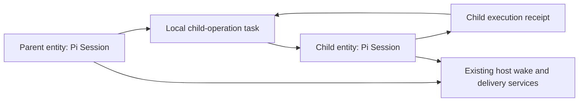

# Durable Pi: settled design and implementation obligations

Date: 2026-10-01. This is the normative decision record for the
[migration plan](durable-pi-migration-plan.md). It settles the architecture and
product contracts left open by the first feasibility run. **Design selection is
not implementation acceptance.** The [feasibility report](durable-pi-feasibility-report.md)
and evidence distinguish native observations, bounded protocol models, and work
that still has to be implemented. None of the old execution engine has been
removed or replaced.

## Decision summary

| ID  | Decision                                                                                                                                                                                                                | Implementation proof still required                                                                                              |
| --- | ----------------------------------------------------------------------------------------------------------------------------------------------------------------------------------------------------------------------- | -------------------------------------------------------------------------------------------------------------------------------- |
| D01 | One Pi Session per existing agent entity, bound to that entity's executable image, context and authority.                                                                                                               | Real protected ports, parallel children, fairness and manager replacement.                                                       |
| D02 | Subagents in separate agent entities run under conversation-owned background supervision. The spawn tool finishes on admission; reports, execution idleness and retained collaborator identity are separate.            | Provision/cancel races, report vs close, suspension/follow-up and parent finish/interrupt without accidental child cancellation. |
| D03 | One kernel wait representation covers local tasks, timed conditions and authenticated external receipts.                                                                                                                | Native dormant generation, compaction, tools and cleanup; no retained wait invocation.                                           |
| D04 | Use the existing host owner registry, alarm store and delivery recovery scan, with monotonic schedule revisions.                                                                                                        | Crash every registration/publication/ack boundary with no client traffic.                                                        |
| D05 | Reuse Pi's existing self/ancestor wait checks and ownership semantics; preserve proven Vibestudio serviceability safeguards. General cycle detection is outside this migration.                                         | Existing self-inspection and queued-turn continuation regressions, plus messaging/inspection during waits.                       |
| D06 | One asynchronous initialization lifecycle owns the entire entity schema. Pi supplies its migration history inside that lifecycle.                                                                                       | Production base/manager integration, trusted source/target fingerprints, crash/retry.                                            |
| D07 | Explicit checkpoint versions and immutable operation bindings govern code handover. Compatible implementation updates may resume; incompatible work blocks.                                                             | Pending/running/waiting/completing records across compatible/incompatible artifacts.                                             |
| D08 | History/context forks create fresh owner identities and import knowledge only. No live ownership transfer.                                                                                                              | Active mutation/approval/child/compaction forks, source-copy rollback.                                                           |
| D09 | Pi records tool intent/replay policy; independently admitted external work exposes its domain-owned admission and result receipts. Pure inline tools need no new durable job owner.                                     | One real EvalDO path first; map remaining domain capabilities without duplicate wrappers or journals.                            |
| D10 | Retain canonical admission/closure identity after result payload reclamation; retire finite executor incarnations before discarding their admission records. Sequence/range compaction is deferred.                     | Conflicting replay, exact acknowledgement, executor disposal and resource ownership.                                             |
| D11 | Model interruption preserves attempt evidence and honest uncertainty. Retry is an explicit execution policy, not exactly-once provider execution.                                                                       | Faux failure/abort/reconnect; required providers through actual attributed transport.                                            |
| D12 | Tool rounds consist of parallel-safe waves separated by individual sequential barriers.                                                                                                                                 | Native ordered admission, held receipts, restart and cancellation at every barrier.                                              |
| D13 | Generic agent cards belong to Pi product documents; domain cards belong to their existing domain state owner. Channel copies are projections.                                                                           | Atomic state/publication, competing writers and direct late-join recovery.                                                       |
| D14 | Product policy is composed with the execution kernel through definitions and typed hooks. Panels own observers only.                                                                                                    | Every customized worker and inspection/UI consumer.                                                                              |
| D15 | Mission owners keep goals, revisions, schedules and occurrence admission. Pi executes one admitted occurrence.                                                                                                          | Goal completion vs tick, duplicate occurrence, old-revision delivery and direct automation.                                      |
| D16 | Keep raw history; compaction is checkpointed work with an immutable input boundary and explicit placement validation.                                                                                                   | Overflow, tool pairing, interrupted/stale/busy summaries and retention.                                                          |
| D17 | Distribute one coherent fork as immutable built packages with recorded dependency closure.                                                                                                                              | Installed compositions, reproducible packaging and source/provider patch parity.                                                 |
| D18 | Pre-release cutover starts with fresh product state, with no backward compatibility or migration of existing state. Drain/cancel and join old owned work before retirement. Future released-data upgrades are separate. | Clean resource retirement and fresh installations; no historical import/archive or upgrade gate.                                 |

No architecture choice in this table is deferred to cutover or exposed as a
runtime switch. Validation can still falsify a decision; in that case revise this
record and the plan before proceeding, rather than adding an exception path.

## 1. Executable ownership and supervision

Here, a separate agent entity means a separately identified collaborator with
its own context, transcript and executable/authority binding. It does not imply
a separate machine, an external agent service, or a second execution engine.
Today these entities use the same agent-vessel/Pi harness and host durable-work
driver. The migration selects the same durable Pi kernel for each entity and
removes the displaced agent-loop/effect execution machinery; it does not remove
the collaborators themselves.

The coordination atom is the **agent entity**, not a supervision tree and not a
channel. Its identity is the platform's source/class/object identity together
with its non-reusable entity incarnation. Its facet contains one Pi Session.
Conversations within that entity can have different channels and settings, but
they share one executable/capability domain. They cannot impersonate another
entity's independently customized definitions.

Use the existing UniversalDO/WorkerLoader boundary to bind the entity to its
sealed runtime image. Source image, source frontier, authority scope and context
are product facts. The registry is constructed from that image and remains fixed
for the activation; dynamic request preparation selects tool/schema/resource
snapshots from that registry. An image update replaces the activation and runs
the schema/checkpoint compatibility boundary. Do not hot-install another
entity's same-named executable into a resident registry.

The extended native experiment runs two actual facets with the same task and
extension names, different immutable module bindings, and distinct attributed
egress identities. They return code A and B respectively. Replacement of A
retains its binding; a subsequent A-only image update leaves B's image and
activation unchanged. Each can use its fixture port and is denied the other's.
This proves the placement primitive, not production permission enforcement or
distributed supervision.

The rejected alternative is a shared artifact-bound Session. It requires a new
artifact-aware registry, independent code loading and capability execution inside
one owner, beyond the scheduler changes already necessary. It would recreate a
host boundary inside Pi. The separate-entity design reuses that boundary and the
same operation protocol already needed by eval, VCS and service calls.

A parent-local child-operation task records provisioning intent, child handle,
accepted submission, observed terminal receipt and cancellation/cleanup debt.
The child entity is the sole authority for its actual execution. The proxy's
state means the parent's dependency is ready, waiting or settled; it is not an
independently mutable copy of child status. UI status resolves the child receipt
or committed child inspection, with delivery lag shown separately.

Provisioning is a domain operation with a stable identity and retained outcome.
Allocate the child's entity/context/source binding once. Retrying the same
intent attaches to that child; conflicting semantic inputs reject. A cancellation
accepted before provisioning completes closes the admission or durably cancels
the child produced by that exact intent. Losing a parent reply cannot leak an
unowned child/context.

Pi's ordinary task-owned work still holds its owner's completion and follows
its cancellation scope. **The existing `spawn_subagent` API is not a foreground
join.** The tool launches a retained background collaborator and returns its
handle once admission succeeds. Do not attach the child's whole assignment as
ordinary work of the parent's generation task; that would change final-answer
and interrupt behavior.

Record a conversation-owned `background` supervisor task before admitting each
child assignment. The foreground spawn task owns provisioning/admission
until its acceptance boundary; the background task then owns result observation
and explicit child cancellation/retirement obligations. This is one committed
ownership disposition, not a mutable child-status mirror or a new runtime mode.
Ordinary parent completion/interrupt does not cancel admitted collaborator work.
Cancelling a not-yet-admitted spawn closes admission or cleans the exact child
created by that intent. `cancel_subagent` stops the specified assignment;
entity/tree retirement fences and joins all remaining background obligations.

Keep the retained collaborator handle, child entity/context, authority and source
provenance independently of an individual assignment task. Follow-up starts new
logical work in that same entity, with a fresh background supervision task.
Ordinary reports, including a report describing a problem, remain messages.
Neither a report nor failed parent report delivery establishes execution idleness
or permanent collaborator failure. Actual child execution closure releases its
slot; report publication and VCS incorporation may still be pending. A cancelled
or failed assignment remains follow-up capable; an abandoned/retired collaborator
refuses new execution.

Parent suspension is a durable input wait in the existing submission, not final
completion or an all-children join. An eligible child report, child-close fact,
user input or already-admitted queued request can make progress possible.
Commit the conversation input cursor and continuation; ignore the task's own
suspension result and a bare recovery hint. If a report was admitted before the
park, consume it without waiting for another notification. Resume synthesis
before settling the response; preserve explicit user pause/Stop ordering. Refuse
`waiting_for_background` when there is neither live supervised work nor eligible
queued input; unincorporated source alone is not a wake source.

VCS incorporation remains a separate operation referencing exact source/target
heads and receipts. Child completion with a merge conflict is completion plus
unincorporated source. A new target head is a new explicit integration request,
not an implicit retargeting of a replay.

## 2. Kernel waits, admission and fairness

Extend Pi's existing `waiting` state rather than adding an adapter scheduler.
Its checkpoint identifies the next phase. Its condition is one of:

- `tasks`: existing local task IDs and `allSettled`/`failFast` policy;
- `time`: an absolute due time and the explicit retry/schedule reason;
- `receipt`: an operation handle, immutable request binding and required receipt
  kind/version;
- `registry`: a compatibility wait on a published registry revision; preserves
  the original checkpoint and cleanup debt until compatible code is available;
- `input`: a durable approval, credential, authority or human-answer identity,
  or eligible addressed conversation input after a committed cursor for suspension.

These contracts are implemented in the maintained fork. They are not all APIs
present in the unmodified upstream revision.
Conditions are typed; an authority input cannot satisfy a result receipt wait.
The initial API has no arbitrary JavaScript predicate or OR over task completion
nodes. A first-answer product request has one canonical settlement receipt; it
does not require a general OR-dependency graph.

The wait transition commits the checkpoint, condition and schedule-publication
obligation in one local transaction and ends the phase invocation. Checking
locally admitted input/receipt facts and parking occurs on the same Session
mutation line. An early result remains durably available; a later result admits
an authenticated fact and triggers reevaluation. The external owner retains its
receipt and delivery obligation until acknowledgement, so missing a notification
cannot erase completion. Duplicate or stale input is harmless or conflicts by
identity; forged input never becomes a condition fact.

An eligible condition changes the task to schedulable state. It does not invent
an outcome. Due time only enables the next phase. Missing code, unsupported
version, unavailable authority or unknown operation inspection remains visibly
blocked with its original evidence. Inspection can read blocked records without
starting execution or awaiting the blocked service.

Remove `runtime.sleep()` from durable phase code. Generation retry/deferred
polling, compaction retry, operation completion, credential acquisition and tool
continuations all use the same wait state. A provider's documented polling
protocol may use durable time waits; a heap polling loop cannot substitute for
owner receipt recovery. Ordinary active network I/O remains activation-local
while executing. Its interruption policy is explicit in section 6.

Pi supplies a finite scheduling pass. Reserve ready phases fairly, launch at most
the configured concurrency, and advance at most a finite number of phase
boundaries per pass. Count/work budgets yield another ready wake; they do not
terminalize tasks after elapsed time. Active I/O belongs to an owned invocation;
parked work owns only durable facts. Separate entities must progress while a
peer waits on a provider, approval or long job. A pass returns only when its
budget yields or active invocations settle/park; residency and cancellation must
be measured rather than inferred from a returned HTTP response.

Abort handlers may record cleanup intent and park for its owner's receipt. The
current blanket prohibition on waiting in abort handlers cannot represent
durable remote cancellation. Abort mode disallows new ordinary work, but permits
typed cancellation/cleanup operations. Native retirement establishes exclusion;
an uncooperative old promise is never used as the ownership fence.

**Acceptance:** no dormant invocation, timer, observer or provider socket; due
time and receipt races across restart; bottom-up cancellation and held completion;
blocked-definition diagnostics; bounded ready-pass fairness with a stuck peer.

## 3. Loss-safe host wake publication

Use current `WorkspaceDO.do_alarms`, `AlarmDriver`, the durable owner registry and
the existing delivery recovery scan. The tested facets cannot arm native alarms.
There is one host wake/delivery system and one Pi scheduler. Remove `agent-effect`
claims and their semantic dispatch; a delivery lane for executing an eligible Pi
pass is generic owner wake transport.

Host receipt/readiness events also need a retained wake request in this same
store. Such a request is an incarnation-bound opportunity to reconcile canonical
owner state, not a Pi schedule revision or an operation outcome. Keep one bounded
per-owner generation/acknowledgement record. Capture its generation when the
host claims an alarm; acknowledge only that captured generation after a
successful owner pass. An event arriving during the pass remains due for the
next pass. Failed dispatch or failed acknowledgement retains the request.
Source null/clear publications and duplicate publications cannot erase this
host obligation or release its live dispatch claim. Host generation adoption
recovers abandoned claims; incarnation replacement or authoritative entity
retirement invalidates old requests. Do not add timers, expiry or a semantic
execution queue to repair hint loss.

The registry entry is committed **before any execution-bearing local admission**
can create a task, external intent, dormant wait or publication obligation.
Registration binds the authenticated entity incarnation and remains until its
retirement/cleanup protocol finishes. Do not rely on a constructor's unawaited
RPC. Failure to register refuses admission; loss after registration but before
local admission leaves an inert, discoverable owner which lifecycle cleanup can
reconcile. Schema probes never register or execute.

The entity's schedule record contains its incarnation, monotonically increasing
schedule revision, earliest wake (including immediate ready work), and revision
of host acknowledgement. A change to execution or product-domain alarm sources
computes one complete schedule. Timer waits, ready continuations, publication or
cleanup delivery debt, and Gmail/News domain schedules participate in that
minimum. A blocked operation has a named readiness/input source; it cannot hide
an unrelated pending delivery obligation.

Schedule changes and their outstanding publication obligation commit with the
task/domain transition. The implementation must stage this before Storage
acceptance. A post-commit observer may notify the host for latency, but cannot be
the sole creator of the durable obligation. Extend the Session's internal commit
preparation to stage the scheduler's native schedule document and product
publication records. This is one commit mechanism, not a state-parsing storage
wrapper or second effect journal. Colocated product changes use the same commit
boundary; direct writes affecting alarms cannot bypass it.

Relay sequence:

1. Read the latest committed schedule revision.
2. The workspace alarm owner accepts it for that incarnation. A smaller revision
   is stale; an equal revision must have identical payload; a newer revision
   replaces the complete schedule, including an explicit null/clear.
3. Accepting a revision fences any in-flight older alarm claim. Old dispatch
   completion cannot clear or overwrite the newer slot.
4. The entity acknowledges only that accepted revision. A newer local revision
   remains outstanding. Never clear a publication row by owner identity alone.

Keep a revision watermark when the wake time is null. Deleting the whole slot
would let an old relay resurrect a cleared alarm. Incarnation retirement closes
the slot; an old incarnation cannot register again.

On quiet-owner loss, recovery scans enumerate the durable registry and retrieve
outstanding schedules even if no client, result hint or alarm notification
survived. On host restart, generation adoption reclaims transport dispatches
from the dead driver. Recovery also runs while the host remains alive, covering
a facet dying after local commit but before relay. Reuse the existing scan's
cadence initially; it is a delivery recovery backstop, not a task expiry or a
watchdog verdict. Normal latency comes from commit hints and result delivery;
recovery latency must be measured separately.

Transport failure does not acknowledge or clear work. Retry after actual
transport failure/readiness repair is delivery policy and preserves the original
error. A permanent immutable-image/schema refusal blocks until its owner is
repaired. An acknowledged host generation/dispatch fault is the release event;
elapsed time is not permission to steal a claim. Fix the current alarm outcome-
ack failure path so an obligation can reconcile in the same live generation,
rather than requiring an unrelated server restart to make progress.

The bounded executable model explores 177 states and 880 transitions with a
later wake, an earlier insertion, a clear, dropped/reordered delivery, lost hints
and lost acknowledgements. Every reachable state preserves monotonic acceptance
and can recover the latest schedule under a successful fair scan. This proves
properties of the specified protocol, **not its native implementation**.

**Native acceptance:** first registration crash; local commit before relay;
host accept before local ack; old alarm dispatch completing after a newer wake;
same live host after facet loss; host/workerd restart with no client traffic;
multiple domain alarm sources; unavailable image repair; explicit retirement.

## 4. Existing wait safeguards; general cycles deferred

A **kick** is a prompt to check progress or carry on. Sending the prompt does
not wait for the recipient to finish. Parent/child send, read and inspection
remain available while foreground work waits. A delivered service result is a
different promise from input acceptance; preserve each API's actual contract.

Stock Pi at the evaluated SHA rejects a task waiting on itself or an owning
ancestor, and restricts `failFast` joins to owned tasks. It does not detect every
sibling cycle. Our fixture deliberately creates two instances of a tiny custom
wait task, each waiting for the other. That is a synthetic limitation test,
not a reproduced product failure or a demonstrated loss of existing behavior.
Keep those upstream checks and structured ownership semantics. **No general
local graph validator or host-wide dependency coordinator is required by this
migration.** The user explicitly prioritized avoiding speculative work here.

The current Vibestudio engine does not expose the same arbitrary Pi task-wait
graph, and the reviewed code has no general cycle detector. It does contain
specific tested safeguards that must survive the replacement:

- `chat-op.test.ts`: an eval inspecting its own agent gets a local snapshot
  rather than a channel call that cannot return while its caller waits.
- `step.ts` / `agent-loop.test.ts`: parked foreground work can yield to an
  eligible queued direct invocation; future-turn artifact preparation cannot
  prevent the current tool continuation from progressing.
- Child send acknowledges delivery and returns a message identity; child
  read/inspect returns retained messages or VCS/domain snapshots. Standard,
  Gmail and News method handlers dispatch independently of the model turn.

Preserve these behaviors through the native input, service, inspection and
operation owners. A waiting tool must not hold the SQL/Session mutation line
or prevent receipt admission and independently serviceable handlers. Preserve
original error and cancellation propagation. These are actual preservation
requirements, not a promise to detect every deadlock in arbitrary eval code,
custom task definitions or external programs.

The sibling fixture remains an observation. The small local graph model remains
exploratory evidence of a possible enhancement, not selected implementation or
release acceptance. Revisit general detection only if a supported product path
reproduces the problem, this migration introduces it, or an upstream change
makes it available without expanding our maintained fork. Do not invent a timeout
outcome or new coordination service to make the synthetic case disappear.

## 5. Schema and code handover

One asynchronous initialization Promise belongs to the entity activation. All
fetch/RPC/alarm/lifecycle admission awaits it; probes await the same schema work
but never product activation. Constructors may assign pure fields only. They
cannot write lazily or launch execution before readiness. Do not hold native
initialization gates across network or model work.

The sealed build provides a schema composition: platform base, Pi storage and
product-domain components. Each component owns disjoint schema objects, ordered
versions/migrations, validation and a trusted descriptor for every supported
source version. One outer native asynchronous SQL transaction:

1. Inspects the source component versions, metadata shape and complete schema.
   Empty stores are a defined fresh source. Unknown/newer/drifted shapes reject
   before any mutation. Compare against trusted build descriptors, not merely a
   fingerprint copied into the same database.
2. Runs supported migrations in declared dependency order. Reuse Pi's existing
   immutable `SQLITE_MIGRATIONS`; extract its transaction-scoped application body
   and keep its standalone API as a wrapper. Do not run nested independent
   installers or fork a second migration history.
3. Validates the resulting complete shape and semantic invariants against the
   fresh target probe, including indexes, triggers, views and component metadata.
   Unknown application objects are drift, not omitted tables.
4. Commits component versions/composition identity together and confirms native
   durability. Only then open Storage/Session and admit execution.

`SqliteStorage.open()` must participate in that initializer instead of invoking
another bootstrap after it. Its migration application becomes a transaction-
scoped component of the selected composition; standalone Pi uses the same
mechanism with its single-component plan. There is no post-guard lazy installer,
schema-validation bypass switch or independent runner in an adapter.

The existing synchronous empty-or-exact helper and synchronous `ensureReady()`
become this single lifecycle. Synchronous domain creation hooks can run inside
it; component ownership is declared explicitly. Both platform base variants,
schema-error RPC envelopes, `afterSchemaReady`, lifecycle prepare/resume,
descriptor probing, WorkerdManager admission and any host-side integrity checks
must adopt the same asynchronous boundary. A descriptor includes component
versions, composition identity and whole target fingerprint. Installed
descriptors are keyed to the actual immutable image.

The production base now owns this asynchronous lifecycle. Pi exposes its existing
transaction-scoped migration body and the native adapter confirms storage before
acceptance. A production-base native fixture proves fresh failure rollback,
retry, complete-composition drift refusal and replacement/reopen. Host tests prove
trusted supported upgrades and artifact-specific manager descriptors. The older
schema-spec fixture remains counterexample evidence; it is not the shipped runner.

Component stores retain declared ownership. A full Pi composition overrides
`schemaTables()` to attest the whole application store. Its shipping activation
must require the exact execution-digest descriptor on every build route. Missing
evidence must trigger a contained probe or visible refusal, never self-attestation
from persisted metadata. Actual shipping Pi process replacement, reset/restore
journal integration and all product schemas remain acceptance work.

Schema compatibility, task checkpoint compatibility and operation binding are
different axes. Registry definition version is an explicit semantic compatibility
promise: unchanged version means the new implementation can read and correctly
continue all its committed phases. Code review/tests enforce that promise; a
package version or unchanged function name does not. A version change requires
a pure tested checkpoint conversion or visible blocking. Unsupported/newer
checkpoints remain intact and inspectable.

Prepared tool requests now record the positive semantic tool version (default 1),
canonical provider-wire schema, replay/cancellation/output contract and effective
execution mode. TypeBox's symbol metadata does not enter the provider wire shape.
Schema drift is incompatible even without a version bump. Execution/cancellation,
wrappers and hooks must honor the declared version; hashing function text is not
an implementation compatibility proof. Shipping definitions must additionally
retain the admitted artifact, source, authority and operation binding. The current
kernel signature does not claim those production pins are implemented.

An incompatible parked continuation or cancellation handler waits on registry
publication; it retains the receipt, checkpoint, output and cancellation intent.
Inspection shows the compatibility block, including abort cleanup. Compatible
registration wakes it; a new activation rechecks once and remains dormant if still
incompatible. Registry revision is a readiness opportunity, not execution status
or permission. Interrupted unsafe work without a continuation never becomes
replayable solely because newer registration declares it safe.

Image replacement fences the old facet before opening the new one. Compatible
task implementations may continue at the committed boundary using the new image;
record original and current implementation provenance. This is an explicit
handover, not arbitrary replacement by a sibling registry. An already admitted
external operation retains its original immutable target/code/context/request
and authority scope until completion. Reattachment retrieves that receipt; it
cannot retarget it. New requests bind the new image/resource snapshot. Reacquiring
secrets can refresh transport material but cannot broaden admitted permissions.

On uncertain storage confirmation/adoption, seal the Session and reopen from
durable state. No publications or external actions may be issued from the
unconfirmed candidate. Unsupported code/schema and missing artifacts block
truthfully; elapsed time is not a terminal verdict. Restoring compatible code
resumes preserved work under its recorded recovery policy.

## 6. Operations, cancellation, models and reclamation

The common boundary is the recovery meaning Pi needs, not a compulsory uniform
RPC service. Replay-safe inline tools keep Pi's native task/checkpoint/replay
policy; do not create a second durable job for every read. Independently admitted
long-running or side-effectful work uses its actual domain owner and receipts.
Use existing authoritative VCS/source/mission receipts directly where their
contract suffices. Cancellation and payload reclamation reflect owner capability:
a committed mutation cannot be undone, and permanent source provenance does not
need an invented acknowledgement/close queue. Every domain records its exact
recovery guarantee before effect admission; a wrapper cannot manufacture one.

Admit an operation with a stable caller/executor identity,
semantic digest, immutable target/context/source/resource references, requested
authority and recovery policy. Identity belongs to the logical operation;
transport attempts have independent IDs. Knowing an ID alone grants no attach,
inspect, cancel or result permission.

The executor commits acceptance before execution and returns/retains an immutable
receipt. Reuse with the same semantics attaches; conflicting semantics rejects.
Inspection distinguishes absent, accepted, running, interrupted, terminal,
retired and unavailable. Absence is safe to act on only under the executor's
durable admission contract. Result acceptance verifies executor incarnation,
operation, digest, recipient and receipt version. A generic broadcast is never
enough to settle work.

Pi records intent before remote admission; loss after remote acceptance attaches
to the same operation. Pi commits the result and next checkpoint before
acknowledging its retained receipt. The executor's completion and delivery/cleanup
state are separate facts. Nested eval/service calls use this same contract;
active callers may await a handle, but their heap promise is not the receipt.
Read-only APIs should execute independently of the agent's foreground generation.

Cancellation closes new admission and records exactly which operation is being
cancelled. The executor owns cancellation and resource release. Completion that
won the race stays completed; the caller's submission may still be interrupted.
Retain mutation/result provenance and cleanup debt. Caller loss, executor loss,
provider disconnect and target retirement propagate their authoritative events
and original errors. Never describe an accepted mutation as undone because its
caller stopped waiting.

Replay policy is fixed before action: pure/replay-safe work may rerun;
owner-deduplicated work reattaches; checkpointed remote jobs recover their owner;
unsafe unreceipted actions become visibly uncertain/interrupted. A later tool
registration cannot upgrade an interrupted unsafe action to safe. Lost eval
activation is not a persisted JavaScript notebook stack; only the eval owner can
promise checkpointed execution. Otherwise retain the actual interrupted outcome.

For non-resumable model streams, interruption records an uncertain provider
attempt with any observed usage/progress. Continuation may start a new attempt
under the admitted model recovery policy, with a new attempt ID and preserved
history/provenance. Do not claim exactly-once billing or assume unobserved usage
was zero. A provider-supported durable handle reattaches instead. Explicit user
cancel, immutable request rejection and unusable credentials do not silently
replay the same request. Retryable provider responses use bounded policy/retry
budget and durable due-time waits; credential/approval reconnection is a separate
input. Repository watchdog/idle leases do not manufacture provider failure.

Reclamation preserves the executor's canonical admission record. After exact
durable receipt acknowledgement, large result bytes may be released according
to the domain retention policy; retain the minimal operation identity, semantic
digest, receipt/closure version and outcome provenance needed to reject a replay
as closed. This is the existing owner record with a smaller retained payload,
not an extra status mirror or a new workflow service. VCS/source receipts that
are permanent provenance keep their existing identity and lifetime.

A finite eval kernel retires its non-reusable execution incarnation and closes
admission before deleting run records. An old handle cannot address a replacement
kernel. Public `eval.dispose` now requests canonical host retirement; the old
EvalDO row-erasing dispose path has been removed. Retirement seals new admission
before awaiting cancellation and resource release and keeps canonical records
until namespace collection. Exact result acknowledgement retains closed identity
and payload; it is not collection. Lookup/control does not create a missing scope
or rebind an admitted context. The complete physical host retirement boundary
still requires its own acceptance proof. An executor remaining available cannot erase its
admission identity and subsequently treat an old operation as new.

Do not require ordered sequence allocation, retired prefixes or coalesced ranges
for the first cutover. Those optimize historical closure storage and have no
measured necessity yet. Retain closed identities alongside retained history,
measure bytes per operation, and apply normal storage/backpressure limits.
Explicit executor retirement/deletion has its own lifecycle and data policy.
No TTL closes an approval or job. The existing range model is exploratory only.

**Acceptance:** one real eval path through every commit boundary; wrong-scope and
conflicting requests; early/late/duplicate/forged results; lost cancellation;
executor death/disposal; resource cleanup; exact acknowledgement loss;
replay after payload reclamation and incarnation retirement.

## 7. Product behavior and customized consumers

### Admission, context, tools and authority

Stable envelope identity deduplicates input before delivery acknowledgement.
Ordinary user work queues in accepted order; explicit steering reaches the next
safe phase boundary; passive observation/feedback does not create autonomous
execution. Rejection writes no accepted work. Reset establishes a model-context
boundary and explicit submission disposition; it neither duplicates nor erases
already admitted external work. Feedback consumption and input admission occur
in the same local commit, using a Pi product document. Remote feedback is
acknowledged only after that acceptance. Diagnostic compaction preserves original
faults/counts/causal references beyond presentation dedupe.

Request preparation pins prompt, tools, model/settings, source/context, recipient
selection and content references. Refresh applies to subsequent preparation,
not the already admitted request. Resolve protected ports and secrets through
the existing authority owner at use; revocation blocks new protected action
without altering old receipts. Outside-content ingestion records provenance and
the required authority transition before actionable admission. A failed reset
leaves that content blocked with the original failure. Deduplication includes
content/admission identity and authority epoch; there is no new trusted-agent
attestation shortcut.

Replace Pi's whole-round sequential switch with native ordered waves. Commit the
assistant/tool-round plan, call ordinals and immutable offered tool identities.
Start the maximal parallel-safe prefix, join its terminal receipts, execute one
sequential barrier, then continue. An accepted but unresolved mutation still
holds its barrier. Results assemble in model call order, regardless of finish
order. Unknown/unoffered calls produce deterministic tool-unavailable results.
Validate/repair arguments before effect admission and keep provider schema
rejection terminal under its explicit policy. This changes generation/tool
phases in Pi, not a wrapper queue outside it.

### Cards, domains and product hooks

Generic agent-created cards use a versioned conversation product document as
their canonical state. State validation, expected-version update and publication
intent commit together. Gmail, News, Explorer findings and application-specific
cards remain projections of their existing canonical domain records; direct
snapshot APIs read those records. Do not copy their state into a second CardDoc
just to unify storage spelling. A channel publication carries stable identity,
version and validated snapshot/receipt reference. Channel state is communication,
not the only recovery source for a card.

Domain rows sharing an entity participate in its schema and local commit
lifecycle. Pure materialization prepares a Pi document and domain/publication
writes before one accepted local transition. Introduce a transaction-scoped
local participant boundary in Storage for such colocated domain writes; it
cannot issue network effects or adopt heap state before confirmation. Do not
execute an independently committing SQL call inside `runtime.commit()` and
pretend it is atomic. Domains in other entities use the operation protocol.

Replace execution-heavy inheritance with a worker composed from platform/domain
services and a Pi agent definition. Typed hooks cover prompt/resources, tool
registration, input/participant/method policy, publication policy, submission
settlement and history-fork policy. Hooks affecting external state must record
an operation/publication obligation before action; transient rendering hooks
cannot control task completion. A settlement hook runs by durable logical
submission/occurrence identity and survives lost notification. No production
adapter recreates old `StepPolicy`, executor or protocol events.

| Consumer                                          | Observed extension points                                                                                               | Required native meaning                                                                                                                                                                               |
| ------------------------------------------------- | ----------------------------------------------------------------------------------------------------------------------- | ----------------------------------------------------------------------------------------------------------------------------------------------------------------------------------------------------- |
| Base `AiChatWorker`                               | `getParticipantInfo`, replacement-prompt resource short circuit, configured `getLoopTools`, panel resource/tool binding | Prepare typed participant/prompt/tool snapshots; preserve duplicate/unknown-binding errors and exact resource identity.                                                                               |
| Base `SilentAgentWorker`                          | `getPublishPolicy`, allowed tools plus explicit `notify`                                                                | Internal transcript remains complete; public channel output is notify-only plus boundaries.                                                                                                           |
| Personal `ExplorerAgentWorker`                    | Mention/follow-up respond policy, `getStepPolicies(defaultPolicies)`, finding receipt/file/card publication             | Quiet admission policy with visible accepted responses; preserve semantic finding/VCS receipts and canonical finding state. Never inherit Silent's publication suppression.                           |
| System `SystemAgentWorker`                        | Prompt/eval guide, no memory recall, restricted participant methods, eval+notify tools                                  | Exact small method/tool surface, bound eval authority and prompt resources; no ambient Base tools added by default.                                                                                   |
| System-testing `TestAgentWorker`                  | `processChannelEvent` intercepts deterministic mode and emits synthetic old protocol terminals                          | Replace synthetic execution bypass with a scripted native agent definition/provider and native views. Keep deterministic control/evidence; tests must exercise the shipping admission/scheduler path. |
| Gmail `GmailAgentWorker`                          | Triage/draft models and tools, watch/push, subscriptions, reminders, alarms, method dispatch and cards                  | Domain workers own watches/queues/preferences; Pi executes admitted agent work. Shared complete alarm schedule preserves every domain source.                                                         |
| News `NewsAgentWorker`                            | Feed/politeness policy, polling/briefings/deep dives, preferences, feedback, cards and fork hooks                       | Keep domain state/recovery; agent waits use native conditions; network politeness belongs to the actual fetch operation, not a completion watchdog.                                                   |
| Adventure                                         | Tools, `receiveMoment`, `cancelMoment`, `onTurnClosed` reads old loop to settle `participantStopped`                    | Durable moment occurrence/submission association and domain settlement operation when that exact work closes; later queued work does not settle the wrong moment.                                     |
| Grimoire and Regency                              | Domain-specific tools, source/game bindings, `receiveMoment` steering                                                   | Preserve independent executable definitions and addressed occurrence admission/settlement through domain handles.                                                                                     |
| Spectrolite, chat, onboarding and agentic-session | Chat features, bootstrap, controls, reducers and inspection                                                             | Consume native committed snapshots/cursors and product commands. No execution reconstructed from old wire terminals.                                                                                  |

The matrix records concrete boundary decisions, not per-method implementation
parity. The inventory remains the worklist for declaration/import review when
each consumer is migrated. Supporting filesystem, image, channel, VCS, authority
and provider services stay domain-owned; matching an old agent import does not
authorize deleting their functionality.

Historical regression anchors read during design include the driver's admitted-
mutation/interrupt ordering, noncooperative lifecycle release/late result,
ordered waves, authority wake-before-deferred-ack, authority refresh during result
wait, duplicate terminal result and transient store-load failure dropping an
eval outcome. Their native replacements test committed effects, delivery and
resource ownership separately. A model eventually recovering is not a pass for
the swallowed original failure. Retained-child follow-up admission must also
survive termination of the previous foreground task; entity usability is not
inferred from that task's terminal status.

### Missions, forks, compaction, UI and retention

Mission owners retain their present charter/schedule/admission semantics. Pi
executes one admitted run and returns its receipt; it does not become a recurring
schedule owner. Preserve these concrete `MissionsDO` policies:

- Scheduled times are opportunities, not a backlog. The current five-second
  delivery window tolerates jitter; an older missed occurrence advances directly
  to the next future occurrence without running catch-up work. This is the
  schedule contract, not a watchdog terminating an already-admitted task.
- Permit one active run per mission. A new overlapping request records a skipped
  run (`ERUNACTIVE`) and one persistent attention issue per active run; do not
  enqueue a hidden backlog or launch concurrent ticks.
- Duplicate manual/scheduled admission attaches to the deterministic identity
  formed from the immutable mission revision subject and occurrence/command.
- Pause closes future scheduling without withdrawing standing grants or
  manufacturing cancellation of an admitted run. Revision replacement commits
  the new revision before interrupting old executions and retiring old authority.
- Run outcome and goal completion remain separate. A successful explicit
  completion response, `untilAt` or `maxRuns` closes the current goal through its
  domain transaction; an old-revision result cannot close a newer goal. Terminal
  receipt acknowledgement cannot reactivate scheduling. Stop/retire and edit
  preserve their existing admitted-run interruption and cleanup obligations.

A quiet watch returning no prompt stays model-free; a signalled watch preserves
its exact invocation and continues through native agent admission. Failed child
operations remain in the run's result even if the final assistant text succeeds.
No new overlap, catch-up, or completion policy is introduced by changing engines.

History forks import committed context at an exact entry and selected source
frontier into a new entity incarnation. Local Pi forks are suitable within one
code/authority domain; cross-entity forks use explicit history export/import,
not live database copying. Each product document declares history/fork policy.
No task, pending submission, operation identity, approval, subscription,
supervisor, cancellation or schedule registration is copied. Historical receipts
are provenance only. Parent work remains parent-owned. A selected child may
become a new independent root through this knowledge/source fork; live ownership
transfer is excluded from this change.

Compaction pins raw context/input entry boundary, model settings and request
identity. Keep raw history and tool/result pairing; reject a summary whose
placement preconditions no longer hold. Manual compaction queues at a safe
boundary; automatic/overflow compaction follows one documented policy and
records any rebuilt request. Its retries/receipt waits use native wait states.
Large output bytes live behind retained artifact references with bounded previews
and explicit availability errors. Missing data is never silently empty content.

UI and headless inspection read native committed conversation/task/product views
plus domain receipts. Snapshots carry a continuation cursor; reconnect does not
reconstruct execution from whichever channel broadcasts remain. Persist accepted
inputs, assistant/tool terminals, attempts/usage, fault evidence, receipt and
publication references. Stream deltas and progress are bounded transient views;
they cannot acknowledge acceptance or settle execution. A late join recovers
committed truth even if some transient progress was missed. Disconnect/rebuild
releases observers without cancelling the entity's execution.

Retain full execution history created by the new system by default. Existing
pre-release history need not be migrated or kept readable at cutover. Separately
measure snapshot/delta write amplification, transcript retention and artifacts.
Compaction of model context is not deletion of audit history. Explicit export/
delete policy can reclaim history later without changing operation admission
closure. Coalesce repeated faults with counts and original causal evidence;
strict system tests still reject unexpected faults after a successful final answer.

## 8. Provider integration and packaging

Maintain Pi durable, Pi AI and Chord in the same source fork/revision and license
history. Publish built immutable npm artifacts under distinct fork identities:
`@panticonic/pi-durable`, `@panticonic/pi-ai`, `@panticonic/pi-chord` and
`@panticonic/pi-telemetry`. The user selected this scope and existing publish
account `panticonic`; all four libraries are published at `0.99.2-vibestudio.9`
under tag `durable-pi`, with registry bytes and ordinary installation verified.
The existing `@vibestudio/durable` remains the platform package. Use the existing
userland package materialization/release pipeline and immutable integrity-bearing
dependency records, not runtime Git dependencies or a new loader. Internal fork
imports resolve to the exact same fork release; external dependencies are pinned
in the reviewed lock/closure. Product/template publication and installed cutover
acceptance remain release work; fork library publication is complete.

Build output includes source SHA, fork delta identity, lock/dependency closure,
toolchain inputs, package contents/integrity and license notices. Installed
template projections must reproduce that identity. Product consumers import the
published fork directly. The displaced `@workspace/pi-ai` package and its
compatibility exports are removed. Host provider authentication and generated
provider metadata use the same immutable fork closure as the native runtime.
No second published upstream Pi AI enters the product dependency realm.

The required provider delta has an explicit home in fork source:

- Anthropic OAuth uses an explicit trusted credential method, never token-text
  inference; credential injection remains host-owned.
- Codex transport session identity and logical request/attempt identity are
  separate. SSE/WebSocket retries retain phase/status/reason diagnostics.
- Workers WebSocket transport uses attributed fetch-upgrade through the bound
  host egress contract. Socket/debug/cache cleanup belongs to the invocation;
  no unbound Node/browser constructor or inappropriate global socket reuse.
- Local-provider `prompt_progress` remains monotonic meaningful progress even
  before generated text, with bounded transient consumers.
- Preserve actual model/tier/usage provenance. Cost metadata comes from an exact
  versioned provider/model registry; unknown cost is unknown, not an invented
  multiplier. Verify primary provider pricing when implementing tier accounting.
- Do not carry over renewable stream-idle watchdogs as task outcome policy.
  Diagnose and propagate disconnect/error/abort through the actual transport.
  A protocol-defined deadline requires its own source and cancellation/join law.

Delete generated-package patches only after their behavior lives in the coherent
fork and focused provider tests pass through native egress. GPT-6.1 Sol support
is required; ultrafast mode remains separate scope. Provider protocol/pricing
verification is implementation/release evidence, not a remaining architecture
choice or a claim established by this local scripted experiment.

## 9. Implementation sequence and review gates

1. **Native lifecycle and package seam.** Integrate one schema lifecycle and the
   proven async adapter. Extract Pi's migration transaction body; establish
   source/target shape descriptors and exact package composition. Run native
   storage conformance, interruption/reopen/uncertainty and manager admission.
2. **Kernel scheduling.** Implement typed dormant waits, finite fair passes,
   pre-commit schedule/publication preparation, versioned host relay and
   independently serviceable input/receipt/inspection handlers. Retain Pi's
   existing wait/ownership checks. Generation, compaction, tools and abort use
   the wait contract together. Native no-client recovery and existing regression
   behavior are the exit gate; general cycle detection is not.
3. **One real operation path.** Complete EvalDO intent/admission/receipt/wait/
   replacement/result/ack/close, including unsafe interruption and cancellation.
   Expose its native inspection before expanding operations. No panel required.
4. **Product ownership.** Add child provisioning/supervision, service calls,
   domain cards/feedback, missions and remaining provider deltas. Migrate each
   customized definition and hook. Close ledger rows with tests and exact
   deleted symbols/tables/imports, not package-level checkmarks.
5. **Consumer cutover and deletion.** Update chat/CLI/headless validators/skills
   to native contracts, then remove the old loop, folds, effect expansion/outbox,
   execution status mirrors, synthetic terminal bypass and semantic host claims
   in one delivered path. Preserve domain delivery, logs and source provenance.
6. **Release.** This is a pre-release cutover with fresh product state and no
   backward compatibility or migration of any existing state. Stop old admission;
   drain or explicitly cancel/join owned operations; retire owned runtime state
   without touching unrelated workspaces or source checkouts. No historical
   import, converter, legacy reader or archive/export verification is required.
   New-system recovery and history retention remain required. Future supported
   Pi/domain migrations and checkpoint upgrades are separate release work.

Performance/fairness/leak evidence uses the repository's native performance
skill and isolated instances; no latency verdict is obtained while other heavy
work shares the test host. Agentic tests follow deterministic crash proofs and
run the smallest exact relevant scenarios on fresh installed compositions.
The user has now requested completing product cutover. Concrete release and
state-disposition work proceeds within that scope; valuable unrelated state is
not disposable. Registry scope/access is settled and the four libraries are
published. The exact Base registry dependency closure passes its typecheck.

Remaining work is implementation and acceptance against these choices, including
the concrete service-lane audit rather than an unproved universal deadlock claim. The
kernel phase changes, schedule commit integration and schema-base integration are
the largest maintained deltas; measure them at gates 1–3 before migrating all
consumers. If their total complexity recreates the old engine in a fork, reject
the approach and revisit ownership. The opportunity is one explicit execution
authority and reusable domain receipts; moving the same machinery between
packages is not sufficient.

### 2026-10-01 implementation packet outcome

The requested schema, dormant wait/real EvalDO recovery, and affected-caller
review packet is complete at component scope; see the
[implementation audit](durable-pi-implementation-audit.md). Sequence items 1–2
have implementations and native fault evidence. Item 3 has its real admission/
wait/replacement/result slice, including the acceptance-before-continuation crash.
Canonical receipts/exact acknowledgement, finite retirement, host incarnation
journal rotation, installed fork packages, ordered tool waves, compatibility waits
and provider source deltas are now implemented. EvalDO domain-side hints now
redeliver until exact acknowledgement with absolute deadlines and finite due
passes. Shipping Pi receiver routing, physical retirement fencing, complete
operation pins, cancellation/reclamation and shipping product ownership still
require acceptance before cutover. Do not confuse the three requested
review steps with completion of every operation-family obligation in item 3.

Host storage incarnation rotation belongs inside the existing fenced maintenance
journal: record the new identity idempotently after exclusion/drain, then resume
admission. Registered sources with undelivered first schedules receive recovery
opportunities during worker-generation adoption. Exact artifact schema evidence
is keyed by execution digest. These decisions close the remaining boundary
questions; their shipping integration and product preservation are still gates.
