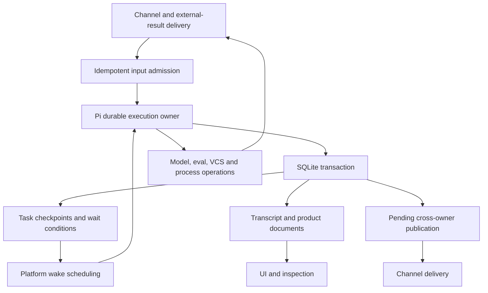

# Fork Pi Durable and replace Vibestudio's agent execution machinery

Date: 2026-09-30; reviewed and revised 2026-10-05
Status: product cutover published and verified on fresh production state; lower-priority acceptance and expanded regression coverage remain separately tracked
Priority: rebuild recovery and task management first; self-development last

Cutover policy: this is a pre-release system; start with fresh product state.
Backward compatibility and migration of existing state are explicitly out of
scope. Do not add either to the implementation or acceptance gates. Preserve
supported user behavior and the durability of state created by the new system.

## Current acceptance boundary — 5 October 2026

The maintained fork `.11` is published and the product source uses Durable Pi.
All default browser/rebuild/profile/optimization repairs have installed passing
receipts. Personal-plus-Examples acceptance passes browser import, all four
adventure cases and Svelte scaffolding. The reconciled 0.1.55 host passes commit
gates; 1,875 affected Base chat/harness/native-owner/pubsub/CDP/worker tests and
Base, System-testing and composed Personal types pass.

Checkpoint 98 verifies bounded channel inspection and exposes a real cold-child
inspection defect during follow-up. Retained conversation lookup now initializes
and validates the same native Session before inspecting committed work; it does
not submit input or dispatch a turn. Focused cold-admission tests preserve task
and input state and original failure propagation. The two onboarding validators
now select canonical native invocations rather than preceding transport echoes;
the actual opening and stable-ID handoff already completed successfully. Checkpoint 99 clears
onboarding opening and same-collaborator follow-up with no tool faults. Routing
then exposes a separate preservation gap: public UI selection metadata is absent
from model content despite being retained in product provenance. The same native
input now includes only its four public selection fields; private transport and
authority metadata remain excluded. All 85 focused product intake, child and
settlement tests pass. Checkpoint 100 freshly passes stable-ID routing with no errors or tool faults;
all previously open Personal-plus-Examples verdicts are cleared.

Checkpoint 101 completes real rendered chat verification, with exact first and
warm responses and owned CDP/panel/context cleanup. Warm submit-to-completion
takes 3,233 ms; the first measurement includes credential approval and is not a
cold latency baseline. Checkpoint 102 passes the native Android source install.
Fresh checkpoint 103 (`st_976b7e638a434a9d9c0b9f34e56f71c0`) also passes Android
onboarding: one pass, zero failures, errors or unexpected tool faults, 254.715
seconds. Correct workspace-owned endpoint exposure, upstream mobile lifecycle
changes and cancellable readiness observation are verified together; this run
does not isolate one change as the cause. Phone setup no longer declares failure
merely because three minutes elapsed. It observes actual readiness, propagates
original RPC failures and joins cancellation when its panel closes. Six focused
helper/UI regressions and all 465 mobile tests pass. Native process diagnostics
preserve bounded original output and join output streams.

The reviewed source is committed and pushed: host `f1b4187c`, Base `7353fb64`,
System `bd5bb9a4`, System-testing `ac4db305`, Personal `d7114210`, Examples
`6f8c8259`, Google Workspace `0ee91451` and News `85f71c6e`. Complete host commit
gates pass. Review worktrees and Android executors/emulators are retired.
Canonical template publication and release-pin adoption are complete:
Base `v0.3.62` at `8d8e0377`, Personal `v0.3.57` at `9bfe0649` and System
`v0.3.75` at `0cb3f836`. Each went through the ordinary inspected/reviewed
publisher. Personal and System preserve all authored runtime configuration and
exactly their own repository inventories; neither ships the development-only
System-testing dependency. The host release artifact adopts the three verified
publication receipts. Production checkpoint 105 boots these exact pins and
passes real rendered first/follow-up chat responses without console errors.
Warm submit-to-completion takes 3,494 ms; the 21,086 ms first turn includes
credential approval and is not a cold latency baseline.
The production Personal workspace installs its exact published pin and retains
its onboarding startup configuration. Native panel/CDP cleanup, CLI session and
context retirement, desktop executor shutdown and server shutdown complete;
all owned publication/production temporary roots are absent. This completes the
product cutover boundary for the exercised workflows. Lower-priority unverified
cases remain separately recorded; they are not represented as passing tests.

Publication inspection also caught and repaired a preservation defect: authored
runtime configuration referencing inherited units was filtered out of releases.
Personal's onboarding `initPanels` remains declared while Base supplies the chat
panel. Projection distinguishes owned files from available units; regression
coverage checks retained startup arguments without copying inherited code.
Base tests and composition types pass. Base 0.3.61 remains immutable; 0.3.62
includes the fix and regenerated agent-facing contract. Exact Git pins now
reject ambiguous refs at admission, before workspace registration, using the
existing canonical-ref contract (77 focused host tests pass). Follow-up host
source `cc0e9b65` is committed and pushed with complete commit gates passing.
Self-development and local-model acceptance remain explicitly lower priority
and unverified. Expanded tricky-case coverage follows the release-pin commit.
The [installed acceptance inventory](durable-pi-installed-acceptance-remaining.md)
records the exact remaining tests and evidence. Published fork packages and source
checks alone do not establish a published product cutover.

## 1. Decision and intended result

This plan is a working guide, not a requirement for slavish adherence. The goal
is a really good system that serves users performantly and robustly, with a
simple, coherent implementation we can understand and maintain. That outcome
outranks the architecture, protocols, milestones and implementation sequence
written here. Use engineering judgment: revise, simplify or replace any part of
the plan when source review, implementation or testing reveals a better design.
Remove unnecessary work rather than building machinery just to satisfy a planned
step. Record material changes and their reasoning so the plan stays useful.

Preserve supported user behavior and data created by the resulting system, and verify performance,
recovery and resource ownership against the resulting system. Acceptance checks
must prove those outcomes; their current wording or prescribed mechanism is not
a reason to retain an impractical design or add a workaround. If a check encodes
the wrong assumption, revise the assumption and check together, keeping evidence
that the actual user need is met.

The [settled design record](durable-pi-design-decisions.md) is the normative
architecture and protocol specification for the current approach, subject to
the outcome-first principle above. D01–D18 close the choices left open by
the first feasibility run. This plan defines implementation and acceptance; the
[behavior ledger](durable-pi-behavior-ledger.md) tracks preservation/deletion and
the [feasibility report](durable-pi-feasibility-report.md) records actual evidence.
Design closure never substitutes for native acceptance.

Scope is replacement and preservation of supported product behavior. New
capabilities are required only where Pi cannot preserve that behavior in our
runtime. General cycle detection, a distributed task graph, a catch-up scheduler,
receipt range compaction, Ultrafast mode and unrelated upstream applications are
outside cutover acceptance. **This is a pre-release system: the product cutover
requires no backward compatibility and no migration of existing state. Start
with fresh product state; do not build old-state converters, imports, legacy
readers, compatibility runtimes or archive/export requirements for this cutover.**
Existing pre-release databases, execution records, histories and approvals are
not inputs the new system must support. This does not authorize deleting
unrelated workspaces or source checkouts. Cancellation, authority, recovery and
preservation of history created by the new system remain
required because they protect existing product behavior, not speculative features.

Use one Pi Session per independently hosted agent entity, existing host wake/
delivery services with versioned schedules, Pi's existing wait/ownership checks,
independently serviceable messaging/inspection, and one asynchronous composed schema lifecycle. Other entities retain
child/eval/VCS/service execution through durable operation receipts. Do not share
independent executable definitions in a tree registry or introduce a second
semantic execution queue.

Replace Vibestudio's custom agent execution loop with a source fork of
`@earendil-works/pi-durable`. Use its transactional SQLite backend as the
authority for execution state. Complete the missing execution capabilities in
the fork, including durable suspension and wakeup for workerd.

For each agent entity, the result should have one owner for input admission,
generation, tool rounds, waiting, cancellation, and supervision. Separate
subagents remain distinct agent identities using that same kernel, not another
execution engine or an external agent service. A replacement activation should resume
from committed state without reconstructing an agent's execution from channel
history or coordinating a second semantic effect queue.

The user explicitly permits using unpublished upstream main and modifying the
fork directly. Existing implementation protocols need not remain compatible;
supported product behavior must survive, as tracked in the behavior ledger.
Choose the simplest correct design and remove the displaced implementation.
Do not preserve old machinery through feature flags, protocol conversions, or
a permanent alternative execution path. This fresh-state decision applies to
the current pre-release cutover, not to future releases with supported user data.

Pi's own schema machinery may remain where it provides clean initialization
and validation; it does not create a requirement to migrate pre-release state.
Future released-data upgrades are a separate requirement when needed, not a
gate for this cutover; see section 6.4.

The user has authorized completing product cutover and selected publication
under `@panticonic/pi-*`; the four fork libraries are now published. Authorization
does not substitute for acceptance or permit losing new-system history. Each
milestone has a concrete gate. A failed gate is information that the design
needs revision, not a reason to add a workaround.

## 2. Evidence and upstream baseline

### 2.1 Exact revision

The original review used
[`earendil-works/pi`](https://github.com/earendil-works/pi), main at
[`d2931ad3d5bf6936fbdfa5dfc81fb32f875499b2`](https://github.com/earendil-works/pi/commit/d2931ad3d5bf6936fbdfa5dfc81fb32f875499b2),
checked on 2026-09-30. The refreshed source review on 2026-10-01 uses
[`0f8740bb65638180403a225ad7ec4d0cc1f8dedf`](https://github.com/earendil-works/pi/commit/0f8740bb65638180403a225ad7ec4d0cc1f8dedf),
the main revision returned by GitHub during this review. This is a review
baseline, not an adopted artifact. The published `pi-durable` 0.99.1 npm metadata identifies
`d86654abb8862e201933517d6f1fce9f88dd117f` as its source commit.

Keep `0f8740bb65638180403a225ad7ec4d0cc1f8dedf` as the tested implementation
baseline in the owned fork. Later upstream adoption requires explicit delta
reconciliation and relevant checks, not an automatic moving target. A floating
branch is not an installation contract.

The earlier assessment of Pi's older `packages/agent` scaffold does not describe
the newer `packages/durable` implementation. The SQLite backend is implemented;
it is not merely a proposal. Its
[existing commit implementation](https://github.com/earendil-works/pi/blob/0f8740bb65638180403a225ad7ec4d0cc1f8dedf/packages/durable/src/storage/sqlite/storage.ts)
applies storage writes transactionally.

### 2.2 What exists and what remains

| Capability                                      | Reviewed status                    | Migration consequence                                      |
| ----------------------------------------------- | ---------------------------------- | ---------------------------------------------------------- |
| Transactional sessions and SQLite storage       | Implemented                        | Reuse the backend and its conformance tests                |
| Checkpointed tasks and reopen recovery          | Implemented                        | Adopt as execution authority                               |
| Request-ID input admission                      | Implemented                        | Use stable identities for delivered inputs                 |
| Generation and deferred model responses         | Implemented                        | Retain provider-specific transport requirements            |
| Tool tasks and recorded replay policy           | Implemented on unpublished main    | Use main rather than only npm 0.99.1                       |
| Durable inbox and conversation views            | Implemented on unpublished main    | Replace custom input/turn coordination                     |
| Owned conversations and cancellation cascades   | Implemented on unpublished main    | Adopt for supervision                                      |
| Structured task ownership and task waits        | Implemented on reviewed main       | Reuse; prove product cancellation and dependency rules     |
| Compaction and overflow handling                | Implemented on reviewed main       | Verify and adapt; do not schedule a second implementation  |
| Extensions, per-conversation agents, task graph | Implemented on reviewed main       | Audit selection, environment, and product isolation        |
| Final lifecycle and public conformance work     | Reported complete on reviewed main | Run ourselves; embedded rebuild correctness remains a gate |
| Hibernation-friendly timed and external waits   | Not established by this review     | Implement and prove in the fork                            |

Source status comes from the pinned
[durable changelog](https://github.com/earendil-works/pi/blob/0f8740bb65638180403a225ad7ec4d0cc1f8dedf/packages/durable/CHANGELOG.md)
and
[implementation handoff](https://github.com/earendil-works/pi/blob/0f8740bb65638180403a225ad7ec4d0cc1f8dedf/packages/durable/docs/pico-v5-handoff.md).
The refreshed handoff marks implementation packages 1–23 complete. The source
review is not an execution test report. In particular, implemented task-dependency
waits do not establish hibernation-friendly timed or external-result waits.

### 2.3 The merged SQLite facade change

[PR #10232](https://github.com/earendil-works/pi/pull/10232) merged on
2026-09-30 at 20:32:54 UTC as
`d4d74eb19be92c559f629a7f9707c5503a840edc`. The refreshed baseline's database
operations and transaction callbacks are asynchronous, with explicit
transaction handles. `SqliteStorage.commit()` awaits SQL helpers inside the
transaction callback; document materialization also uses an async transaction.

Retain this async transaction API. Wrapping an async callback in
`transactionSync()` is invalid, but native `storage.transaction()` supports SQL
and asynchronous callbacks. The first feasibility run proved rollback, scoped
handles, queued connection isolation and uncertain-acceptance recovery in actual
UniversalDO facets. A synchronous SQL-core rewrite is not justified; see
[the feasibility report](durable-pi-feasibility-report.md).

### 2.4 Relevant local architecture

Paths beginning with `Base/` below mean the configured external Base source
checkout, not a host package-manager workspace.

| Current owner                                                              | Current responsibility                                    | Intended disposition                                                   |
| -------------------------------------------------------------------------- | --------------------------------------------------------- | ---------------------------------------------------------------------- |
| `Base/packages/agent-loop/src/{fold,step,effects,state}.ts`                | Fold trajectory into execution and derive effects         | Replace execution ownership with Pi tasks                              |
| `Base/packages/agentic-do/src/agent-loop-driver.ts`                        | Dispatch, outcome append, recovery, cancellation          | Remove as responsibilities transfer                                    |
| `Base/packages/agentic-do/src/effect-outbox.ts`                            | Effect claims, retries, completion evidence               | Remove the agent semantic effect queue                                 |
| `Base/packages/agentic-do/src/fold-cache.ts`                               | Reconstruct execution from GAD                            | Remove execution dependency on this fold                               |
| `Base/packages/agentic-do/src/agent-vessel.ts`                             | Agent integration, channel intake, supervision, lifecycle | Reduce to product/runtime integration; move execution into Pi          |
| `Base/packages/agentic-do/src/subagent-runs.ts`                            | Supervision records                                       | Replace execution status authority; preserve required product metadata |
| `Base/packages/agentic-do/src/effect-executors/`                           | Provider and tool execution                               | Move useful transport/tool behavior into the new boundaries            |
| `Base/packages/harness/src/tools/`                                         | Workspace-aware tools                                     | Preserve useful operations and authority contracts                     |
| `src/server/services/durableWorkDriver.ts`                                 | Host claims and wake/recovery dispatch                    | Keep only required platform scheduling and delivery responsibilities   |
| `packages/shared/src/durableWork.ts`                                       | Host queue protocol                                       | Delete obsolete agent-effect protocol after cutover                    |
| `packages/durable/` and `Base/packages/runtime/src/worker/durable-base.ts` | DO storage and runtime integration                        | Supply native transactions and lifecycle integration                   |
| `packages/builtin/src/eval-engine/EvalDO.ts`                               | External eval execution and retained results              | Remain an operation owner with recoverable receipts                    |
| `src/server/workerdManager.ts`                                             | Runtime images, replacement, fault-abort seam             | Prove activation exclusion and replacement recovery                    |

This inventory is a starting point. Re-locate symbols before implementation and
trace actual callers. Historical plans are not evidence that a bug still exists.
For example, mutation replay already consults command evidence, and retirement
already attempts child abandonment; preserve those guarantees without copying
their surrounding machinery.

## 3. Scope and design laws

### 3.1 Scope

The replacement covers agent execution, not every durable subsystem in the
product. Channels still own communication; VCS still owns semantic source
changes; eval/process owners still own admitted external work. Replacing an
agent loop does not imply replacing those services or their durability.

Keep GPT-6.1 Sol support and the current credential and transport requirements.
Ultrafast mode is a separate, lower-priority feature and is not part of this
migration's acceptance criteria.

### 3.2 Required laws

1. **One execution authority.** Pi task records, submissions, and committed
   transcript/documents determine agent execution. Channel projections cannot
   independently resume a model call or tool.
2. **Atomic local transitions.** A transition's checkpoint, affected documents,
   transcript entries, and local publication obligations commit together.
3. **Intent before action.** Persist an operation identity and recovery policy
   before issuing external work.
4. **Committed visibility.** Publish authoritative state only after commit.
   Transient indicators cannot acknowledge an input or settle a task.
5. **Explicit waiting.** Waiting work has a durable condition and continuation;
   a heap promise or timer is never its only representation.
6. **Single active owner.** Replacement cannot leave two harness activations
   capable of advancing the same state. Old callbacks cannot commit later.
7. **Honest external uncertainty.** An interrupted action is not assumed to
   have failed, succeeded, or become safe to repeat.
8. **Cancellation is an operation.** Record cancellation intent and its owned
   cleanup obligations. Losing an activation is not user cancellation.
9. **Resource ownership.** Processes, streams, subscriptions, waiters, caches,
   and temporary artifacts have owners and bounded lifetimes.
10. **Failure evidence survives recovery.** A successful final answer does not
    erase a fault encountered during execution.
11. **Fresh-state cutover without backward compatibility.** No existing
    pre-release state is migrated or supported. Development may use isolated
    prototypes, but the delivered system has one execution path.
12. **Product semantics precede implementation vocabulary.** Agent prompts stay
    human sounding; APIs and skill documentation carry technical procedures.
13. **Explicit storage initialization and validation.** Validate the resulting
    schema before execution admission and reject unknown or corrupt state.
    Existing dependency migration machinery may remain; historical-format
    support and future release upgrades are not cutover requirements. Committed
    new-system work must recover across activation loss and compatible replacement.

## 4. Target ownership and placement

### 4.1 Responsibility boundaries



Pi owns input placement, generation/tool ordering, task state, continuation,
submission settlement, and the supervision graph. Vibestudio supplies resources,
authority checks, model/credential resolution, native storage, wake delivery,
and external operations.

### 4.2 Chosen placement: one independently hosted agent entity

Each existing agent entity owns one Pi Session inside its sealed source/class/
object facet and non-reusable incarnation. Conversations can differ in channel
and request settings within that executable/authority domain. An independently
customized child is another entity, not another entry in its parent's registry.
Construct the registry from the image; replace the activation for image updates.

The shared-Session fixture returned code B for both children. The extended actual-
host fixture runs same-named tasks in two facets with distinct immutable modules
and attributed egress: results are A/B, replacement preserves A, and an A-only
image update leaves B's activation unchanged. This proves the placement primitive;
real authority, cross-entity supervision, manager death and fairness remain gates.

Parent-local tasks own child admission, result observation and cleanup debt.
Existing `spawn_subagent` launches a background collaborator and returns after
admission; its lifetime does not hold parent completion. Pi ordinary task-owned
work still drains within its actual scope. Child entities own execution receipts. Publication
and VCS incorporation are independent. A proxy is not a mutable child-status
mirror. The shared artifact-bound alternative would recreate code loading and
capability isolation inside Pi and is rejected. D01/D02 specify the ownership
and cross-owner races in the [design record](durable-pi-design-decisions.md#1-executable-ownership-and-supervision).

### 4.3 Independent canonical facts

- Pi storage owns an agent's execution and transcript.
- Channel storage owns shared communication and recipient delivery.
- VCS storage owns source changes, semantic commands, and integration results.
- External operation owners own jobs, process lifecycle, and result receipts.

Different stores may retain references to the same causal operation. That does
not make all of them agent execution authorities. Explicitly document every
reference and recovery dependency.

GAD may remain useful for channel history, source provenance, and inspection.
Do not maintain a second complete agent execution journal in GAD and then
reconcile the two. Audit each trajectory consumer and either read Pi's
committed records or consume a product publication with a stable identity.

### 4.4 Ownership map for preserved capabilities

This map constrains sections 9.5–9.13. A generic handle is a reference to an
owner's facts; it does not move those facts into Pi or require another global
registry.

| Fact                                                 | Canonical owner                                           | Agent execution commits locally                                             | Cross-owner obligation                                             |
| ---------------------------------------------------- | --------------------------------------------------------- | --------------------------------------------------------------------------- | ------------------------------------------------------------------ |
| Submission and foreground/background child execution | Pi in each bound entity; child owns its execution receipt | Local admission, dependencies, result acceptance and durable waits          | Child provisioning/admission, cancellation and retained receipts   |
| Semantic mutation and integration outcome            | VCS mutation owner                                        | Intent, receipt reference and resulting continuation                        | Idempotent admission and receipt recovery                          |
| Eval/process execution and cleanup                   | Eval or managed-job owner                                 | Operation handle, observed receipt and cleanup dependency                   | Admission, inspection, cancellation and retained result            |
| Shared communication and membership                  | Channel owner                                             | Delivered input admission and publication intent                            | Mailbox acknowledgement and idempotent publishing                  |
| Product card identity and current state              | Chosen product card owner                                 | State plus publication intent if colocated; otherwise update intent/receipt | Versioned update and snapshot delivery                             |
| Recurring mission lifecycle and tick admission       | Mission/schedule owner                                    | Individual tick execution and completion-operation intent                   | Tick admission, goal completion receipt and acknowledgement        |
| Authority decisions and credential availability      | Existing authority/credential owners                      | Non-secret binding and independent wait conditions                          | Enforced acquisition/revocation and reconnect inputs               |
| Fault evidence and resource ownership                | Observing boundary/resource owner                         | Causal references and locally observed faults                               | Durable diagnostic delivery and independently reconcilable cleanup |

Where product records are colocated with Pi, use the same native transaction.
Where they are not, use owner receipts and durable delivery. Do not require
distributed transactions or make a UI publication the commit point for an
execution result. Pick the card owner and resource-owner placement during the
caller audit; the table does not imply new standalone DOs for every row.

### 4.5 Forks copy history, not live execution ownership

The current vessel's `postClone()` and `initFromTrajectoryFork()` deliberately
normalize inherited execution before waking the child. The runtime's
`cloneContext()` also clones entity storage and source context. Those paths
must be audited explicitly; a Pi conversation fork alone does not replace them.

Starting product contract: a conversation/task fork creates a new conversation
and explicit context binding from a committed history boundary. It does not
copy runnable tasks, pending submissions, approvals, cleanup obligations,
external-operation admission identities, or background ownership. Historical
receipts remain provenance; they cannot authorize another execution. The parent
keeps its own live work. New child work has new identities and authority checks.
Pi already keeps tasks and task documents out of conversation forks; use that
boundary and define each product document's history/fork policy explicitly.

Distinguish this operation from exact runtime replacement, which reopens the
same owner and retains its admitted work. A whole-workspace/context copy needs
an explicit execution disposition and new owner namespace; copying SQLite bytes
must not create two owners capable of issuing the same admitted external work.
A selected child can become an independent root through an explicit knowledge/
source fork into a fresh entity. Live ownership transfer is excluded; context
copying never transfers admitted execution. Cross-entity history uses explicit
export/import rather than copied live SQLite bytes (D08).

**Gate:** fork during a model call, pending protected mutation, child admission,
approval wait, and compaction. The child has correct usable history and isolated
source context, with no inherited runnable effect or authority. Replacement of
the parent still recovers its original work under the applicable policy.

## 5. Fork, dependency, and build strategy

1. Create a maintained source fork of the upstream Pi repository. Preserve
   upstream history and MIT notices; record the upstream base SHA for each
   adoption. Do not start with another generated-distribution patch pile.
2. Build the required packages from a coherent source revision. Account for
   `pi-durable`, Chord, and `pi-ai` API compatibility. Package version strings
   alone do not distinguish unpublished source states.
3. Use immutable built npm packages through the existing template dependency/
   release pipeline: `@panticonic/pi-durable`, `@panticonic/pi-ai`,
   `@panticonic/pi-chord` and `@panticonic/pi-telemetry`, from one fork release
   with exact internal dependencies.
   Record source SHA, build inputs, integrity and external dependency closure.
   Installed compositions reproduce the identity; no runtime Git installation.
4. Expose a package/runtime identity distinct from `@vibestudio/durable`, which
   is the existing platform package. Do not create ambiguous imports.
5. Make the source fork the owner of our Pi modifications. Review the existing
   `Base/packages/pi-ai/patches/` changes individually and preserve required
   OAuth, provider attribution, WebSocket cleanup, stream-progress, retry, and
   pricing behavior. Remove superseded patches when their behavior moves into
   the coherent fork; avoid applying the same change twice.
6. Keep narrow package imports and confirm the workerd bundle excludes Node
   adapters and unnecessary providers. Measure bundle size and startup effects.
7. Maintain a short change ledger: upstream base, our changes, why they exist,
   tests, and whether upstream now supplies the behavior. Upstream contributions
   are useful but are not a prerequisite to correctness here.

External template checkouts remain source inputs. Build and test them through
host-owned projections. A separate fork checkout can have its own development
workspace, but its artifacts must not leak into configured template checkouts.

## 6. SQLite commit contract

### 6.1 Native implementation

Use the implemented Pi SQLite storage core with a workerd facade based on
`ctx.storage.sql.exec()` and asynchronous `ctx.storage.transaction()`. Workerd
does not permit SQL `BEGIN`/`SAVEPOINT` through `sql.exec`; transaction ownership
belongs to the native storage API. The first actual-facet experiment runs the
existing Pi SQL core unchanged and passes all 23 portable storage conformance
cases, plus rollback, queued isolation, reopen and uncertain acceptance.

Cloudflare's
[SQLite transaction API](https://developers.cloudflare.com/durable-objects/api/sqlite-storage-api/#transaction)
supports SQL inside async storage transactions. `transactionSync` remains a
separate synchronous API and cannot wrap Pi's async callback. Fully consume
cursors before yielding; invalidate transaction handles when callbacks settle;
queue unrelated connection operations outside the active transaction.

Keep transaction callbacks free of model calls, network requests, shell work,
and externally visible repeated effects. Serialize preparation/admission and
validate the applicable committed revision. Confirm native writes before the
portable Storage/Session adopts IDs or publishes committed views. A confirmation
failure after possible acceptance is uncertainty, not `StorageRejected`.

Retain the async SQL-core/Storage/Session contracts unless complete native
conformance demonstrates a missing guarantee. The platform connection adapter
is the present justified delta. Schema lifecycle integration has a selected design and remains a production
acceptance gate; see section 6.4 and the feasibility report.

### 6.2 What commits together

Within one execution owner's database, a transition can atomically update:

- submission deduplication and input placement;
- task checkpoint, wait condition, abort mark, or terminal receipt;
- conversation and product documents;
- transcript entries and committed usage/evidence;
- stable publication records for another owner.

This atomicity does not extend to another DO, a VCS database, a provider, or a
filesystem. A publication record is a delivery obligation, not proof that a
remote recipient already accepted it. Deliver after commit and retry by its
stable identity; recipients acknowledge after durable acceptance.

Do not use one table to represent the same agent effects that Pi task records
already own. A small cross-owner publication outbox is justified by its
independent delivery obligation and must not become a replacement loop driver.

### 6.3 Durability and failure handling

Honor the native storage confirmation/output-gating contract before claiming
durable acceptance or sending irreversible downstream actions. Do not enable
unconfirmed writes on correctness-critical transitions. Prove the facade's
commit/visibility behavior on our embedded workerd runtime.

Distinguish guaranteed rollback from uncertain storage completion. On uncertain
commit or failed in-memory adoption, seal the affected harness and reopen from
storage before further execution. Never retry a candidate against poisoned heap
state and guess whether it committed.

Run upstream storage conformance against the workerd adapter, plus explicit
rollback, reopen, and failure-at-publication tests. Treat document/row caches as
disposable. Preserve stable identities and required records after cache amnesia.

### 6.4 One composed schema lifecycle and explicit code handover

Fresh-state cutover is not a ban on dependency migration machinery. Preserve
new-system history; do not require historical Pi/domain formats or conversions
of existing pre-release state. Future release upgrades can use sound
owner-provided mechanisms when needed. One async entity lifecycle owns
platform, Pi and domain schema components in one native transaction: validate
source versions/complete shape against trusted descriptors, apply supported
migrations, validate the target against the sealed image's fresh probe, and
commit component versions/composition identity before execution admission.
Unknown/newer/drifted sources remain unchanged.

Extract Pi's transaction-scoped migration body so `SqliteStorage.open()` uses
this composition rather than running a second installer after the native guard.
Standalone Pi uses the same mechanism with its single component. Replace sync
`ensureReady()`/creation/probe assumptions coherently across both DO bases, RPC
schema-error envelopes, `afterSchemaReady`, lifecycle and WorkerdManager admission.
Await one initialization Promise; constructors/probes cannot launch execution.
Declare disjoint component ownership and include all application schema objects.

The native composition specification passes fresh rollback after Pi DDL, failed
domain-upgrade rollback, retry, retained data and downgrade/index-drift refusal.
Its duplicate prototype runner must not ship. Base/manager integration and actual
process-death recovery remain acceptance work. See D06 in the
[design record](durable-pi-design-decisions.md#5-schema-and-code-handover).

Checkpoint versions are semantic compatibility promises separate from schemas.
Compatible image replacements resume committed phases with original/current
implementation provenance. Incompatible work blocks intact unless a pure tested
conversion exists. Already admitted external operations retain their immutable
original source/context/target/request and authority scope. New preparation binds
new resources; credential/routing refresh cannot retarget old work (D07).

First cutover starts with fresh product state after owned old work drains or is
explicitly cancelled/joined. No existing-state conversion, historical-data import,
legacy reader or archive verification is required. Source checkouts remain source
inputs; retiring an old runtime must still release its owned resources cleanly.

## 7. Durable suspension and wakeup

### 7.1 Why this is execution work

The refreshed
[Pi scheduler](https://github.com/earendil-works/pi/blob/0f8740bb65638180403a225ad7ec4d0cc1f8dedf/packages/durable/src/harness/scheduler.ts)
persists task-dependency `waiting` states, but uses in-memory timers for
`runtime.sleep()`. Generation retry/deferred polling and compaction retry call
that sleep API. Reopening can recover a checkpoint, but retaining
the invocation is not a hibernation-friendly waiting contract.

Ordinary hibernation happens after active work settles; it is not a mechanism
for suspending arbitrary JavaScript stacks. Deployments, faults, and runtime
replacement may interrupt active work. Design for both cases, independently of
graceful shutdown hooks. Cloudflare documents these distinctions in its
[DO lifecycle reference](https://developers.cloudflare.com/durable-objects/concepts/durable-object-lifecycle/).
Test actual embedded workerd behavior rather than assuming hosted Cloudflare
timings are identical.

### 7.2 One native wait contract and finite execution passes

Extend Pi's `waiting` state with typed local-task, due-time, operation-receipt and
approval/credential/human-input conditions. Commit checkpoint, condition and
schedule-publication obligation together, then end the phase invocation.
Condition check/park and admitted local facts share the Session line; retained
remote receipts/addressed delivery close early/late result races. Authority
refresh cannot satisfy a result wait.

Generation retry/poll, compaction, tools, supervision and cancellation cleanup
use this contract. Remove durable-phase `runtime.sleep()`; no promise interception
or heap timer substitutes for a persisted continuation. Abort phases can park
for owned cancellation/cleanup receipts while refusing new ordinary work; change
the existing blanket no-wait-in-abort rule coherently.

Finite scheduling passes reserve phases fairly under concurrency/count budgets.
Yielding schedules another ready pass; elapsed time does not establish failure.
Active I/O remains owned while executing; dormant work owns data only. Missing
code or unavailable owners block visibly with original evidence. D03 specifies
the native contract. Kernel typed waits and finite-pass tests now pass; native
quiet timer and real EvalDO receipt recovery pass. Full product serviceability
and resource residency remain shipping gates.

### 7.3 Host wake publication and existing wait safeguards

Actual facets in the tested embedded runtime reject native alarms. Use existing
host alarm storage/driver and durable registry/recovery scans. Register the entity
incarnation durably before execution-bearing local admission; an unawaited
constructor RPC cannot satisfy this ordering.

Stage the complete execution/domain schedule and outstanding publication before
Storage acceptance. A monotonic revision covers readiness, timed waits, delivery/
cleanup debt and domain alarms. Host acceptance rejects stale revisions, checks
equal payloads and fences older dispatch claims. A null/clear retains a watermark;
local acknowledgement names exactly the accepted revision. Post-commit hints
improve latency only. Recovery scans find quiet outstanding schedules even after
facet loss with the same host alive. Host-generation adoption and same-generation
ack-failure reconciliation retain obligations; transport faults never clear work.

Reuse Pi's existing self/ancestor wait validation, `failFast` restrictions and
structured ownership semantics. Preserve Vibestudio's tested self-inspection,
queued-invocation and current-tool-continuation safeguards. Waiting work must
leave input, receipt, inspection and independently serviceable handlers available.
Sending a child a prompt or reading progress is not a completion dependency.

The synthetic sibling-cycle fixture is not a migration blocker. Stock Pi admits
it, and the current engine has no equivalent general task-cycle detector. No
observed supported product failure establishes a need for a new local graph
validator or host-wide coordinator. Keep the observation; defer that enhancement
unless an actual product regression establishes the need.

Bounded models cover versioned wake loss/reordering and operation protocols;
the graph model is exploratory only. Production quiet-owner crash, dormant
residency and existing serviceability regressions remain acceptance work. D04/D05
specify the [protocol and scope](durable-pi-design-decisions.md#3-loss-safe-host-wake-publication).

### 7.4 Activation fencing

Record and validate the active ownership generation at the native execution
boundary where necessary. Old host callbacks and operation-result callbacks
must not advance a replacement harness. Prove exclusion across both graceful
replacement and the existing fault-abort seam.

An old generation's write can be rejected while its external operation's valid
receipt remains recoverable by the new owner. Do not discard a real completion
solely because its first delivery raced with replacement.

## 8. External-operation contract

### 8.1 Identity and receipts

Assign a stable, session-scoped operation identity before execution. Record its
arguments or immutable argument references, target, authority binding, and
recovery policy. The identity must survive retry, reload, and activation loss.
Do not use timestamps or freshly minted retry IDs as mutation identities.

Where an operation owner supports admission receipts, define a single contract
for admit-or-attach, inspect, result retrieval, cancellation, and retention.
Duplicate admission with conflicting arguments must reject. The result receipt
must remain available until the consumer's durable acknowledgement permits
reclamation.

Chosen recovery policy classes (D09/D11):

| Operation class                           | Recovery behavior                                            |
| ----------------------------------------- | ------------------------------------------------------------ |
| Read or otherwise replay-safe operation   | May rerun under its recorded policy                          |
| Owner-deduplicated mutation               | Attach/retrieve by stable identity; do not mutate twice      |
| Durable external job                      | Reconnect to the admitted job and await its receipt          |
| Unsafe action without completion evidence | Record interruption/uncertainty; do not repeat automatically |

Pi's
[tool task implementation](https://github.com/earendil-works/pi/blob/0f8740bb65638180403a225ad7ec4d0cc1f8dedf/packages/durable/src/harness/tool.ts)
already records replay policy before execution. Keep the conservative rule that
a later registration cannot upgrade an interrupted unsafe invocation to safe.
Extend the core with generic recoverable operation handles where necessary,
rather than adding an eval-only continuation route.

### 8.2 Required operation families

- **Semantic VCS changes:** preserve command evidence written by the mutation
  owner. Persist the resulting receipt in Pi afterward; recover it if that
  second commit was interrupted. Pi and VCS do not share a transaction.
- **Eval and managed shell/process work:** the process/job owner persists
  admission and terminal results. Reattach rather than starting a second job.
  Arbitrary commands remain unsafe unless that owner provides deduplication.
- **Channel/service calls:** commit call admission/result acceptance with
  stable causality and duplicate checks at each owner.
- **Model calls:** persist request settings and attempt identity. Reuse a
  committed deferred-response handle when the provider supports one. Streaming
  calls without resumable provider receipts may incur a new billed attempt
  after interruption; record that uncertainty and do not claim exactly-once
  provider execution.
- **Approval, user input, and credential waits:** create durable wait records
  and product requests. Resolve through durable input admission. Use expiry
  only when the product explicitly defines expiry, not as a substitute for
  reporting a broken selector, crashed page, or unavailable executor.

### 8.3 Cancellation

Separate stopping the caller's wait, withdrawing queued input, cancelling owned
execution, closing an activation, and retiring an execution tree. They are
different operations with different durable consequences.

A cancellation request may race with a committed external mutation. Record the
actual receipt and cancellation outcome; do not fabricate an aborted mutation
that actually completed. Cleanup obligations remain pending until their owner
acknowledges them. A provider ignoring `AbortSignal` cannot hold replacement
correctness hostage or allow a late write into new execution state.

## 9. Product integration

### 9.1 Inputs and conversation state

Map delivered messages to Pi submissions with stable request IDs. Commit local
admission before acknowledging the channel's delivery. If the acknowledgement
is lost, replay must return the same admission result.

Specify steering, follow-up, passive writes, reset, interruption, and final
submission settlement in product terms. Adopt clean upstream semantics where
they meet the product need; do not translate every old event name into a new
event merely to preserve protocol shape.

Dynamic tools and prompt resources refresh at explicit request boundaries.
Persist the settings required to explain and recover an admitted request.
Resolve secrets at execution through the credential owner; never journal API
keys or OAuth material. Recovery must not silently switch the target provider,
workspace context, or authority binding.

### 9.2 Entity-owned children and explicit supervisors

Keep task-owned conversations within one coherent entity. Other child entities
own Pi execution receipts; parent-local tasks own admission/result obligations
and cancellation debt. Subagents begin under conversation-owned
background supervision, preserving immediate spawn handles and parent finish/
interrupt behavior. Tree/entity retirement also
settles those supervisors and resources. No status-derived scheduler is retained.

Provision context/entity/source bindings once by stable intent. Cancellation
racing provisioning closes admission or cancels the exact child. Follow-up is
new logical work in the retained entity. Completed children retain history/results
with no live slot; publication and source incorporation remain separate. D01/D02
define ownership and deterministic race acceptance.

### 9.3 Compaction and context overflow

Verify upstream's implemented compaction in the fork before general cutover;
adapt only the behavior that fails our ownership/context contract.
Summary work is itself checkpointed. Select a stable exchange boundary, preserve
raw history, reject stale summaries, and place a busy conversation's summary at
the correct execution boundary. Test interruption during summarization and
between summary completion and placement.

Use explicit policies for manual, threshold, and provider-overflow compaction.
Preserve model-facing tool/result pairing and recoverable operation references.
Do not hide oversized results or weaken test validation to avoid exercising
overflow. Keep bounded artifact access for large tool results.

### 9.4 UI, channel publication, and inspection

Use committed Pi conversation views for transcript and task status. Build native
product projections from those records instead of preserving the entire old
wire protocol. Channel publications retain stable causal identities and their
own delivery acknowledgements.

Late join and reconnect start from an authoritative snapshot and a well-defined
continuation position. Bound watcher buffering and subscription lifetimes.
Client views do not determine whether execution is busy or complete.

Expose task identity, checkpoint phase, waiting reason, owner generation,
external operation identity, attempt history, cancellation obligations, and
publication backlog. Diagnostics must not wake blocked work or await the
subsystem whose stall they are meant to explain.

### 9.5 Agent-worker preservation and protocol deletion audit

The migration should save guarantees and product capabilities, rather than
preserving the shape of the current workers. The following is a source-grounded
audit of deletion opportunities, not a claim that these replacements already
exist. Paths here are relative to `Base/packages/agentic-do/src/` unless stated
otherwise. Trace callers again during implementation.

#### Work worth preserving

| Existing work                                                                    | What must survive                                                                                                                                                      | Where it belongs after migration                                                                           |
| -------------------------------------------------------------------------------- | ---------------------------------------------------------------------------------------------------------------------------------------------------------------------- | ---------------------------------------------------------------------------------------------------------- |
| Mutation evidence lookup in `agent-vessel.ts` and semantic integration receipts  | A committed mutation is recovered by identity instead of repeated; child source integration retains its exact source/head provenance                                   | Mutation owner receipts and explicit product integration records                                           |
| `local-tool-execution.ts` and lifecycle release paths                            | Cancellation follows ownership; arbitrary legitimate tool work has no invented wall-clock deadline; downstream work must actually terminate or remain observably owned | Pi invocation scopes plus external job/process owners, tested together                                     |
| Scoped RPC/caller checks, `outside-content-reset.ts`, credential suspension      | Tool authority is enforced by code, outside-content policy is explicit, and credential availability does not imply approval                                            | Authority services and durable tool/input admission; do not copy activation-local policy state blindly     |
| Prompt-artifact preparation, resource loading, blob hydration and bounded caches | Models receive actual tool/content bytes and the intended prompt/resource version; refresh and replay cannot silently retarget admitted work                           | Immutable generation inputs and resource preparation tasks                                                 |
| `effect-executors/model-call.ts` and provider transport patches                  | Credential routing, attribution, supported provider settings, honest usage/attempt evidence, and cleanup of poisoned or finished WebSocket sessions                    | A narrow provider transport adapter, preserving only patches still needed against the chosen upstream      |
| `custom-cards.ts`                                                                | Stable card identity, emission-time schema validation, explicit failed frames, and idempotent publication                                                              | A product card service/document and channel publication contract                                           |
| `feedback-ingest.ts`                                                             | UI failures are visible, bounded/deduplicated, and cannot generate an autonomous feedback storm                                                                        | Diagnostic records and admitted Pi input; atomic consumption with input admission                          |
| `subscription-manager.ts`                                                        | Durable channel membership is data, not an open response resource; replay and addressed delivery remain well-defined                                                   | Channel relationship and mailbox services, independent of execution                                        |
| Recovery, cancellation, rebuild, authority, and leak tests                       | The regressions we found remain detectable, including problems an agent later heals                                                                                    | Tests asserting canonical receipts, failure evidence, and actual resource lifetime under the new contracts |

“Preserve” does not mean freeze these implementations. For example, feedback
currently drains its local queue separately from admitting a turn; copying that
sequence would preserve a loss window. Commit local diagnostic consumption and
input admission together, or acknowledge remote diagnostic delivery only after
durable admission. Similarly, audit outside-content reset failure behavior and
deduplication against the authority policy; an in-memory set is not durable proof
that authority was revoked.

#### Additional machinery removable through protocol changes

| Current machinery                                                                                                                                                 | Principled replacement                                                                                                       | Deletion condition                                                                                                                                                                |
| ----------------------------------------------------------------------------------------------------------------------------------------------------------------- | ---------------------------------------------------------------------------------------------------------------------------- | --------------------------------------------------------------------------------------------------------------------------------------------------------------------------------- |
| `runDeferredEval`, `recoverStartedDeferredEval`, start-attempt markers, eval-specific parked-run maps and recovery backstops                                      | One owner-backed operation contract: admit-or-attach, inspect, cancel, retrieve retained result, acknowledge                 | Eval admission rejects conflicting arguments; retries cannot recreate a reclaimed side-effectful run; lost notifications recover from retained owner state                        |
| `relayChannelCall` / `chatOpPendingCalls` beside effect-outbox channel calls, with separate callback and broadcast completion routes                              | Service-call admission produces the same durable operation handle whether initiated by a tool or nested eval                 | Delivery resolves the durable handle after activation loss; an activation-local promise is only a convenience waiter, never the sole continuation                                 |
| Child execution status mirrored through task-channel terminals, `SubagentRunStore`, supervisor wake work, and `recoverSubagentRunFromParentChannel` history scans | Pi owns task status and cancellation within the supervision tree; product/channel records are projections keyed by that task | Child completion is durable before publication, publication retries are independent, and source integration metadata has its own canonical product record                         |
| Old turn recovery wake rows, effect leases, GAD folds, outbox redrive and receipt-to-loop settlement                                                              | Pi checkpoints, durable wait/admission and activation fencing                                                                | Every old consumer has a native replacement and the fork passes crash/reopen/wakeup conformance; do not retain a second execution scheduler                                       |
| Card reconstruction from agent/channel history and duplicate local card-state authority                                                                           | One canonical product card record with stable identity/version, validated publication and a snapshot/continuation read API   | Reconnect/fork can obtain the card directly; history remains useful provenance, not the only way to recover current state                                                         |
| Automation completion scattered across turn state, completion keys, terminal receipt callbacks and schedules                                                      | Explicit recurring-goal status, per-tick task status, and retained operation receipts owned by the mission/schedule service  | A tick ending does not end a recurring goal; missed acknowledgements cannot reopen a completed mission; necessary cross-owner delivery remains durable                            |
| Agent execution coupled to `PanelDurableObjectBase` in `AgentVesselBase`                                                                                          | Execution owner exposes native snapshots/commands; panel rendering is a product adapter                                      | Caller audit proves panel lifecycle and registration can move without losing authority, cards, or client delivery; inheritance alone is not proof that all panel code is obsolete |

The eval protocol deserves particular attention. Current code deliberately
records that `eval.start` was attempted and then refuses to start it again,
because disposal can erase the owner's run and a repeated start can execute the
same side effect twice. That protection is valuable; its placement is evidence
of an incomplete owner contract. Fix retention/admission at the operation owner
so callers do not each need a permanent “already attempted” workaround. Retain
deduplication identity, or reject an expired identity explicitly, for as long as
the operation can be submitted again. Result reclamation must not make an old
identity eligible for fresh execution.

Use one logical operation identity across these boundaries, with explicit
attempt and transport identities where needed. Do not collapse authorship,
workspace/context identity, operation identity, and delivery identity into one
string: they answer different questions. The removable work is repeated mapping
and settlement machinery, not those distinctions.

Likewise, spawn acceptance and eventual child completion are different facts.
Replace their bespoke terminal protocols with a task handle and its committed
status; do not make spawning block until the child finishes. Execution completion
and delivery acknowledgement are also different facts. Channel delivery may
still need its own durable mailbox/outbox even after the agent effect outbox is
deleted. One local SQLite transaction cannot remove a cross-owner delivery
obligation.

Do not indiscriminately delete channel routing or guest envelopes. A conversation
and a channel have different membership/authority semantics. Investigate whether
stable addressed delivery can simplify the envelope protocol, but require an
explicit recipient and authority model before proposing its removal.

For each deletion above, record the old invariant, the new owner, the focused
test proving the invariant, and the removed callers/tables/protocol fields. This
audit is an implementation checklist for M3–M5, not an invitation to transplant
the entire vessel into a Pi tool adapter.

### 9.6 Recoverable operations: make the owner contract complete

The shared abstraction is an operation handle and its recovery rules, not a
second workflow engine. Eval, semantic mutation, channel calls and managed
processes retain their own domain implementations. Pi needs a small common
boundary for learning whether admitted work exists, obtaining its outcome, and
recording cleanup obligations. Provider calls without these guarantees remain
explicitly uncertain; an adapter cannot manufacture owner-side deduplication.
Replay-safe inline tools use Pi's existing task/replay policy without a new job
owner. Reuse sound VCS/source/mission receipt contracts directly; the common
boundary expresses required recovery semantics, not mandatory identical RPC
methods or a second generic operation journal. Cancellation cannot undo an
already committed mutation, and permanent source provenance needs no invented
reclamation handshake.

Map the following recovery semantics onto each actual owner during M3:

| Operation            | Required semantics                                                                                                                                                                                                                                  |
| -------------------- | --------------------------------------------------------------------------------------------------------------------------------------------------------------------------------------------------------------------------------------------------- |
| Admit or attach      | Accept a caller-scoped operation identity, immutable semantic request digest, target/context binding, and authority reference. Commit acceptance before execution or acknowledgement. The same identity/digest attaches; conflicting reuse rejects. |
| Inspect              | Return committed acceptance, current activity, result availability and cleanup state without starting work. Distinguish absent, reclaimed, interrupted, unavailable and still running.                                                              |
| Obtain result        | Return an immutable terminal receipt or a reference to retained artifacts, with outcome, provenance and failure evidence. A progress notification is not a result.                                                                                  |
| Request cancellation | Commit cancellation intent idempotently; report whether execution and owned cleanup have settled. Completion racing cancellation preserves the actual result.                                                                                       |
| Acknowledge          | Record the consumer's durable acceptance of a specific receipt/version. Authorize reclamation only under the documented retention policy.                                                                                                           |

Keep semantic identity separate from short-lived routing credentials. Current
EvalDO already compares normalized semantic input and can refresh admission
transport material for pending/cancelling runs. Preserve that distinction in the
new contract. Refreshing a token or result destination must not change the code,
workspace revision, authority scope or operation target that was admitted.
Authenticate attachment, inspection and cancellation; knowing an operation ID
does not grant access to its result or the right to cancel it.

The crash-safe sequence is:

1. Pi commits operation intent, immutable request references and recovery policy.
2. The owner commits acceptance, then starts or attaches to execution.
3. Pi commits the handle and parks on its durable completion condition.
4. The owner commits a terminal receipt and independently delivers a wake hint.
5. Pi obtains and commits the receipt, tool result and next task transition.
6. Pi acknowledges the retained receipt; an interrupted acknowledgement retries.

Loss between steps 2 and 3 causes reattachment, not a second execution. Loss
between steps 4 and 5 causes result retrieval. A hint arriving before wait
registration is handled by the durable input/wait protocol in section 7, not by
an in-memory callback race. Inspection failures leave a visible blocked state;
they never imply that a side effect did not occur.

Fix eval retention before deleting its caller-side start marker. Today
`EvalDO.enqueueRun` already rejects different semantic arguments under the same
run ID, and eval schemas expose accepted/already-running/terminal responses.
Build on those guarantees. The retention/admission defect to repair is what remains after
`dispose()` deletes run rows. Prefer retiring the operation-owner namespace:
old handles remain retired and cannot admit new work, while a genuinely new
notebook/kernel has a new owner identity. If results are reclaimed in a live
namespace, retain a durable consumed identity or enforce a protocol-level
closed admission boundary that rejects old IDs. Retain the executor's minimal
canonical admission/closure record when large result payloads are released.
Exact durable acknowledgement authorizes reclamation, not fresh admission.
Finite-kernel disposal must close and retire its incarnation before removing
those records. Ordered sequences/prefixes/ranges are a deferred optimization
(D10), not a new mandatory protocol. No TTL retires pending work.

Pi durability does not serialize an arbitrary JavaScript eval stack or restore
an in-memory notebook kernel. A lost eval activation must produce the honest
interruption outcome unless the eval owner itself implements checkpointed
execution. Preserve existing provenance and lifecycle failure distinctions;
do not automatically rerun user code because Pi can recover its surrounding
tool task. Likewise, recovery of a completed semantic mutation retrieves its
receipt even if authority has since changed; starting new work still requires
current authority checks.

**Deletion proof:** terminate the caller after owner acceptance, after side
effect commit, after receipt commit, and after Pi result commit. Each recovery
must use one semantic operation; disposal/reclamation must never reopen it.
Exercise wrong-scope callers, conflicting inputs, lost notifications and
unavailable inspection. Only then remove eval-specific deferral maps, attempted
start flags, backstop code and duplicate receipt settlement.

### 9.7 Service calls and channel delivery: one settlement contract

The vessel currently has channel-call effects and a loop-independent
`relayChannelCall` that settles heap promises through broadcast terminals. Route
both tools and nested eval service calls through section 9.6's native operation
contract. Their callers differ; their acceptance and result recovery do not.
An inline API may await a durable handle while its activation is alive, but it
must be possible to reattach without that promise or callback registration.

Separate three identities explicitly: logical call, physical delivery attempt,
and authenticated actor. The same logical call arriving through a retry or a
different transport attaches to its recorded result. A new request from the
same actor is a new call. Result acceptance checks the owner, request digest,
recipient and handle; an arbitrary channel event cannot settle an invocation.
Shared-channel rendering is a projection of the committed call result, not the
only path by which the caller can discover it.

Channel membership, audience routing and mailboxes remain channel-owned. On
delivery, Pi commits input admission before the mailbox acknowledgement. Late
join uses a snapshot and continuation position; it does not reconstruct pending
tool calls by observing whichever broadcasts happen to arrive. Cross-channel
guest envelopes may simplify to authenticated addressed messages if the channel
can express the same recipient and authority rules directly. Decide that from
the membership model, not from a desire to remove a packet type.

A durable handle does not fix a logical deadlock. A task waiting for a service
call that can only be handled by that same blocked task has no runnable receiver.
Preserve the tested self-inspection behavior through an independently serviceable
read API and retain the existing queued-work/continuation safeguards. Preserve
method result semantics. General cycle detection is deferred; this migration
does not add a graph service or claim arbitrary eval programs cannot deadlock.

**Deletion proof:** test receiver completion before waiter registration, caller
replacement, lost result delivery, duplicate/conflicting call delivery, forged
terminals, cross-channel addressing and self-dependencies. Then delete
`chatOpPendingCalls` as execution state and redundant callback/broadcast
settlement paths. Retain any mailbox retry state needed across distinct owners.

### 9.8 Supervision and source integration: separate execution from incorporation

A child entity owns its execution receipt; a parent-local task owns the parent
dependency. Spawn records provisioning identity, intended bindings and ownership
admission before the child executes. Context provisioning is attributable and
cleanable even if the parent loses its reply; D02 defines the cross-owner races.

The returned spawn handle means accepted, not completed. The parent can inspect
or wait on the child's committed status. Child completion releases its live
execution slot regardless of whether a panel or parent-channel publication is
temporarily unavailable. Publication retries must not keep a completed child
artificially running or induce another terminal report from the model.

Retain a separate product integration record containing the child task/context,
source event or immutable VCS reference, relevant source and target heads,
integration operation identity and resulting receipt. A completed child may
produce no source changes, and a completed integration is not proof that the
child's whole user goal succeeded. Integration requests bind the intended
source and target state. Concurrent edits use the VCS owner's conflict/semantic
merge contract rather than silently substituting newer heads during replay.

Cancellation before spawn admission must close/settle that provisioning intent
or clean its exact child. Once launch succeeds, the remote assignment belongs
to conversation-owned background supervision; ordinary parent interruption
does not implicitly cancel it. Explicit child cancellation stops the assignment
while retaining the collaborator. Root retirement fences and joins remaining
background work; it cannot leave anonymous resource obligations. Retain outcomes and source references
after completion without retaining resident execution resources.

Channel task cards and supervisor summaries read committed Pi status and the
product integration record. They can lag delivery, but cannot independently
decide that a child is completed/cancelled or cause it to execute again. Independent entities are separate owners in this design. Use remote operation
handles at that boundary; do not revive status mirrors or let channel terminal
packets determine parent execution.

**Deletion proof:** race cancellation with spawn, provisioning and child
completion; interrupt publication and integration; test background survival
and tree retirement. Verify one terminal task outcome, recoverable source
provenance and no live resource for a completed child. Then remove execution
status fields from `SubagentRunStore`, terminal admission/mirroring machinery,
parent-channel recovery scans and supervisor-specific execution wake rows.
Keep only product metadata that still has a documented canonical owner.

### 9.9 Authority, prompts and provider behavior: preserve boundaries

Treat authority as an enforced service contract, not transcript text or a Pi
task flag. Persist the accepted task/context, requested capability scope and
authority decision reference; resolve live credentials through their owner.
Reattachment cannot broaden permissions. Revocation prevents subsequent gated
work while inspection/recovery truthfully reports already executed work.
Credential reconnect, user approval and external-content policy changes are
distinct durable input conditions. Resolving one must not accidentally resolve
the others.

Owner work uses the existing detached invocation boundary and independently
admitted execution proof; it cannot inherit an input call's transient authority.
Protected calls return EACQUIRE rather than retaining a human-waiting invocation.
The authority source must retain pending/decision readiness and delivery until
owner acknowledgement, and reconcile replacement. Ordinary and source-delta
acquisitions now retain their immutable requests and decisions in the grant
owner's database. Standing target joins and acknowledged production delivery
remain incomplete; owner callbacks are best-effort. The old redrive path cannot
be deleted until its replacement covers those boundaries. Callback retries alone
do not close that gap; section 17 and the implementation audit record the proof.

Make outside-content handling explicit at ingestion: record source/provenance
and the required authority transition before admitting content for actionable
use. A failed authority reset is a visible failure with a defined blocked
continuation, not a successfully completed policy action. Dedupe by the policy's
content/admission identity and authority epoch where appropriate, rather than
assuming that a process-local remembered origin covers all future content.
Use the existing authority owner for this transition and block actionable
admission until it commits. No additional trusted “clean agent” attestation
protocol is introduced (D14).

Build model input from immutable resource references: prompt artifacts, tool
schemas, transcript boundary, content blobs and generation settings. Record
the versions needed to reproduce the input. Refresh is an explicit preparation
task that affects subsequent admissions; it does not mutate an in-flight
generation's request. Context overflow/compaction may build a new request under
its own recorded policy. Hydrate blob references before calling the model,
preserving provider metadata needed for tool/thinking semantics; missing bytes
are errors, not empty content.

Inventory provider patches against the pinned upstream by behavior: credential
routing, OAuth refresh, session attribution, supported model settings, progress
events, usage/cost reporting, stream failure handling and WebSocket release.
Adopt upstream behavior that already meets the requirement and port only the
remaining delta. Give each retained patch an owner, reason, focused test and
upstream-removal condition. Keep model policy and credentials out of the
scheduler. Release transport sessions on all terminal/abort paths and avoid
reattaching to a poisoned socket after replacement.

**Deletion proof:** change resources, authority and credentials during pending
and running work, then replace the activation. Verify immutable target/input,
proper revocation, truthful old receipts and independent wait resolution. Test
provider failure/abort and session cleanup. Delete duplicated request-building
and credential-deferral glue only after its behavior is covered at the new
boundary.

### 9.10 Cards, diagnostics and panel separation

Generic cards use Pi product documents; domain cards read their existing
canonical domain records (D13). Store stable identity/type, validated state and
monotonic versions; do not add duplicate CardDocs for domain state. The same local transition
records any publication obligation. For a remote owner, use idempotent update
admission. Concurrent updates require an expected version or a documented
reducer; retry cannot silently overwrite another writer. Current state is
retrievable directly with a snapshot/continuation cursor. Channel events retain
history and provenance but do not serve as the card's only recovery database.

Keep emission-time validation and standard failed-card behavior. Distinguish
invalid producer state, renderer failure and delivery lag. Persist the original
failure even if the agent later publishes a valid replacement. Diagnostic
deduplication may suppress repeated notifications, never the first underlying
failure record needed by strict validation. Bound note previews and pending
notifications separately from evidence retention; if compacting repeated faults,
retain counts and causal references.

Diagnostic delivery does not start endless repair turns. Admit it passively for
the next request or steer an already running task under explicit policy. Commit
consumption and Pi admission together locally, or acknowledge a remote diagnostic
only after admission. Neither clearing a feedback queue nor rendering a card
acknowledges agent execution completion.

Use product/kernel/panel composition (D14):
an execution owner exposes durable submissions, commands, status and views;
the panel adapter handles rendering registration and bounded client observers.
Disconnecting a panel releases its observers without cancelling unrelated
execution. A renderer rebuild neither resets the harness nor creates a second
execution owner. Core task execution must be testable without mounting a panel.

**Deletion proof:** interrupt each card update/publication, reconnect after
rebuild, race writers and duplicate deliveries, and inject invalid state and
renderer failures. Verify direct state recovery and preserved failure evidence.
Disconnect observers during execution and prove bounded residency. Then delete
card-history reconstruction, redundant local card copies and panel lifecycle
dependencies that have no remaining execution purpose.

### 9.11 Recurring automation: a goal is not one tick

The mission/schedule owner holds recurring-goal lifecycle, schedule revision,
tick admission and the decision that no further tick is needed. Pi owns the
execution of each admitted tick. Identify a tick by mission, schedule revision
and scheduled occurrence, so duplicate scheduler delivery attaches to the same
task. Preserve `MissionsDO`'s existing policy: one active run, overlapping
occurrences recorded as skipped with one persistent issue, and missed scheduled
opportunities beyond the current five-second delivery window advancing directly
to the future without catch-up. That window governs not-yet-admitted schedule
opportunities; it never manufactures failure of an active execution.

A tick records its result independently from an explicit goal-completion
decision. Completion acceptance is idempotent and bound to the admitted mission
revision; an old tick cannot terminate a newer revised mission. The mission
owner commits completion and disabling future admissions atomically in its own
store. Pi subsequently obtains that receipt. Pause leaves admitted work/grants intact; edit commits the new revision before
interrupting old work and retiring its authority. Completion/retirement follows
the existing domain transaction and cleanup policy; no new cancel/finish mode
is introduced by replacing execution.

Use the common operation/result acknowledgement contract for these cross-owner
facts. Do not equate a final model response with recurring-goal completion, or
require the model to participate in delivery retries. Missed acknowledgements
retain evidence without reopening a completed goal.

**Deletion proof:** duplicate tick admission; lose completion responses and
acknowledgements; revise a mission while a tick runs; race future admission with
goal completion. Then remove transient completion keys, bespoke terminal receipt
callbacks and turn-level schedule bookkeeping whose authority belongs to the
mission owner. Preserve concise product instructions explaining when a user
goal is actually finished.

### 9.12 Resource lifetime and failure evidence: preserve the lessons

Create ownership records before launching external processes or allocating
reclaimable artifacts. Records bind resource identity to operation, host/runtime
generation and cleanup responsibility. In-process streams and watchers have
bounded scopes; processes and work that can survive an activation require an
independent owner. Cancellation is not settled just because an abort signal
was dispatched or a task was marked terminal. Cleanup may remain pending even
when the execution outcome is already known, and must be inspectable separately.

Use cooperative shutdown first where supported, then the owner's termination
and reaping mechanism for unresponsive work. Verify actual process identity
before cleanup; PID reuse must not target unrelated work. Recover ownership
records after host loss and reconcile only owned resources. Task deadlines, if
the product defines them, request cancellation through this mechanism; they
do not manufacture a successful cleanup or hide a hung selector/executor.

Give temporary output/spill data, provider sessions, caches, progress buffers,
observers and terminal artifacts explicit retention rules. User-owned workspace
files are not temporary execution residue. Keep receipts until consumers no
longer require recovery and apply section 9.6's admission-retirement rule when
reclaiming them. Idle durable waits retain state and wake obligations, not a
process, socket, timer or open callback just to keep the agent alive.

Failure evidence belongs at the boundary that observes the fault. Include
causal task/operation/attempt identity, classification, code, observation time
and enough bounded context to investigate. Recovery appends what happened next;
it does not rewrite the fault as success. Strict system tests check unexpected
fault records even if final user artifacts are correct. Injected-fault tests
declare the expected fault and assert its handling; that declaration must not
globally excuse interruptions in ordinary runs.

**Deletion proof:** repeat wait/replace/cancel cycles with cooperative and
uncooperative work, inspect process/socket/artifact ownership after cleanup,
and assert bounded retained memory/storage. Inject a recoverable tool or hook
failure and verify that the strict ordinary-run gate still rejects it. Retain
the useful old regression scenarios while replacing assertions tied solely to
the deleted loop's event names.

### 9.13 Migration accounting and documentation

During M0, create a behavior ledger for every externally observable old-worker
capability. Each entry records source symbols/callers, invariant, new owner,
protocol change, focused acceptance test, deletion set and any unresolved
decision. Mark entries preserved, intentionally redesigned or intentionally
removed with a product reason. “Moved behind an adapter” is not evidence that
duplicate authority or recovery logic has been eliminated.

Use that ledger to drive M3–M5. Implement complete native boundaries and update
their callers; do not ship the old and new settlement protocols together. In
M5, inspect imports, RPC/schema registrations, database tables, alarms, host
dispatch, trajectory readers and template skills. Every retained queue/table
must name its remaining owner and recovery obligation. A channel delivery
queue can remain valid while an agent execution outbox is obsolete.

Skills should explain product operations and genuine constraints: source
integration, background ownership, explicit mission completion, supported
dependency rules, cancellation and truthful interrupted outcomes. Put technical
API usage there, keeping system-test prompts generic. Do not document retries,
extra polling, special reload sequences or hand-built receipt recovery as normal
agent procedures where the new system is supposed to own them. An unavoidable
limitation gets an explicit capability/error contract, a test and a documented
reason rather than instructions that help an agent conceal it.

## 10. Failure visibility and resource lifetime

### 10.1 Failures remain observable

Persist unexpected task, tool, hook, provider, storage, and runtime failures with
causal identity. Wire non-fatal upstream reports into durable diagnostic
evidence where they represent real execution defects. Hook recovery and safe
replay cannot remove the original record.

Expected product control outcomes, intentional injected faults, and unexpected
errors require explicit classification. The harness must explain which occurred.
Agentic validation reads this evidence as well as the final artifact. An agent
that self-heals an unexpected tool failure still fails the relevant strict gate.
Do not make all interrupted tools expected merely because the new runtime
knows how to continue after them.

### 10.2 Resource ownership

Each execution attempt owns its provider stream, abort controller, watchers,
temporary progress publisher, and runtime handles. An external job owner owns
its process tree, output/spill artifacts, and terminal receipt. Durable waiting
owns data and a wake obligation, not an indefinitely open response stream.

Prove cleanup for cooperative and uncooperative cancellation. Pi's graceful
close/join is useful but is not a guaranteed shutdown hook or a process-reaping
mechanism. Platform replacement must fence and terminate its owned activation;
managed jobs need independent owner reconciliation after a host crash.

Bound caches, retained progress, watcher frames, task scans, diagnostics, and
temporary storage. Establish explicit retention for terminal receipts, raw
transcripts, and user artifacts; do not reclaim evidence still needed by a live
consumer. Resource tests must distinguish owned work from unrelated host work.

## 11. Implementation milestones

Each milestone produces code, focused tests, an updated decision/change ledger,
and reviewable commits. Work in disjoint areas may proceed independently, but a
dependency gate cannot be bypassed by parallel implementation. Do not overlap
heavy builds or another suite with a latency-sensitive system-test run.

### M0 — Fork and executable baseline

Fetch and pin current upstream, establish the source/artifact distribution, and
map all current execution consumers. Build required packages and run focused
upstream durable tests. Record which upstream capabilities and patches are
actually present at the chosen SHA.

Produce section 9.13's behavior ledger, including provider patch deltas and
the canonical owner for cards, mission status, authority and external cleanup.
Resolve section 4.5's fork/context-copy contract and section 6.4's schema-owner
integration. Establish local artifact reproducibility here; publication remains
M6 work. Review the complete fork delta before broad product integration.

**Gate:** reproducible artifact, known dependency closure, coherent model
transport, and no external-template build artifacts. No product switch yet.

### M1 — Workerd storage and replacement feasibility

Implement the native SQLite facade. Run storage conformance and open/commit/
rollback/reopen tests in actual workerd. Exercise replacement and fault-abort
against one checkpointed task, including uncertain commit handling.
Use the existing async SQL contract with native storage transactions; change
the core only if native conformance demonstrates a missing guarantee. Prove
fresh-schema probing, recovery of current-format state and rejection of
unsupported/corrupt storage before execution admission. Historical upgrade
coverage is not a gate for this pre-release cutover.

**Gate:** task and transcript transitions survive abrupt loss; stale activations
cannot write; no second authoritative journal is required. Stop and redesign if
the storage/owner boundary cannot satisfy this.

### M2 — Durable wait and scheduling contract

Implement explicit waits, finite execution passes, wake registration, fair
dispatch, and recovery inspection in the fork. Move built-in retry/poll/tool
dependencies onto this contract. Prove lost wake recovery and dormant residency.
Validate placement with independently hosted child entities using distinct
workspace/authority/custom-code bindings. Retain Pi's existing wait/ownership
checks and preserve the known self-inspection, queued-invocation and current-tool
continuation behaviors. Test independent prompt/inspection/result handling while
foreground tasks wait, and history/context forks during active work. The synthetic
sibling-cycle observation is not a gate. Exercise a small native
input → scripted model → owner-backed operation → wait → replacement → result
path before expanding the product integration; complete operation families and
retention in M3.

**Gate:** timed, task, and external waits resume without new user input; no
pending invocation/timer is necessary to preserve dormant work; duplicate wakes
cannot duplicate semantic execution; entity placement preserves isolation and
usable forks; existing serviceability safeguards survive and foreground waits
cannot block independent service handling. Revise placement before proceeding if those laws fail.

### M3 — Recoverable operations and product admission

Implement stable operation receipts for evals and semantic mutations, input
admission, authority/credential waits, and completion delivery. Preserve required
provider behavior and classify uncertain model attempts honestly.

Apply sections 9.6, 9.7 and 9.9: finish owner retention/admission, unify nested
eval and ordinary service-call settlement, and prove immutable prompt/authority
bindings. Retain domain-specific execution implementations; remove redundant
caller recovery only after the replacement boundary passes its tests.

**Gate:** kill between external completion and Pi result commit cannot repeat
a protected mutation or lose the recoverable result. Cancellation and stale
delivery preserve the actual operation outcome.

### M4 — Compaction, supervision, and product views

Verify/adapt upstream compaction/overflow and required reload behavior. Integrate entity-owned
child operations, parent-local tasks, background supervisors, context bindings,
committed UI views, channel
publication, and strict failure evidence.

Apply sections 9.8 and 9.10–9.12: separate source incorporation from task
completion, validate direct card recovery and passive diagnostic admission,
separate recurring-goal completion from tick results, and close independent
resource-cleanup obligations. Prove panel disconnect/rebuild independence.

**Gate:** rebuild and parent/child cancellation races, late join, overflow,
retained results, and source integration pass deterministic tests. No product
view acts as execution authority.

### M5 — Coherent cutover and deletion

Replace the default agent implementation and update all its callers, tests,
schemas, skills, and inspection surfaces. Delete the displaced loop/driver/
outbox paths and unused dependencies. Run priority system tests on a fresh
managed instance containing the new Base composition.

Close each section 9.13 ledger entry with its test evidence and concrete removed
symbols, callers, tables, schema fields and host dispatch. Explain any retained
delivery queue by its remaining cross-owner responsibility. No deletion is
accepted merely because a new adapter makes the old protocol less visible.

**Gate:** one agent execution path, no compatibility translation, no old loop
imports, priority cases pass with strict unexpected-failure accounting, and
owned resources are cleaned up.

### M6 — Release and upkeep

Semantically merge current main in every affected repository; run required
checks and commit/push reviewed changes. Publish fork artifacts and template
releases through their ordinary mechanisms, then adopt exact release receipts
into the host manifest. Main commits alone do not update packaged-template pins.

**Gate:** installed composition reproduces the chosen fork revision; default
templates and packaged release receipts agree; no temporary instance or
artifact remains; maintenance/change ledger is current.

## 12. Verification program

### 12.1 Deterministic tests before model-driven tests

Use scripted models and controllable operation owners. Assert durable state,
external effects, receipts, and resources, not only UI text. Every asynchronous
boundary needs a forced-loss test on both sides of its durable commit.

| Boundary/interleaving                      | Required assertion                                                                                        |
| ------------------------------------------ | --------------------------------------------------------------------------------------------------------- |
| Before/after input admission               | One submission; acknowledgement only after durable acceptance                                             |
| Intent committed, action not admitted      | Recovery issues the recorded action once through its owner                                                |
| Action admitted, response lost             | Recovery attaches to the same operation                                                                   |
| Mutation committed, Pi result absent       | Retrieve receipt; no second protected mutation                                                            |
| Result committed, publication absent       | Publication obligation survives and delivers once logically                                               |
| Wait condition committed, wake not armed   | Recovery discovers and schedules it                                                                       |
| Result arrives during wait registration    | No missed wake or permanent suspension                                                                    |
| Duplicate input/result/alarm               | Identical logical state; conflicting duplicates reject                                                    |
| Old activation completes after replacement | No stale write; valid operation receipt remains retrievable                                               |
| Cancel races with completion               | Truthful outcome and settled cleanup obligation                                                           |
| Parent cancellation during child admission | No unowned child; correct cascade/background behavior                                                     |
| Source rebuild while tasks are active      | Defined handover/reopen; never two writable owners                                                        |
| Missing or incompatible task definition    | Visible blocked state retaining checkpoint and cleanup ownership; no guessed continuation or cancellation |
| Compaction interrupted or stale            | Valid model context and preserved raw history                                                             |
| Slow/disconnected observer                 | Bounded buffering; execution unaffected                                                                   |
| Uncooperative provider/process             | Replacement completes safely; no owned orphan/resource leak                                               |

Add randomized duplicate/reordering tests only around the real transition
contracts, with reproducible seeds. Distinguish planned fault injection from
unexpected failures in the test evidence.

The preservation/deletion audit adds these acceptance cases. They belong in
focused deterministic boundary tests before the corresponding old path is
removed; the final agentic run does not substitute for them.

| Capability                 | Required additional case                                                                                                                   |
| -------------------------- | ------------------------------------------------------------------------------------------------------------------------------------------ |
| Receipt reclamation        | Dispose/reclaim an acknowledged eval, then retry its old handle: explicit retirement/reclamation, never fresh execution                    |
| Operation identity         | Same ID with changed semantic input or wrong authority/context rejects; renewed routing credentials do not change semantic identity        |
| Result inspection          | Owner unavailable is visibly blocked/uncertain; it cannot authorize re-execution                                                           |
| Eval activation loss       | Interrupted arbitrary user code has a truthful lifecycle failure; recovering Pi does not replay the JavaScript stack                       |
| Nested service calls       | Tool and nested eval share one committed call result; caller replacement loses no continuation                                             |
| Existing wait safeguards   | Pi self/ancestor validation and tested self-inspection/queued-work/tool-continuation behavior survive; general cycle detection is deferred |
| Child status projection    | Failed terminal publication leaves a completed child completed, with zero live execution-slot usage                                        |
| Source incorporation       | Child completion without changes, integration conflict and changed target head remain distinct, recoverable outcomes                       |
| Background ownership       | Parent cancellation preserves only explicitly transferred/supervised background work; tree retirement leaves no unowned resources          |
| Outside-content authority  | Reset failure blocks actionable admission and remains visible; restart/deduplication cannot bypass the required transition                 |
| History/context fork       | Parent retains active work; fork inherits usable history/source provenance without runnable effects, operation identities or grants        |
| Schema integration         | Fresh probe matches runtime; current-format state recovers across loss; unknown/corrupt sources fail before execution admission            |
| Tree isolation             | Children cannot use root authority, another child's resources, or the wrong executable source revision                                     |
| Human-response arbitration | First valid answer settles durably; duplicates/replacement cannot settle twice, and remaining forms are invalidated by lifecycle           |
| Tool ordering/fairness     | Sequential barriers retain intended ordering; a slow model/tool does not starve independent conversations or cancellation                  |
| Prompt refresh             | Concurrent refresh/rebuild affects future inputs while admitted request bytes, settings and target stay stable                             |
| Cards                      | Duplicate/concurrent update, schema error, missing publication and reconnect recover a single versioned canonical state                    |
| Diagnostics                | Loss before/after feedback admission neither drops the note nor creates repair-turn storms; healed faults remain visible                   |
| Recurring missions         | Duplicate occurrence, mission revision and completion/admission races never duplicate a tick or reopen a completed goal                    |
| Panel separation           | Renderer rebuild/disconnect neither restarts execution nor leaks observers; headless execution needs no mounted panel                      |
| Cleanup truth              | Completed execution with pending cleanup is observable; abort dispatch alone cannot mark resources reaped                                  |
| Retained patches           | Each provider patch has a behavior test; removing an upstream-obsolete patch preserves credentials, usage and session cleanup              |

### 12.2 Conventional and template checks

Run focused fork tests, workerd integration tests, host tests, and composition
typechecks appropriate to each changed boundary. For external Base tests, use
the host checkout's projection commands, for example:

```sh
pnpm test:userland -- --template base --filter packages/agentic-do/src/agent-loop-driver.test.ts
pnpm type-check:userland -- --template base
pnpm check:template-checkout-hygiene
```

The old driver file is useful while validating removed behavior; replace this
example with the new test paths after cutover. Never execute pnpm/Vitest/tsc
with a configured template checkout as the working directory.

### 12.3 Agentic verification priority

1. Rebuild recovery, especially `panel-rebuild-reacquire-and-interact`.
2. Task management, especially `task-management-build-launch-debug`.
3. Operation cancellation/recovery, tool mutation, and permission reuse.
4. Messaging, supervision, background work, and integration.
5. Compaction, provider failures, model configuration, and usage accounting.
6. Self-development last, using a separately adopted instance only when needed.

These are existing examples, not a complete test list. At implementation time,
select the smallest exact cases justified by the changes; discover additional
names from the current catalog rather than inventing commands.

Use the self-provisioning runner with one unique owned instance:

```sh
pnpm system-test --instance durable-pi-UNIQUE doctor
pnpm system-test --instance durable-pi-UNIQUE run panel-rebuild-reacquire-and-interact
pnpm system-test --instance durable-pi-UNIQUE run task-management-build-launch-debug
pnpm system-test --instance durable-pi-UNIQUE stop
```

Use a finally-equivalent cleanup path. On nonzero test exit, immediately inspect
the run, then request the full trajectory only if the bounded evidence is
insufficient. Reprovision after Base changes so installed source is current.
Do not run builds or another heavy suite during a delivery-latency verdict.
Keep artifacts private; full trajectories may contain sensitive data.

### 12.4 Performance and leak acceptance

Use the native profiling skill from the exact System template checkout for
performance measurements. Compare input admission, first provider event, tool
completion delivery, child completion delivery, replacement recovery, idle
residency, and reopen cost against the current implementation on an idle host.

Measure SQLite writes during streaming and tool progress. Bound retained progress
and checkpoint replay; avoid repeatedly copying full transcripts or large output
into each commit. Establish evidence-based budgets before changing defaults.

After repeated open/run/wait/replace/cancel cycles, verify no owned process tree,
provider socket, observer connection, managed instance, or temporary staging
directory remains. Report retained user history separately from reclaimable
runtime state. Do not kill unrelated processes to make the measurements pass.

## 13. Cutover, state, and documentation

### 13.1 No compatibility execution path

The isolated feasibility implementation must not be shipped as a second default
runtime or a hidden feature-flag mode. At cutover, update native consumers and
remove old event/fold/effect contracts that exist solely for the old loop.

This is a pre-release system and the cutover starts with fresh product state.
No backward compatibility or migration of existing state is required, including
old execution records, histories, grants and approval receipts. Remove cutover
work whose sole purpose is historical imports, conversion, legacy readability
or archive/export verification. Do not preserve migration code just because it
has already been written. Reuse dependency schema machinery only where it serves
the new system's initialization/validation or an actual future release need.

Reset only state owned by this cutover. Stop old admission and drain or explicitly
cancel/join owned work before retiring it. Unrelated workspaces and source
checkouts are outside that reset. Once the new system admits work, its durability,
recovery, authority and history-retention guarantees apply normally.

### 13.2 Documentation reconciliation

Before implementation changes execution authority, annotate these plans with
the specific supersession scope and link to this document:

- `docs/ws1-agent-loop-spec.md`: custom execution fold, effect derivation, and
  host agent-effect dispatch ownership.
- `docs/pi-architecture.md` and `docs/pi-agent-worker-upstream-handover.md`:
  historical PiRunner/older upstream assumptions.
- `docs/hibernation-first-agentic-messaging-and-subagent-lifecycle-plan.md` and
  `docs/hibernation-delivery-hardening-plan.md`: retain channel delivery and
  resource laws; reconcile execution and supervision sections.
- `docs/gad-architecture.md` and `docs/stage0-unified-log-spec.md`: distinguish
  retained source/channel provenance from replaced agent execution authority.

Do not mark all GAD/channel architecture obsolete. Rewrite current architecture
guidance after cutover and retain historical findings as historical evidence.
Update agent/tool skills to explain native APIs and genuine recovery actions.
Remove obsolete workaround instructions from agentic prompts and skills.

### 13.3 Recovery of the development effort

If a gate fails, retain evidence and repair or revise the design before cutover.
Do not paper over it with a successful final answer, timeout, or relaxed test.
Development rollback is a deliberate checkout/artifact decision using isolated
state, not automatic routing between two execution engines. After cutover,
rollback of an incompatible persisted task format needs an explicit state
disposition; do not claim arbitrary old code can resume new checkpoints.

## 14. Settled decisions and acceptance tracking

[D01–D18](durable-pi-design-decisions.md#decision-summary) settle package identity,
placement/supervision, forks, schema/code handover, SQL, waits/wakes/dependencies,
operations/reclamation, cards/missions, authority/resources, model interruption,
compaction, progress/retention and first-cutover state. These are designs, not
runtime switches. A failed implementation proof requires architectural revision.

| Work                         | Evidence now                                                                                                                                                   | Acceptance still required                                                                                                 |
| ---------------------------- | -------------------------------------------------------------------------------------------------------------------------------------------------------------- | ------------------------------------------------------------------------------------------------------------------------- |
| Storage                      | 23 portable cases in actual facets; rollback/reopen/uncertainty; coherent installed fork archives                                                              | Remaining native crash/resource matrix and complete shipping composition                                                  |
| Placement                    | Independent code/fixture egress, replacement and A-only rebuild                                                                                                | Real authority, distributed supervision, manager death, fairness                                                          |
| Schema                       | Production async base + extracted runner; native rollback/reopen/complete-shape refusal; exact-artifact manager tests                                          | Required Pi artifact evidence on all routes, shipping composition and process/reset integration                           |
| Wakes/operations/reclamation | Typed waits, actual host relay/driver, quiet/lost-publication recovery, host incarnation journal, real EvalDO admission-gap and exact-ack Base consumer proofs | Shipping Pi receiver routing, reclamation/cancellation, physical process/reset integration and resource/fairness evidence |
| Preservation/deletion        | 44 contracts plus customized-worker/historical race decisions                                                                                                  | Per-consumer declarations, meaningful tests and exact deletion sets                                                       |
| Release                      | Pinned source/lock, four published libraries with verified registry bytes/install and complete Base types                                                      | Fresh-state product/template release receipts and installed acceptance                                                    |

Architecture selection is closed. Native, preservation and release gates remain
mandatory; inventory counts and component/model passes do not authorize deletion.

## 15. Definition of done

- [ ] Exact upstream/fork/artifact identities recorded and reproducible.
- [ ] Pi durable state is the sole agent execution authority.
- [ ] SQLite transitions and uncertain commit handling proven on workerd.
- [ ] Schema initialization has one owner, native probing/validation and tested current-format recovery/unsupported-state refusal; no pre-release state migration is required.
- [ ] History/context forks cannot duplicate runnable work or authority; compatible replacement retains admitted work.
- [ ] Entity placement preserves independent context/authority/code and canonical child receipts.
- [ ] Pi's existing wait/ownership checks and Vibestudio's proven self-inspection/queued-work/continuation safeguards survive; no general cycle-detection gate.
- [ ] Dormant waits release activation resources and resume without user traffic.
- [ ] Replacement/rebuild fencing prevents overlapping writable owners.
- [ ] External admission/result receipts close protected mutation/eval crash windows.
- [ ] Result reclamation cannot reopen old operation identities; retention is bounded.
- [ ] Tools and nested eval service calls share one durable settlement contract.
- [ ] Unsafe external uncertainty remains visible and is not blindly replayed.
- [ ] Foreground/background supervision and retirement obligations are explicit.
- [ ] Source integration retains immutable provenance independently of task status.
- [ ] Compaction, context overflow, and required reload behavior implemented.
- [ ] UI, channel publications, inspection, and authority consume native contracts.
- [ ] Cards recover directly, feedback admission is loss-safe, and panel lifecycle is independent of execution.
- [ ] Mission completion, tick settlement and delivery acknowledgement remain distinct.
- [ ] Strict tests surface unexpected failures despite agent self-healing.
- [ ] Priority agentic cases and justified blast-radius coverage pass.
- [ ] Resource/retention checks show no owned orphan or unbounded runtime leak.
- [ ] Displaced loop, effect queues, recovery paths, imports, and compatibility glue removed.
- [ ] Preservation ledger closes every retained/redesigned/removed capability with ownership and test evidence.
- [ ] Current architecture and skills updated; historical specs clearly reconciled.
- [ ] Affected repositories merged, committed, and pushed to main.
- [ ] Fork artifacts/template publications and exact packaged release receipts agree.
- [ ] Owned instances, staging directories, and sensitive temporary evidence cleaned up.

## 16. Source references

All upstream implementation links below pin the reviewed revision where possible.

- [Pi durable package and usage guide](https://github.com/earendil-works/pi/blob/0f8740bb65638180403a225ad7ec4d0cc1f8dedf/packages/durable/README.md)
- [Durable changelog](https://github.com/earendil-works/pi/blob/0f8740bb65638180403a225ad7ec4d0cc1f8dedf/packages/durable/CHANGELOG.md)
- [Normative upstream Pico5 specification](https://github.com/earendil-works/pi/blob/0f8740bb65638180403a225ad7ec4d0cc1f8dedf/packages/durable/docs/pico-v5.md)
- [Upstream implementation status and remaining milestones](https://github.com/earendil-works/pi/blob/0f8740bb65638180403a225ad7ec4d0cc1f8dedf/packages/durable/docs/pico-v5-handoff.md)
- [Implemented SQLite storage](https://github.com/earendil-works/pi/blob/0f8740bb65638180403a225ad7ec4d0cc1f8dedf/packages/durable/src/storage/sqlite/storage.ts)
- [Existing asynchronous SQLite facade](https://github.com/earendil-works/pi/blob/0f8740bb65638180403a225ad7ec4d0cc1f8dedf/packages/durable/src/storage/sqlite/database.ts)
- [Scheduler and task ownership](https://github.com/earendil-works/pi/blob/0f8740bb65638180403a225ad7ec4d0cc1f8dedf/packages/durable/src/harness/scheduler.ts)
- [Generation task](https://github.com/earendil-works/pi/blob/0f8740bb65638180403a225ad7ec4d0cc1f8dedf/packages/durable/src/harness/generation.ts)
- [Tool intent and recovery](https://github.com/earendil-works/pi/blob/0f8740bb65638180403a225ad7ec4d0cc1f8dedf/packages/durable/src/harness/tool.ts)
- [Merged async SQLite transaction-handle change, #10232](https://github.com/earendil-works/pi/pull/10232)
- [Cloudflare DO lifecycle](https://developers.cloudflare.com/durable-objects/concepts/durable-object-lifecycle/)
- [Cloudflare SQLite storage and transaction API](https://developers.cloudflare.com/durable-objects/api/sqlite-storage-api/)

## 17. Current implementation outcome and cutover scope

The shipping vessel selects `NativeChannelOwner`; native Session tasks and
submissions own execution. The displaced driver, execution tables, engine
packages, compatibility exports and caller dependencies have been removed.
The source cutover is implemented. Installed product acceptance and release
remain open. The [implementation audit](durable-pi-implementation-audit.md)
records exact checkpoints and failures; the
[behavior ledger](durable-pi-behavior-ledger.md) retains preservation obligations.

The plan serves the product. Change its sequence or implementation details when
that produces a simpler, faster and more robust system for users. Do not rebuild
deleted machinery or add a parallel execution path to satisfy an old milestone.
This remains a pre-release, fresh-state cutover: no backward compatibility or
migration of existing state is required. Recovery of work created by the new
system remains required.

### Completed boundaries

All four `@panticonic/pi-*` libraries are published at exact version
`0.99.2-vibestudio.11`, under tag `durable-pi`, with source digest
`e1a7ab294a8fce6b4c64b2e8e6f0e4e4230fccd39e60970b2417e6f26f29a8e0`.
Registry bytes, SRI, dependency closure, ordinary installation, public ESM
entrypoints and actual Harness commit/close match the publication receipt.
Library publication and obsolete-engine removal are complete.

Shipping source covers authenticated native invocation/authority binding,
protected provider preparation, acquisition withdrawal, Eval and method
continuations, atomic input/feedback admission, read receipts, knowledge-only
forks, automation, child supervision and retained terminal publication. Required
product preparation belongs to native bootstrap; readiness observes committed
configuration without awaiting its own activation task.

Conventional checks and real SQLite/Workerd probes cover these boundaries and
retain their exact source checkpoints in the audit. The latest full Base
baseline passes 3,462 cases with two existing skips; its two manifest-preflight
failures have exact repaired verdicts. The complete system-test framework passes
759 cases with one existing skip. These are not whole installed-catalog verdicts.
Later changes receive focused checks across their actual blast radius rather
than automatic repetition of every historical suite.

Actual native Iroh desktop evidence passes hosted-provider onboarding,
retained-device reconnect after a server restart, System/Personal routing and
owned graceful shutdown. CPU native tool/model-switch inference also passes;
production-host local-provider acceptance remains lower priority. No controlled
provider or Node-only proof substitutes for the actual product workflow.

The resumed installed runtime/resilience checkpoint repaired headless principal
classification, terminal-before-answer ordering, committed tool argument/output
projection and causal method-receipt identity. Fresh retries pass the two-turn
tool workflow and the affected runtime/resilience cases, including explicit
user deadlines, linked rejection/recovery, self inspection, actual metric/value
reporting and bounded-history discovery. Original failures remain recorded.
The next sixteen-case lifecycle/delivery cohort passes eight cases and exposes
eight failures/errors. A fresh three-case retry passes transient claim recovery.
Recipient behavior is correct, but its validator omitted the canonical error
message. Child routing wakes its parent, exposing that suspension terminated the
original request before a visible answer. The next source checkpoint preserves
that input through resume, scopes native outbound authority independently of
inbound callers, and joins settlement/wake consumers before closing SQLite.
Authority discovery and scenario constraints now match actual preflight and
grant facts. Replay probes observe the same admitted input after acknowledged
activation loss; they do not resubmit work or automatically retry a failed RPC.
The next seven-case installed retry passes recipient handling, child steering
through the original visible answer, and terminal delivery after vessel
replacement. It exposes stale authority failure schemas, an approval-default
mismatch, cold-activation causal reads, and expected operational refusals parked
in Pi's task-failure rendezvous. The current repair shares authority wire
constants, propagates preauthorization cancellation, restores the same bound
Session for causal reads, and returns a confirmed refusal of the first eval
admission to the model as a failed tool result. Resumed or ambiguous admissions
retain their owned continuation and original failure; infrastructure faults and
cancellation retain their actual lifecycle. Admission failure details are
explicitly distinct from a real eval result receipt. Focused tests and current
composition types pass; installed authority/replay retries and the full catalog
still remain. Fresh replay passes. The authority retry finishes without
session/cleanup errors; exact typed denial then passes after guidance and
validator repairs. Exact access attenuation and preauthorization acceptance
remain under verification. The broader 218-case selection reaches a repair
checkpoint with 15 passes, ten failures and four errors (including three active
cases explicitly cancelled for repair). Its cold model-evidence read and stale
validator contracts are repaired with focused regressions; remaining installed
coverage is still required. The eleven-case retry passes five cases, with six
failures, three unexpected tool errors and no session/cleanup errors. The next
repair addresses exact-ceiling selection, presentation-sensitive validators and
missing extension-backed Git help schemas. Further retries pass Git, symlinks,
whole-chain commit and status orientation. The preauthorization validator now
joins one canonical call projection instead of comparing object identity across
separate projections. Exact confinement is checked on every actual protected
read, while discovery remains available before its permission is known. Service
docs preserve declared capabilities, and both help and docs render positional
overloads. Unexpected model tool mistakes remain recorded, with no fault
exemption. Focused checks and the current product build pass; remaining installed
coverage is in progress. Nine local-model/self-development cases remain
explicitly deferred at the user's priority. Missing-unit cases remain untested
until run in a supported composition. The audit records exact checkpoints and limits.
All failure packets and needed trajectories were captured before retiring each
instance. No parallel recovery path or weaker terminal/authority check is
introduced.

### Remaining acceptance and release

The latest broad installed run remains a repair checkpoint: checkpoint 34
completed 79 cases with 40 passes, 34 failures and five errors before explicit
cancellation; 127 selected cases remain untested. Subsequent focused checks close
observed gaps in native task/automation ownership, original-input attribution,
compiler dependencies and notification publication. The image-read storage
failure is closed through the published `.10` libraries. Other captured failures
still require independent review and fresh acceptance where source changed.
Do not count historical passes as acceptance of changed source; the audit records
the evidence and limits.

The fresh targeted checkpoints confirm move/copy ordering and close the real
SQLite row-size defect through the published `.10` libraries. Every JSON record
and document revision uses bounded chunks with atomic writes, exact
reconstruction, historical reads and owned reclamation. The permanent Workerd
regression verifies process replacement with a record over 10 MB; the original
installed image scenario passes with no tool failures. The schema starts at a
fresh baseline and does not convert pre-release state.

Native automation launch, cold continuing automation with two real scheduled
runs and owner notifications, exact-input VCS provenance, and worker persistence/
owned cleanup now pass fresh installed checks without failed tools. Compiler
declarations and the executable's standard libraries travel through their owning
native runtime boundaries; standalone and isolated bundled typechecking checks
pass. The installed diagnostics-service test now discovers and calls the canonical
extension. That revealed a duplicated child-side dependency installer requiring
the host checkout environment. The extension now receives a host-resolved exact
compiler program through read-only native resource admission. The next installed
run executed the extension without failed tools but exposed missing SDK and
development declarations: chat produced 1,347 diagnostics and exceeded eval
transport size. `build.prepareTypecheck` now prepares the exact runtime/development
closure, selected installed SDK exports and the unit's module conditions. SDK
resources are copied independently of mutable host source; source/dependency
identity participates in project reuse and owners join preparation at shutdown.
Checkpoint 33's deterministic installed probe reduced the 1,347 errors to five
stylesheet-import errors. The extension now also consumes the shared bundler
asset declarations and authored workspace ambient declarations, matching exact
build reports without filtering errors. All 39 extension checks and the complete
System composition typecheck pass; unsupported imports and genuine type errors
remain visible. Checkpoint 34's fresh installed service checks `panels/chat` with zero errors,
zero warnings and nine informational suggestions. The existing installed `extension-typecheck-unit` case also passes in 64 seconds
with zero failed tools (`st_9e11d22aa87647c0b1fc0da421363b82`). Existing cancellation, explicit eval deadline/recovery and exact agent-vessel
crash/replay all pass (`st_8d86f79d672446ec8b2c0f160ce1a7b9`, three cases, zero failed
tools). The subsequent 206-case selection was cancelled after a shared attribution
projection defect was confirmed. Its retained checkpoint has 40 passes, 34
failures and five errors across 79 completed cases; remaining selected cases are
untested. Nine local-model/self-development cases remain lower priority and eight
cases need another supported composition. The canonical chat card projection now
retains native invocation and originating-input attribution, eliminating the
headless snapshot's parallel lookup. The memory check now joins the original retained request independently of an
agent-authored intent's legitimate `stated` tier, with exact hash/path/range and
typed provenance roots. All 71 projection checks and 70 consumer/validator checks
pass, as does the complete System-testing composition typecheck. Fresh installed
proof follows. Retirement must distinguish runnable queued inputs from passive
history writes: Pi cancellation retains writes for the next ordinary boundary.
Cleanup now withdraws input across the retained conversation inventory, rather
than only live subscriptions, and retains passive history across a new canonical
owner lifetime. All 17 focused retirement/cancellation/child-settlement checks
pass. Checkpoint 36's installed injected-memory case also passes with no failed
tools. Child retirement is clean in both subsequent installed checkpoints. The
remaining child-diagnosis mismatch is prose grading; the validator now joins a
bounded inspection to its exact in-progress assignment. Scheduled notification
proof must distinguish durable execution settlement from consumed terminal-card
publication. The headless harness now joins exact observed publication
obligations before capturing final evidence, and close/disconnect cancel and
join owned observations. Seventy-five focused checks, the stronger delivery
before capture regression and complete System-testing composition typechecking
pass. Checkpoint 37's existing child-diagnosis, scheduled-notification and
watch-notification cases all pass in the installed system with zero failed tools
(`st_4597aaa9787a476687137e1ef5ddd863`, 185.195 seconds). Its managed instance
was stopped and its root is absent. This is
current-system lifetime handling, not pre-release state migration. Other
captured failures require independent review; this repair is not a full-suite
verdict.
The browser investigation found a faulty external fixture and a stale lazy-handle
kind hint. Two test-owned documents replace the mutable page assumption, and CDP
navigation policy uses the observed ready generation. The installed browser case
now passes without failed tools. The harness's existing deadline cancels and joins
owned orchestration before retiring its eval admission; failure diagnostics retain
the active session. Forty focused harness/panel checks pass. Extension guidance
now describes canonical identity discovery and on-demand activation rather than
a removed registry method or a warm-process requirement. Thirty-nine extension
checks, sixteen affected host/template build checks, actual native resource
isolation and retirement checks, and host/System typechecks pass. These source
checks do not replace the installed acceptance run. These are repairs to existing coverage, preceding the
requested post-push suite expansion.

The desktop approval check exposed a build-smoke lifecycle defect: activating
its real HTTP model fixture left the server open because the smoke driver never
ran extension disposal. Smoke now joins every subscription and module deactivation,
including after failed activation, and preserves original and cleanup failures.
Five focused native smoke/build checks pass. The real scoped-network approval
flow now passes: approval unblocks the request and the same agent turn completes.
It exposed and closed a Base runtime ordering defect where derived alarm publication
started after causal RPCs were drained, losing the admitting invocation's authority.
All 37 Base runtime checks pass, including a held derived-wake ownership regression.
All four inline UI checks pass with stable card/message identity after recovery.
Onboarding also passes: the shipped skill is read, the native turn completes,
the overview renders and Add workspace opens the actual workspace chooser.
Both desktop runs joined cleanup and retired their owned roots and displays. The production local-model extension passed an isolated smoke
probe, so this evidence does not establish a local-inference failure. Existing filesystem validators pass 62 conventional checks. The installed
append-file, directory-ops and file-stats cases all pass without failed tools;
append accepts proven prefix-preserving focused edits as well as filesystem
append operations. Host/Workerd and System-testing typechecks pass.

Current priority is ordinary hosted-provider chat: genuine replies, tool
continuation, addressing, child collaboration, cancellation, reconnect and
truthful owned shutdown, followed by a coherent immutable release. Local-model
and self-development cases remain lower priority; keep their coverage status
explicit while progressing the main product experience.

1. Complete the requested installed agentic catalog and current-source chat/
   agent integration coverage. Run cases in supported compositions that install
   their declared units; missing-unit exclusions are untested coverage. Preserve
   every unexpected failure and repair its owning infrastructure, documentation,
   harness or validator. A successful subset is not a full-suite verdict.
2. Close remaining physical replacement, authority, cancellation and resource
   obligations using the smallest tests justified by actual gaps. Verify exact
   identity, original error propagation and joined cleanup. Measure real chat
   submit-to-visible-completion and the corresponding exact installed workflow
   with the native performance skill; component SQLite evidence alone does not
   establish whole-host cleanup or performance.
3. Publish templates through the normal protected-main author/review/publish
   workflow. Adopt exact immutable publication receipts into consumer pins and
   the product foundation. Check the resulting composition, reconcile current
   architecture/skills and retire all owned instances, processes, profiles and
   scratch. Historical package receipts are not current template release pins.
4. Commit and push the completed changes in their owning repositories. Then
   expand the installed agentic suite around tricky harness/workspace boundaries
   and user pain points observed during this work, with actual durable effects
   and lifecycle assertions. The user requested this expansion after the current
   work is complete and pushed; do not silently substitute it for acceptance.

For that subsequent expansion, prioritize demonstrated user pain points:
continuing work and approvals across cancellation/replacement; child work and
cross-channel input ownership; native-job dependency/resource isolation and real
service invocation; and browser/panel readiness, navigation and inspection of
test-owned documents. Exercise durable effects, rejected or interrupted work,
exact ownership, and joined cleanup. Use realistic user goals without prescribing
tool sequences. Select cases by the uncovered behavior they establish, rather
than adding repetitions or treating this list as a fixed implementation mandate.

Preserve immutable invocation/operation identity, commit-before-ack, exact-owner
authority, truthful terminal outcomes and approvals actionable until explicit
lifecycle invalidation. Slow work alone is not failure. No timeout, watchdog or
blind replay may manufacture completion. Capture necessary failure packets and
trajectories before retiring the exact ephemeral instance; cleanup is part of
verification. Counts overlap and must not be added into a release total.

General cycle detection, distributed execution graphs, catch-up scheduling,
receipt range compaction and Ultrafast mode remain outside scope. Earlier
upgrade/import proofs remain historical evidence, not requirements to preserve
pre-release state. Use the audit for detailed chronology rather than expanding
this plan into another execution log.

Current acceptance update (4 October 2026), through checkpoint 87:
checkpoint 51 completed 89 of its 130 selected cases (48 passes, 39 failures,
two errors) before explicit cancellation for source repairs. Forty-one selected
cases never started. The interrupted panel-performance operation had no
authoritative provider terminal outcome; elapsed time was not classified as a
provider failure. Private failure captures are retained and its instance is gone.

Focused checkpoints now have passing receipts for thirty-seven distinct formerly failing scenarios on
the default model route: scope persistence; malformed-request and missing-package
recovery; terminal execution; disposable DO invocation and SQL persistence;
explicit conversation title; custom-message publication/update; extension
invocation; inline UI and action-bar delivery; bounded catalog discovery;
installed workspace-service consumption; server-log query/statistics and tail;
blob text/range/grep, immutable tree lifecycle and webhook listing/lifecycle. The continuation-after-tool
case, startup-log diagnosis, exact read-only authority and live service descriptions also pass. These repair existing coverage; the
requested later suite expansion has not begun.

Real product repairs include correct shell workspace cwd, owned DO contracts in
live help, author publication acknowledgements entering the common transcript
reducer, authenticated RPC gateway transport, and native delivery evidence
captured before the owning session is retired. Disposable worker cleanup uses an
independent inventory. Public skill guides remain readable without being mistaken
for private validator implementation. UI checkpoint 67 retains native delivery
diagnostics for both successful cases without diagnostic collection failures.

Log and blob acceptance now consumes native facts in the existing bounded
execution journal rather than guessing JavaScript variable names, return-object
layouts or requiring named boolean flags. Log facts omit message/field payloads.
Blob text facts join stored/read content hashes, sizes, range coordinates and
search counts without retaining text or search patterns. Tree facts join created
versions, listing/file addresses, actual file read, one-file difference and
completed materialization. The portable materializer records its completion at
the shared scoped filesystem operation, after all writes and mode changes settle;
it never obtains the admin host materializer's authority. Held/failed writes do
not publish success and preserve the original error. Fresh checkpoints 68 and 70
pass the blob cases with zero tool faults. All associated conventional checks,
typechecks and external-checkout hygiene pass; the audit retains exact receipts.

Webhook evidence likewise records actual subscription identities and lifecycle
steps without retaining secrets or verifier configuration. Generated public
help now takes SDK signatures from source, preserving permission/ownership
guidance without substituting raw wire argument shapes. Checkpoint 71 passes
listing. Checkpoint 72 exposes a recorder defect after successful revocation:
the JSON RPC response encodes an absent result as null. A void operation has
no result payload to validate; successful completion is the evidence. The
recorder repair passes 77 focused journal/execution checks; fresh installed
checkpoint 73 then exposed an unawaited `agent.describe()` example in the
webhook guide. The corrected awaited form passes 38 help/surface checks and
generation/hygiene checks. Checkpoint 74 completes the requested lifecycle with zero tool faults, but
exposes an unnecessary validator requirement for a second listing after
revocation. Revocation awaits the persisted tombstone. Acceptance now requires
its authoritative completion and rejects any contradictory later active
listing; another read is not mandatory. All 39 semantic and 32 service checks
and the System-testing typecheck pass. Checkpoint 75 freshly passes the lifecycle on the default route with zero
tool faults; its private native capture joins creation, listing, rotation and
revocation to the same identity. The complete System-testing conventional
suite now passes 652 tests in 56 files. Its prompt-policy gate also led to
restoring natural SQL and webhook prompts: temporary cleanup must follow from
product guidance. Checkpoint 76 freshly passes both uncoached scenarios with zero tool faults.

Checkpoint 81 freshly passes automatic conversation naming on the default route after making the shared naming policy available in the tool description. The same checkpoint passes pregranted-only authority, compact provenance orientation, worker source-fork preview and infrastructure-error continuation: five passes and no tool faults. Qualified help resolves the canonical service method; contained tool failures preserve their canonical failure domain. Validators consume public compact graph identities, and worker preview now has its required disposable source fixture.

The [exact remaining installed inventory](durable-pi-installed-acceptance-remaining.md)
lists two unresolved latest-run failure/error cases, one interrupted performance
case, 0 earlier failures awaiting fresh verification, 28 cases never started and zero newly exercised workflow failures,
eight other template compositions, and nine explicitly lower-priority
self-development/local-model cases. These are not all engine defects: classify
and repair the actual product, documentation, harness or validator boundary.
Retained historical failures remain evidence even when later fixes pass.

All owned instances through checkpoint 87 are retired and their roots absent; checkpoint 88 is also retired with its desktop executor and scratch. Focused installed verification continues at the next fresh source checkpoint.
Full catalog acceptance, remaining physical lifecycle/performance checks,
coherent immutable template publication, and scoped commits/pushes remain open.
No overall-green or completed product cutover is claimed. Expand the installed
suite for tricky harness/workspace cases after completing, committing and pushing
this work, as requested.

Upstream review fetched through `20038712` on 4 October, including release
1.0.2. The maintained fork at `6c440118` now selectively adopts persisted
provider conversation identity, per-thinking-level sampling parameters, Bedrock
stale-thinking replay, Anthropic inline tool definitions and SDK 0.129.0,
ChatGPT callback-port failure, provider-capacity classification, and model
catalog/identifier/pricing corrections. Conversation identity survives reload
and compaction; a fork receives its own identity. Protected model preparation,
workerd storage, dormant waits and owned transport remain in the same execution
path. The adoption ledger records the reviewed source and retained changes.
The `.11` source commit and tag are pushed; all four built archives passed
isolated installation and Harness commit/close. Registry uploads are accepted;
registry bytes and ordinary registry installation are verified. Product and
15 template manifests pin `.11`. Four actual Workerd lifecycle/storage checks,
83 focused Base model/session checks, and complete Base, System and
System-testing composition typechecks pass. Transport accepts only its consumed
provider/API/endpoint identity, avoiding coupling to persisted sampling metadata.
`.10` remains immutable. CLI/TUI/Nix changes remain
outside the four-library product boundary. See
[upstream 1.0.2](https://github.com/earendil-works/pi/releases/tag/v1.0.2).

Checkpoint 77 freshly passes exact authority against `.11`. Extension listing
observes live source names but does not verify registry availability; pregranted
permissions are correctly denied, but an earlier invented service method remains
an unexpected tool failure. Both acceptance verdicts remain open.

Checkpoint 79 freshly passes live service description against `.11` with zero
tool faults (`st_a5185078940143cebe9048b2e89010fa`). Its validator joins actual
service/member catalog identities without imposing prose casing, repeated
qualifiers or a particular documentation-page choice.

The obsolete `gad-branch-file-diff-probe` is retired, not counted as a passing receipt. It depended on removed GAD source-file/SQL interfaces and guest-shaped proof fields. Supported trajectory diagnostics remain covered by GAD integrity tests; managed file history remains covered by semantic VCS tests.

Checkpoint 82 passes four repaired documentation probes and two earlier account/skill-discovery cases. Pregranted-only reopens on an invented method before the expected denial; the historical pass does not erase this renewed quality failure. Native permission inventory evidence is being repaired for bounded summaries, and confined library globals now retain safe Function reflection while closing cross-realm constructor/error escapes. These need fresh installed verification. Explanation-only probes should assess supplied workspace policy without prescribing a redundant document read; exact APIs and live state still require canonical discovery/observations.

Checkpoint 83 freshly passes eight affected cases with no unexpected tool faults, including actual dynamic imports, native permission inventory, membership/presence, live version inspection, pregranted-only authority and policy/GAD explanations. Canonical schema-backed aggregate counts replace an invented automation validator shape; settings checks recognize the actual resolved-config API. These validator repairs require a fresh installed checkpoint. Remaining extension discovery must demonstrate registry readiness rather than source presence. Ninety-two focused validator checks and the updated System-testing typecheck pass; 37 native Workerd/confinement/journal checks pass with two existing skips.

Checkpoint 89 closes default-route revert and three newly exercised workflow repairs. Its remaining follow-up fault is long-ID transcription, despite successful final child delivery/integration. Supervision now issues compact exact references derived from native launch task identity, retained in the existing supervisor index. It removes fuzzy ID recovery and retains canonical execution IDs for runtime, authority and receipts. Focused source checks pass; installed acceptance is pending. This is a fresh-state schema change, with no backward compatibility or existing-state migration.

Checkpoint 90 verifies compact native child references on the default route: four of four affected workflows pass with zero errors or unexpected tool faults. Older and newly exercised workflow failure inventories are cleared. The unstarted, mobile, composition and performance inventories still require acceptance; fifteen authoring/scaffold cases are now in progress.

Authoring checkpoint 90 source repairs now pass focused checks: 38 Base tests,
108 System-testing tests across five files (the three initially failing fixture/
goal snapshots were repaired), Base and System-testing composition typechecks,
and external-checkout hygiene. Installed acceptance remains open for ten cases;
a fresh checkpoint 91 is being provisioned from these source inputs. Five
already passing authoring cases are not repeated without affected behavior.

### Installed checkpoint 94 and evidence contracts

Checkpoint 94 clears native image save/read and the last task-management authoring workflow on the default route. Six browser/performance verdicts remain open. Canonical examples must work in their own Base composition; use its portable `about/new` panel rather than requiring Personal panels. Tests judge native observations and completed contracts: finite page values, bounded profiles enclosing the actual interaction, and the clean-state proof supplied atomically by a complete application-chain commit. They do not prescribe redundant status calls, particular guest-code spelling, or a fixed visible status label.

The shipped Base alarm and lifecycle routes must await asynchronous work inside their structured error boundary. Focused regressions and a real Workerd fixture loading that Base verify original rejection propagation and joined model retirement. The original ambiguous Gad read dispatch remains an investigation item; a live process does not prove that an individual request completed. The exact current inventory and private evidence references are maintained in `durable-pi-installed-acceptance-remaining.md`. Fresh installed acceptance, remaining supported compositions/mobile/performance checks, coherent scoped commits and normal immutable publication remain required; this checkpoint does not declare cutover complete.

### Checkpoint 95 source boundary

Panel state and workspace reload profiling have fresh passing installed receipts. Four verdicts remain open: rebuild, browser click/evaluation, browser click profiling and optimization. Native completed locator reads now join interaction evidence, independently of guest summaries or assertion style. Disposable-page examples in the actual browser and performance guides encode the complete document and inspect real outcomes. Host transport pools belong to individual workerd endpoints; process retirement is scoped to its own requests and preserves original failure causes. Focused regressions and source gates pass; these repairs still require fresh installed acceptance. Interrupted diagnostics and nonterminal provider requests remain unverified, never silently promoted to passes. Optional template acceptance uses an ordinary private Personal/Examples dependency composition, whose typecheck passes.

### Checkpoint 96 acceptance and source completion

Browser click/evaluation, click profiling and panel optimization pass on the installed default route. The four-case run has three passes, one rebuild verdict failure, zero errors or unexpected tool faults, and clean retirement. The rebuild outcome contains a genuine changed generation and working controls; its prompt omitted the initial automation interaction and retained-session lifecycle that its validator demands. The request now asks for that lifecycle explicitly, preserving strict native replacement checks. Focused fresh acceptance and the supported optional compositions remain open.

Broader source verification covers all 639 Base agentic tests and 7,951 host tests. Three affected host files pass all 51 checks after exact fixture permissions and generated-source build ownership are repaired; full commit gates pass. Source checks are not a substitute for installed acceptance or immutable publication.
