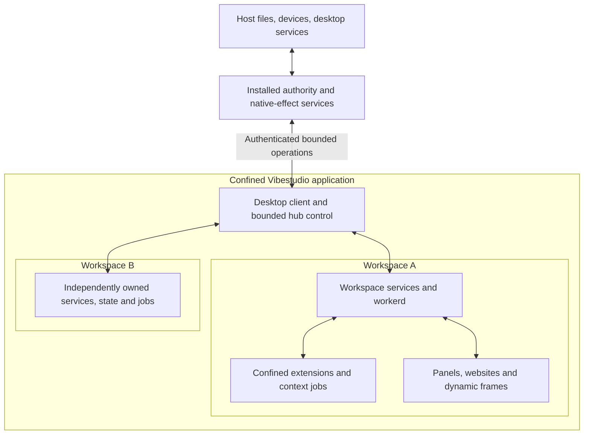

# Cross-platform application and workspace isolation

Status: canonical implementation plan, 2026-09-05. Implementation is in progress. Initial Linux feasibility probes are recorded in the [investigation report](reviews/isolation-feasibility-2026-09-05.md); U1 remains open. Full application confinement is not implemented or certified.

Implementation has begun under the user's subsequent instruction to implement macOS and Windows without waiting for native test machines. Native runtime validation remains outstanding; its absence does not prohibit source implementation. The shared [resource-policy compiler](../packages/process-adapter/src/isolation/index.ts) implements Linux namespace arguments, macOS Seatbelt profiles and Windows admission manifests. The [Windows native launcher](../native/isolation/src/windows.rs) implements per-domain LPAC identity, creation-time Job Object membership, explicit inherited handles, staged resource ACLs/integrity labels, kernel-token verification before resuming guest code, and owned retirement. These components have not replaced application launch paths.

The shared [workspace command host](../packages/process-adapter/src/isolation/workspace.ts) now launches multiple commands through one compiled sandbox and carries the existing extension RPC protocol over bounded inherited pipes. Production extension RPC has switched from loopback WebSockets to launcher-bound process sessions; the same receiver dispatch and revocation remain in force. Development and packaged extensions use one self-contained built bootstrap, without a TypeScript fallback or inherited host launch arguments. Production process creation has **not yet switched** to OS confinement.

Validation includes real concurrent Linux workspaces, shared command state, independent cancellation, host/sibling and raw loopback denial, immutable-input and link-write denial, the actual built extension runtime inside the Linux sandbox, and the managed `extension-invoke-roundtrip` system test (`st_51631ed6ace842a5a6b697c9b0ae38b4`, passed; owned instance stopped). A shared native conformance suite and Linux/macOS/Windows CI matrix are implemented. Native Mac/Windows execution and packaged signing remain unverified. Independent review corrected logical RPC retirement, disconnected/full IPC handling, and host-enforced post-exit drain deadlines.

Latest clean-bootstrap validation: 20 native isolation checks, 10 focused process/extension runtime checks, and 100 filesystem/schema checks pass on Linux. Fresh managed doctor also passes using the repository's pinned, owned local Iroh relay fixture after intermittent public-relay readiness failures. The subsequent agentic run `st_3aa566fb9e904c9d9360b1503631b587` failed: the agent selected the gated `serverLog.stats()` host service and never invoked an extension. Its failure packet was inspected; no approval policy or scenario prompt was weakened. The managed instance, relay fixture and diagnostic processes were stopped. The earlier passing run is evidence for its revision, not a claim that the latest agentic run passed.

Pre-commit review (2026-09-05): the focused host regressions cover 308 tests; all pass after updating the retired terminal's error-name assertion to the shared native PTY terminology. The real Linux conformance suite passes 20 checks, and seven Base terminal authority/lifecycle/component tests pass. `cargo check --locked` passes for the Windows launcher module on Linux. Host/worker type checking, Base semantic-projection type checking, authority catalogs/reviewed census, package boundaries, lint and formatting are checked before commit. No native macOS/Windows or packaged-app conformance is claimed. The remaining production launch, protected filesystem-worker and outer application/broker cutovers stay open; these commits are implementation milestones, not completion of U1–U6.

Pre-release cutover rule (explicit user direction): no backward compatibility, state migration, dual readers, legacy launch fallback, or preservation of obsolete layouts. Implement the current design directly and verify fresh instances. Missing required artifacts or enforcement fail explicitly.

Approved scope addition: explicitly authorized host terminals target all three platforms. After production cutover, ordinary workspace terminals must remain confined. A host terminal is a separate installed-broker effect that runs with the broker's ordinary OS user account access; it is never an automatic fallback when workspace confinement denies an operation.

Approved scope revision (2026-09-05): the workspace is the native sandbox boundary, shared by its commands, extensions and their descendants. Command cancellation is best effort on all platforms. Per-command/context OS separation and guaranteed termination of hostile descendants are not requirements. Use native macOS confinement; a Linux VM and Endpoint Security descendant tracking are not prerequisites. The Seatbelt compiler still needs integration and native validation before it is a complete executor. Earlier per-job feasibility results remain evidence, not requirements to preserve that granularity.

This plan owns all Vibestudio isolation work: containment of the desktop app and server, workspace separation and context routing, native execution, browser and eval confinement, network and credential boundaries, authority propagation, and teardown. Earlier plans remain useful sources of requirements and evidence; their isolation architecture, sequencing and acceptance criteria are subordinate to this plan. Section 12 records their disposition.

The starting evidence is the [Base extension host-access survey](base-extension-host-access-survey.md). The product ownership model comes from [agentic bundles and workspaces](agentic-bundle-partitions-plan.md): workspace is the app isolation/ownership scope; contexts are branches/tasks within it; there is no additional partition concept. That plan's Base extraction, independently owned personal/system services, website behavior and complete template-system removal remain requirements.

## 1. Decision and completion target

Run app code with only app-owned resources and workspace code with only its workspace resources. Commands, native extensions, tests, builds and agent CLIs share their workspace sandbox. Contexts and command IDs retain routing, provenance and lifecycle meaning; they are not mutually hostile native security domains. Selected external resources are acquired through installed, bounded native services. No workspace extension is an unrestricted host plugin.

Use one workspace policy and admission model with platform-specific enforcement: Linux namespaces/bubblewrap, native macOS Seatbelt profiles, and Windows AppContainer-family restrictions with native helpers. macOS App Sandbox remains an outer-client packaging option where compatible; custom Seatbelt maintenance and native compatibility are explicit delivery obligations. All three are first-class delivery targets. Decide supported OS versions/architectures and packaging from native evidence; command cleanup need not use identical kernel mechanisms.

Android/iOS clients retain their platform app sandbox and permission mechanisms. The same workspace, document, credential, remote-call and approval invariants apply to them; they do not receive a desktop native executor or inherit a paired computer's resource grants. Mobile-client boundary tests are required for shared protocol changes. This plan does not propose running the desktop native toolchain on a phone.

This is lightweight process/resource isolation. It does not require a VM per app, an OCI runtime, a container daemon, a second workspace hierarchy, or an isolation implementation per extension. Existing browser/workerd runtime boundaries remain valuable; OS enforcement closes native and machine-level gaps.

Completion means that the common host/workspace/broker boundary suite passes on the supported Linux, macOS and Windows configurations, including packaged desktop and headless execution. Lifecycle tests report actual cleanup outcomes separately from access-control results. A Linux prototype alone does not complete this plan. An essential runtime that cannot be confined is an architecture problem to resolve before release, not grounds for an unconfined fallback.

### Size, risk and delivery boundaries

This is a major architectural programme, with a rough planning scale of multiple engineer-months for the complete scope. That is an order-of-magnitude assessment, not a delivery estimate. The extension survey establishes required access; it does not establish platform feasibility or implementation cost. U1 must resolve the highest-risk assumptions before committing to a full schedule.

| Deliverable | Relative scope and uncertainty |
| --- | --- |
| Outer Linux app containment prototype | Bounded feasibility work. Real Electron desktop/network integration still needs proof. |
| Cross-platform native isolation substrate | Substantial systems work. Shared workspace sandboxes remove per-command separation and strict descendant retirement from the requirements. GUI networking, macOS compatibility and executable signing/loading remain backend questions. |
| All native/runtime/authority boundaries | Major integration work across launchers, resource ownership, RPC, credentials, eval and browser execution; the blast radius exceeds the 13 extensions. |
| Bundle/Base/system/personal product cut | Additional product restructuring already required by the bundle plan. It consumes the isolation substrate; it is not all new sandbox implementation. |

One canonical plan does not require one indivisible implementation. Accept the reusable substrate against its own invariants and fixtures without waiting for all bundle UX or template removal. Preserve the full U5 product obligations and U6 overall completion gate. Partial engineering milestones must state which invariants they prove; they cannot be marketed as complete app/workspace isolation. U1 is a bounded experiment set with explicit falsifiers in section 8, not permission to start an open-ended cross-platform rewrite.

## 2. Threat model and invariants

Assume arbitrary malicious code in a workspace package, dependency, native extension, terminal, build/test script, external-agent subprocess, visited page or dynamic UI. Include stolen credentials available within that execution, deliberately forged RPC arguments, descendants that daemonize, and malformed native-helper inputs. Also consider compromise of an ordinary app/controller process when assessing the outer machine boundary.

Trust the OS/kernel and the minimal installed confinement, authority and native-effect implementation. Do not claim protection against a machine administrator, a separate unrestricted process already acting as the OS user, kernel/driver exploitation, or all resource-exhaustion and side-channel attacks. Workspace users need not be adversarial for their downloaded code to require confinement.

| ID | Required invariant |
| --- | --- |
| I1 — Machine | A compromised confined process cannot read/write unrelated host files, inspect/control host processes, or reach host control services without the corresponding explicit exposure. Read-only visibility of the host home violates this invariant. |
| I2 — Ownership | Workspace A cannot enumerate or access B's source, state, contexts, private catalog, agents, logs, credentials or runtime endpoints by guessing an ID/digest/path. Explicit transfers and service calls disclose only their selected resources. |
| I3 — Native execution | Each workspace sandbox has an authenticated owner and incarnation, admitted bootstrap/toolchain and constrained files/environment/network/IPC. Commands and dynamic code share its native authority; descendants cannot acquire broader launcher, host or another workspace's authority. Context/command labels do not establish native isolation. |
| I4 — Authority | Effects are authorized at the owning receiver from verified live identity, admitted code, resource, session and applicable lineage facts. Native caller identity is workspace-scoped; command-supplied labels cannot prove a narrower exact-code principal. A manifest, transport token, source path, parent relationship or opaque resource handle is not an approval. |
| I5 — Secrets | Workspace code cannot read controller, broker, personal vault or another workspace's secrets. Provider secrets stay behind mediated use except a deliberately provisioned native-client login. Any credential delivered into a shared native workspace must be treated as available to all its native commands; separate agent profiles are organization, not a confidentiality boundary. |
| I6 — Runtime | Evaluated/authored code cannot acquire the containing runtime's globals, privileged loader, transport credentials or principal through prototype chains, dependency loading, iframe relationships or alternate call paths. |
| I7 — Integrity | Managed source, authority state, installed trusted code and immutable artifacts cannot be rewritten through direct native I/O. Changes use the canonical semantic/publication mechanisms; job scratch remains writable. |
| I8 — Lifetime | Command cancellation and descendant cleanup are best effort. Workspace stop/session retirement revoke the applicable broker authority and close broker-owned streams/routes; surviving descendants remain confined but may retain directly accessible workspace files and private listeners. Report cleanup outcomes without asserting complete termination or direct-resource revocation. Window closure does not accidentally terminate a persistent workspace. |
| I9 — Parity | Host/workspace separation and protected broker authorization have the same meaning across platforms and desktop/headless/source/system-test launches. Cleanup strength may differ and is reported truthfully. Unsupported required access controls fail before guest code executes. |

Existing in-workspace collaboration and open-tier service behavior may remain where intended. They do not imply cross-workspace access or ambient privileges for websites. This replaces older mutually-trusted-environment assumptions wherever those assumptions waived an isolation boundary.

The shared native workspace is one compromise domain. Native code can access other commands' exposed context projections, scratch, files and workspace-scoped IPC; command cancellation does not revoke that access. Keep managed semantic/authority backing stores and protected service credentials outside that domain. Receiver context checks remain useful API rules but cannot promise secrecy or agent isolation from arbitrary native code in the same workspace. Use separate workspaces for mutually untrusted native workloads; do not recreate per-command sandboxes as an implicit requirement.

A compromised authorized principal can exercise the rights it already holds; code identity is not an RCE detector. The outer boundary limits a compromised ordinary controller to its actual granted machine resources. It cannot prove that its use of those resources still expresses user intent. Protecting grants alone is insufficient if that controller can forge the identity, resource or approval facts used to obtain additional authority.

## 3. Ownership and process architecture

These are trust roles, not new product containers or mandatory one-process-per-box rules. A platform may combine components only when doing so does not give lower-trust code additional reachable resources.

The application enclosure describes a common maximum machine-access policy. It need not be one shared filesystem namespace on every OS. Each workspace narrows that maximum; its ordinary commands inherit the workspace policy without another sandbox admission.

### Installed authority and native effects

Keep the minimum trusted components that establish process identity, enforce external grants, select native resources, access OS credential facilities and perform bounded host effects. Use independently restricted helpers where their duties differ. A browser-profile parser does not need installation authority; a network relay does not need home-directory access.

They load only installed code/dependencies. Their executable, policy, grant records, IPC credentials and mutable configuration are inaccessible to workspace processes and to app code being constrained. Never load a workspace bundle or execute project build hooks within the broker's privilege domain. Native desktop dialogs display verified identity and resource information when host access is acquired.

Protect the narrow registration and verification roots for runtime ownership/incarnation, admitted executable identity, native resource binding and user decision. The installed launcher registers execution facts through an authenticated channel; native selection and resolution establish host-resource facts; the protected decision owner establishes approval. Ordinary controller-supplied labels, catalog entries or claimed digests cannot replace these facts. Product services and catalogs do not all become trusted merely because some of their metadata is displayed in an approval.

Do not move the complete server, all Electron main code, workspace orchestration, catalogs or application product logic outside confinement. Those are precisely the large surfaces this work is intended to contain.

### Explicit host terminals

Implemented: the terminal panel now offers **Open host terminal…**, backed by the native `hostTerminal` service. Every open uses a fresh critical confirmation with host/workspace/shell disclosure. Sessions belong to the exact authenticated connection lifetime, lose control immediately on disconnect or close, and use bounded PTY I/O. The panel labels full host access persistently, never restores host sessions, and closes a session whose approval finishes after unmount. Linux native PTY, real-dispatcher approval, ownership/lifetime and panel component tests pass; native macOS/Windows execution remains unverified. This service is registered in the current trusted server; moving that receiver into the installed broker remains part of the unfinished outer cutover.

Expose a distinct `hostTerminal` service, with a critical approval to open a session. The approval names the host and requesting workspace/principal and states that arbitrary terminal input can access the OS user's files, credentials, network, processes and other workspaces. This is full user-account host authority, not administrator elevation or a scoped file grant. The earlier machine, secret, integrity and cross-workspace guarantees do not protect the user from code they explicitly run in that host terminal. Native-workspace callers acquire this authority for the shared native workspace, not a secretly isolated command.

The installed receiver launches the host-selected shell and owns the PTY (Unix PTY on Linux/macOS, ConPTY on Windows). It accepts bounded input, output reads, resize and close for an opaque session bound to the verified initiating identity and live connection. A workspace cannot select an unconfined execution flag on the ordinary command launcher. The broker does not execute shell input in its own process or grant its authenticated control channel to the shell. UI identifies host terminals persistently and keeps workspace terminal creation as the default.

Closing or disconnecting retires the session's control authority before best-effort process cleanup. Completed host effects cannot be undone and surviving host descendants are unrestricted; closing a host terminal is not proof of host-access revocation. Report observed process exit separately from descendant cleanup. Workspace stop closes the host-terminal sessions it owns; another workspace's sessions remain intact. No general elevation to administrator/root is implied.

Acceptance includes denied/unapproved opens, forged or other-session controls, retired handles, bounded I/O and native PTY behavior on all platforms, plus a positive explicitly approved read of a host canary. Ordinary workspace terminals must still fail the same host read.

### Client and hub

The system client may aggregate workspace trees and metadata for the user; each workspace receives only the explicitly disclosed projection. Browser sessions, the personal browser vault and personal assistant memory belong to their explicit personal/system owner, never to every workspace that shares Base code. Device-wide identity and grants remain inaccessible to native guest processes.

The bundle plan defines three self-contained source distributions: Personal, System and minimal Base. Existing bootstrap/registry mechanisms ensure a private Personal/System pair for each authenticated user on the selected server/hub, including shared servers; receivers prohibit sharing or additional members for either designated role. Other workspaces may have multiple members under explicit roles. Base need not be a running workspace. Personal is the user's home, not a privileged parent. Each user's protected System role owns their host-target client applications and inventoried user-system operations. Installed bootstrap and exact release admission protect that designation; names, manifests, ancestry and ordinary allow prompts cannot confer it. A system-only execution requires the acting user's designated System runtime plus admitted code, resource, user/session and grant checks. It cannot borrow another user's System identity or personal grants. Server-operator and shared-resource authority remain separate; System designation does not confer server administration. All workspace code stays confined; websites inherit no grants even when visited in System.

About panels are semantic/host-known page roles, not privileged paths. Resolve each known implementation from its declared owner: the authenticated viewer's System or the current workspace; local New and other Base-supplied workspace pages need not live in System. Shared panels store their semantic role and target, not their creator's private System reference. Each instance remains bound to its displaying panel's workspace, context, user and document. Neither an `about/` path nor shared System-sourced bytes turns a local instance into a System caller. Host capabilities execute at protected host receivers even when System displays their approvals. Operations actually owned by System require its authorized local surface; cross-workspace application RPC into System is blanket-denied without prompts or forwarding exceptions. Explicit navigation neither executes a pending action nor transfers grants, and retains initiating user/workspace/website attribution. Preserve document/inspection boundaries so sibling code cannot read sensitive page content or borrow its bridge. New panel creation captures the initiating/focused panel's workspace; later focus changes cannot retarget the page or its pending effects.

Cross-workspace communication extends existing RPC and the canonical authority path. Exact workspace/service/object/method addressing and deliberate exports precede evaluation of source egress, destination ingress and ordinary operation authority. Default-deny boundary policies with explicit permitted scopes are hard ceilings: prior grants and approval prompts cannot override them. System supplies policy-management UI, while protected receivers enforce policy ownership and prevent mutable code/imports from rewriting it. Shared-workspace administrators control their boundary, not members' private account consent. Discovery is separately gated metadata disclosure; known addresses supply no authority. Responses and streams are bounded returns on authorized calls, not permission for reverse invocations.

The existing hub remains the workspace director. Extend its lifecycle owner with confinement ownership instead of introducing a second machine daemon that races it. The security-critical launch/verification operation belongs to installed code; the ordinary hub's application and routing work stays confined.

### Workspace and native principals

Reuse existing workspace IDs, context IDs, runtime principals and execution artifacts. Each workspace server/workerd receives only its own mutable state and authenticated routes. Immutable bytes may be deduplicated, but access still requires an owned reference; a digest is not a read capability. Writable caches cannot be shared across mutually untrusted owners without independent integrity validation.

A workspace's native extensions and commands share its exposed files, private home, scratch and internal endpoints. Per-extension principals and directories may remain for orchestration, but are not OS-enforced confidentiality boundaries. Controller/vault databases, managed backing stores and broker signing material stay outside. Materialize context inputs into workspace-owned projections or use the existing filesystem service, including for file-tools and `ctx.fs.realpath()` consumers. Do not start a separate sandbox for each invocation or context.

Shells, test runners, external agents, compilers, package lifecycle scripts and inference engines use the same confined native-execution mechanism. Their descendants inherit the effective scope. Tool-specific orchestration remains in Base or its extracted owning bundle; platform containment does not.

Treat the workspace's native processes as one OS authority unit. Shell input, build scripts, downloaded dependencies, generated executables and JIT code can run within that scope without a new prompt or privileged interception of every `exec`. They do not become the installed broker's principal or earn fresh exact-version grants. Seeking additional host authority or exporting/publishing output uses the protected receiver. Record command inputs and acquired/generated artifacts for provenance; these records do not prove distinct hostile native caller identities. A broker must treat tokens accessible inside the shared workspace as workspace authority, not proof of a specific command or agent.

## 4. One policy, one authority model, one admission path

The confinement layer enforces the existing authority model at the OS boundary. It does not invent another grant ledger, permission language, approval queue, workspace registry or transport protocol.

### Policy inputs and enforcement output

Derive execution policy from authenticated ownership and the exact sealed runtime/build, then intersect it with live authorization. Use the existing identity, manifest, receiver-definition and prepared-invocation machinery. The internal resolved policy needs these facts:

| Fact | Meaning |
| --- | --- |
| Owner | Authenticated workspace sandbox and incarnation. Context/runtime/session/command labels support protected receiver rules and provenance; guest labels cannot manufacture a narrower native principal. |
| Executable and inputs | Exact sandbox bootstrap and admitted toolchain. Workspace commands, acquired/generated code and source/dependency projections stay under workspace authority; installing separately privileged code requires exact admission. |
| Files | Resource references with read/write/execute rights; app/runtime roots, exposed workspace projections, scratch and explicitly acquired files. Protected backing stores remain outside. Platform paths are resolved privately. |
| Environment and handles | Default-deny environment; explicit executable lookup, private home/temp; enumerated inherited handles and scoped IPC endpoints. |
| Network and devices | Receiver-authorized destinations/listeners and selected devices; neither means access to the host network namespace or entire device tree. |
| Effects and limits | Read-only constraints, applicable credential use, resource budget, parent execution and cancellation owner. |
| Installed policy identity | Version/digest of the trusted enforcement policy used by the platform backend, independent of guest declarations. |

Backends implement workspace admission, launch, inspection and best-effort cleanup for this one resolved contract. The protected broker owns enforceable revocation of its operations and streams. Await owned launchers and observed children and record residual/unknown process state; do not equate a root exit with complete descendant retirement. Do not expose raw bubblewrap flags, entitlement strings or arbitrary ACL updates through the product API. Full host execution is available only through the separately authorized host-terminal service above.

The supervisor records actual enforcement alongside the existing execution/lifecycle record: backend identity, applied policy identity, owner/incarnation, created handles/routes and retirement outcome. A ready file, PID, health response or guest-supplied `sandboxed: true` is not proof. The trusted launcher binds the live process/channel to its creation evidence using platform mechanisms. Keep this evidence in existing execution/lifecycle storage rather than inventing a parallel receipt database.

### Acquiring native resources

Use the canonical acquisition coordinator, typed receiver contracts, grant store, exact prepared state and cancellation model. Move the necessary authority core to a protected owner if its current placement permits the caller being constrained to forge approval. Do not copy the same mutable grant database into multiple authorities.

The native-effect receiver verifies the protected decision or asks that canonical owner directly. A compromised ordinary app server cannot simply assert that approval happened. Guest code cannot mint trusted user input. Broker prompts use a trusted native/system surface, with source and destination workspace when relevant; arbitrary workspace UI is presentation only.

Validation includes the protected provenance of identity and resource facts, not just a signed decision blob. Before irreversible export, publication, installation or other external commit, the owning receiver revalidates the live grant and exact prepared inputs/frontiers. A queued operation cannot commit on a revoked preparation. Consume a once decision for its canonical operation, and bind retries to existing idempotency/recovery state rather than minting another effect. An external effect already committed cannot be undone by later revocation; report that outcome distinctly.

Preserve the current `once`, authority-`session`, and exact-`version` decision semantics and fresh-critical requirements. A durable session can outlive a process. An OS handle or process lease cannot: reconstruct access under current authority on restart. A resource handle selects an object; possession alone does not authorize its use. Do not introduce a generic TTL that changes these rules.

Ordinary in-scope operations reuse existing grants without repetitive prompts. Ask only when the concrete operation crosses a new boundary or existing authority requires renewed review. Show resource/action choices to users, not namespace or entitlement settings.

Any direct resource addition or reusable native broker credential becomes authority of the shared workspace, including its already running commands. Acquire and display that scope honestly; a requesting command's label does not limit which sibling can use the resource. Finer document/service authority remains valid only where a separate protected runtime actually enforces it.

### Revocation and read-only execution

Revocation stops new broker operations and tears down broker-owned streams/routes. Cancellation requests process cleanup but is not the enforcement mechanism for host-resource revocation. Prefer brokered import/export and copied inputs for host files. A copied file or delivered secret cannot be recalled. Direct file/device exposure may survive cancellation or workspace stop while a descendant remains alive; do not offer immediate revocation semantics for that exposure or report it revoked without kernel evidence.

Application resource handles select objects without granting authority. Actual OS handles/mounts/ACL permissions confer their granted access while live. Do not claim to reevaluate a central grant on every native file read. Model direct workspace exposure separately from revocable broker effects. Workspace storage stays stable while owned by the same workspace domain; process restart is not a clean security reset. Surviving commands may retain access to present and subsequently added contents of exposed directories, including workspace-delivered credentials. Do not copy every workspace tree merely because its supervisor restarted.

Use fresh launcher/broker session identities and keep retired sessions and grants unusable. Never transfer exposed paths to another workspace/owner, restore security descriptors, or publish output on an assumption that best-effort cancellation killed every process. Quarantine residual resources before deleting/reassigning ownership. A deliberately clean reset requires fresh storage and authority; an ordinary restart makes no such promise.

Managed source projections remain OS read-only and backing state remains receiver-owned; workspace scratch is writable. A read-only command label within a workspace that also holds writable authority is an API/workflow restriction, not an adversarial native boundary: another command's accessible tokens and scratch cannot be protected from it. Enforce genuinely read-only native authority at the workspace scope. Preserve receiver restrictions, and remove stronger per-command claims instead of adding a second sandbox path to preserve them.

## 5. Resource policy

### Filesystem and process state

- Provide a private home, configuration, runtime sockets and temporary directory. Populate a reviewed toolchain instead of inheriting host `HOME`, `PATH`, shell startup files, SSH agents, package-manager config or arbitrary environment secrets.
- Keep trusted app/runtime executables and selected dependency projections read-only to guests. Put package installation and generated binaries in owned staging; verify/seal reusable artifacts before another trust domain consumes them. Includes native postinstall scripts and downloaded model engines.
- Production build metadata and durable dependency projections already live beneath `workspace.statePath/builds`; centrally shared payloads do not make this a profile-wide directory. Admit only owned resource trees. Windows hardlink/reparse constraints and macOS hardlink enforcement still require their own materialization/denial evidence.
- Materialize context inputs and disposable working trees within the workspace sandbox. Context directories organize work; they are mutually accessible to native commands in that workspace. Semantic state and protected main remain receiver-owned. Import reviewed worktree changes through the canonical semantic path instead of granting writes to the backing state store.
- Bind disposable worktrees to an exact initial semantic frontier. On import, validate the resulting changed-file set, destination frontier, current authority and retained provenance; generated output does not become trusted merely because the build succeeded. Filesystem writes inside owned scratch do not each need a grant-ledger entry. Only the canonical import/publication crosses into managed state.
- Resolve selected external resources by OS handles or anchored, race-resistant operations; prevent symlink/reparse-point substitution, traversal, case/path aliasing, hardlink write-through, and check/use races. Guest-writable descendants cannot change the meaning of an approved destination.
- Protect controller/broker and other-workspace tokens from environment inheritance, files, process inspection, shared temporary sockets and crash logs. OS separation must deny debugging, signalling and handle acquisition across those boundaries, not just hide directory names. Within the native workspace assume shared token/process visibility.
- Add bounded process count, output, memory, disk and execution limits appropriate to each workload. Interactive agents and human approval waits are not killed merely because a short command timeout elapsed; their owned resource/lifecycle policy still applies.

### Filesystem receiver placement

Independent implementation review rejected a new tagged source/scratch path API as unnecessary. Keep the canonical contextual `fs.*` contract. The protected receiver owns caller/context resolution, logical-path classification, semantic reads and mutations, and provenance. Extract whole raw-disk operations into one worker in the shared workspace sandbox: path walking and validation, scratch I/O, bounded readers, glob/ripgrep, open handles, and cancellation. Use one required typed disk port over the bounded process carrier, without a host-local execution fallback. Moving individual `fs` calls across RPC would preserve the vulnerable separation between path checking and use; it is not the design.

Maintain separate physical source and scratch roots internally. Reserved managed namespaces belong wholly to the read-only source projection; other logical paths belong to scratch. Ignored files inside managed repositories cannot silently become writable projection files. Native tools install packages and create working trees under scratch, then import changes through the semantic receiver. Logical root listings remain service results. Native callers must receive explicit source/scratch locations: `realpath("/")` cannot truthfully represent two physical roots without an overlay. Change those callers directly; do not preserve the old mixed layout.

Never grant the disk worker trusted `ServiceContext` construction or the semantic direct-call capability. Classify semantic mutation targets from the original caller's logical path, never from a worker-reported canonical path. Treat worker-returned bytes, names and metadata as untrusted native output. Managed provenance requires a semantic read or independent verification against the selected snapshot. The protected receiver binds remote handles to caller and worker generation and retires those mappings when the worker session ends.

This extraction and production resource-owner wiring remain prerequisites for the native process-factory cutover. Merely replacing `createProcessAdapter` would leave privileged host disk operations reachable over RPC, and admitting writable context projections would expose protected semantic state. Neither is an acceptable completion of the cutover.

### Network

Native guest processes have no unmediated host/LAN access. All effective network paths must be attributable to a runtime or trusted network service. Preserve the existing workerd egress and credential mediation; constrain native sockets so a proxy environment variable cannot be bypassed.

Use these distinct resource classes within the existing evaluator:

| Network use | Policy |
| --- | --- |
| Workspace RPC and internal inference | Only the exact admitted endpoints/principals; no unrestricted host loopback. |
| Public browsing, APIs, registries and Git | Existing authority rules plus an externally enforced route. Broad public browsing can be allowed without permitting host, private or link-local destinations. |
| Local development services/LAN APIs | Explicit destination and port grant; not implicit in Internet access. |
| Preview ingress and OAuth callbacks | Owned listener, intended reachability, bounded routing and lifetime; authentication/state checks remain at the receiver. |
| Iroh/remote pairing | Dedicated installed transport role with the TCP/UDP capabilities it actually needs. Pairing and exposure are explicit; it provides authenticated app transport, not a general relay to arbitrary host endpoints. |

Resolve and check actual addresses at connection time; cover redirects, IPv6, mapped addresses, DNS rebinding, proxy CONNECT, WebSocket, UDP/QUIC and browser WebRTC paths. Preserve HTTPS endpoint authentication; do not introduce a blanket TLS interception certificate to implement isolation. Credential injection remains bound to each authorized destination and redirect policy.

Keep connection-level and HTTP-level authority distinct. A TCP/UDP/CONNECT relay can enforce its selected destination/address/port and lifetime; it cannot validate encrypted HTTP methods, paths or headers inside an arbitrary native TLS stream. Native jobs receive only explicitly authorized connection-level access. Finer URL/method/credential rules use the trusted HTTP/fetch receiver, which constructs the authorized request and applies redirect/audience checks. Do not present raw tunnel access as proof of HTTP resource-level enforcement or widen a narrow HTTP grant into a tunnel silently.

Prefer existing fetch/stream interfaces and explicit proxy-capable native tools. The platform proof must demonstrate how each process with native sockets is restricted. macOS network entitlements are not a destination firewall, and Windows loopback exceptions are not free internal IPC. If a necessary tool needs raw network APIs, supply an enforceable scoped route or redesign its placement; setting proxy variables alone is not acceptance evidence.

### Desktop and devices

Only the graphical client and its necessary renderer/GPU processes receive display/input resources. Native workspace processes do not receive X11, unrestricted D-Bus, automation/accessibility control, camera/microphone, keyring or desktop-manager sockets by inheritance. Use platform-selected file/media/desktop services and scoped native interfaces.

GPU inference receives a selected backend's required drivers/devices, separately from general device access. Android/iOS diagnostic operations bind to the selected device and app. Build tooling that can run project scripts remains confined even when an installed SDK or signing operation is involved. Camera/microphone/clipboard permissions retain existing origin and caller enforcement inside the outer OS grant.

## 6. Runtime isolation absorbed into this plan

| Runtime/boundary | Required implementation |
| --- | --- |
| Native extensions, shell, CLI agents, tests, builds | One OS-backed workspace sandbox shared by its commands and descendants; best-effort command cancellation. Replace the Claude-only confinement declaration and independent launch policies. Preserve Claude's channel/profile workflow without claiming profile secrecy from sibling commands. |
| Worker/DO | Keep production workerd isolation, explicit bindings and mediated egress. Constrain the process to its owning workspace. Audit shared infrastructure/user-code isolates and stores; split protection domains where shared globals or native access otherwise expose authority. |
| Eval | Private guest globals/module state and bounded endowments; no accessible privileged compiler, Node loader or infrastructure client. Test constructors/prototype chains, dynamic import, shared intrinsics and async callbacks across owner/session boundaries. Preserve current scoped Node compatibility aliases. |
| Authored UI/dynamic iframe | Distinct authenticated frame/document principal and private bridge; containing chat/panel credentials stay inaccessible. Parentage does not lend authority. Navigation, reconnect and document replacement invalidate or revalidate scope. |
| Panels/websites | Chromium renderer sandbox and context isolation remain enabled. Website bridge starts without workspace capabilities, even for open-tier/same-context shortcuts. Normal web cookies and capability grants remain distinct. CDP and automation are scoped effects, including across sibling panels/workspaces. |
| Receiver/RPC/DO/service calls | One authority semantics through all entry points, including direct calls, streams, events and native IPC. Preserve initiating and executing principals without unioning their grants. Receiver resource guards still apply. |
| Content integrity | Track mediated content with existing provenance rules. Retire the old assertion that shell/native paths do not exist. Record native inputs/dependencies/external resource acquisition and propagate results conservatively; do not claim complete information-flow tracking inside arbitrary native code. |
| Dependencies | Package review and static authority analysis describe admissible behavior; runtime reachability provides enforcement. If a bundle has erased package boundaries, treat it as one executable authority unit. Promise per-package attenuation only when linkage retains and enforces that boundary. |
| Workspace transfer and communication | Extend RPC with exact workspace addressing, deliberate exports, separately gated discovery and hard source-egress/destination-ingress policy before ordinary capability approval. System rejects cross-workspace application ingress. Preserve selected transfers, reviewed merges, shared-audience disclosure and user/workspace/website attribution through results, references and multi-hop calls. Recheck authority on effects/delivery; policy/member changes retire affected access. Shared agents cannot pool personal grants; returned references confer no authority. Reuse durable task/subscription lifecycles when concrete workflows need them. CAS sharing, panel trees and source ancestry confer no access; connections do not mount workspaces or introduce live Base linking. |

The earlier Hardened JavaScript work is incorporated as a runtime work package, not a competing sandbox programme. Prefer maintained confinement mechanisms compatible with the actual runtime. Do not transplant SES into workerd by patching its evaluator or declare a custom scope proxy secure by construction. Decide the concrete eval mechanism after checking the current loader and adversarial evidence: use an enforceable private realm/isolate with explicitly passed authority, and move the guest execution boundary if existing workerd constraints prevent that. A separate Node sandbox or per-package framework is not added merely for consistency of branding.

This retains useful native JS inside a confined process while preserving the stronger invariants expected of dynamically authored evals. Scope restrictions apply to the primitive receiver and native resource, so bypassing a TypeScript wrapper does not widen access.

## 7. Extension and feature integration

All 13 surveyed extensions are accounted for here. Their current package names identify migration inputs, not permanent distribution ownership.

| Current extension(s) | Target treatment and parity proof |
| --- | --- |
| `browser-data` | Keep workspace/personal orchestration confined. Acquire the selected external browser/profile/categories through the native receiver; parse bounded snapshots in a restricted helper. Sensitive records go to the protected personal browser vault; ordinary app workspaces get only intentionally disclosed results. Cancel/release deletes acquired temporary material. Unsupported decryption stays an explicit capability limitation. |
| `mobile-debug` | Confined facade over selected-device operations. Restrict adb/Apple-tool access at the receiver; no general adb socket sharing. Builds run confined; signing/install/launch are separately authorized effects on exact inputs. |
| `local-models` | Confined engine processes, selected GPU resources, owned model cache and internal listeners. Preserve in-place GGUF use with an explicit persistent read exposure; do not silently turn it into a full-home grant or expensive copy. Explain that a surviving process may retain that direct read access after cancellation; immediate broker revocation does not retract it. Test each supported backend. |
| `claude-code` | Shared workspace sandbox for interactive and headless launches. Workspace-owned CLI profile and bridge. Prefer mediated provider use; where a native login is necessary, explicitly provision it to the workspace, with bounded acquisition and compare-before-write host refresh reconciliation. Assume every native command in that workspace can access a delivered login. Host credential stores remain protected. |
| `shell`, `test-runner` | Usable contained toolchain, PTY and subprocesses. Context input/scratch and scoped calls. Keep panel/workerd/native test runtime selection; no fallback of portable tests to native or unconfined execution. |
| `file-tools`, `image-service`, `pdf-ingest` | Workspace-contained native operations, with context attribution or bytes-in/bytes-out APIs. Bundle required binary/runtime assets. No host-resource grant for ordinary usage. |
| `react-native`, `typecheck-service` | Native bundling/typecheck/dependency jobs inside, with selected source, dependency closure, caches and mediated registry access. |
| `git-bridge`, `template-composer` | Retain reusable Git/CAS/semantic acquisition and mediated credentials inside. Carry local-source import/publication forward into the bundle/Base release model. Delete template-specific implementations under the bundle plan; do not preserve them as a sandbox compatibility layer. |

System client file pickers return selected resources usable across the boundary, not unexplained host paths. Downloads stage inside and export to an explicitly selected file/destination; a remembered Downloads grant can preserve convenience. Opening/revealing an exported file is a separate typed native effect, with executable/custom-scheme behavior reviewed rather than handed to a shell.

Source development, profiling and self-hosted system tests use the same executor and ownership. A source build may be admitted as development code with explicitly selected checkouts; this grants neither host home access nor authority to rewrite the installed broker. Rehearsing a replacement host build is an isolated execution. Publishing files back to the selected developer checkout and installing a trusted application release are separate effects. Do not run Git hooks or other checkout-provided code in a privileged publisher.

## 8. Cross-platform implementation and feasibility gate

The [2026-09-05 investigation](reviews/isolation-feasibility-2026-09-05.md) supplies executed Linux evidence and a reviewed Windows/macOS mechanism assessment. Linux passed concurrent native-domain, generated-code, PTY, workerd, scoped socket, revocation and software-rendered Electron probes. The actual prebuilt hub failed its Iroh online-readiness requirement when confined networking denied DNS. Full workspace startup, real desktop/GPU integration, protected receiver conformance and native Mac/Windows execution remain unproved. These results permit focused substrate work, not U1 completion or cross-platform design lock.

Treat Iroh as a first-class native network integration. Prove an enforceable scoped transport route or bounded installed transport service before complete hub/workspace startup. Do not solve this failure by putting the whole hub outside confinement or widening native-job networking.

On macOS, implement a maintained native Seatbelt backend at workspace granularity. Custom SBPL/`sandbox-exec` is not a supported third-party equivalent of bubblewrap, so signed artifacts and each supported OS release require compatibility and denial testing. Best-effort cancellation removes strict descendant tracking as a prerequisite; neither a Linux VM nor Endpoint Security entitlement is required by this plan. Cross-workspace filesystem/process/IPC separation and protected broker identity still require proof. See the investigation for primary sources; its earlier strict per-job lifecycle gate is superseded by the approved scope revision above.

Target equivalent resource guarantees, not identical mount layouts or identical system calls. Use one policy vocabulary and backend conformance interface. No per-extension platform dispatch and no user-facing “unsafe compatibility” mode.

| Platform | Candidate mechanism | Must prove before design lock |
| --- | --- | --- |
| Linux | bubblewrap with explicit filesystem, PID/IPC/user/network isolation, minimal devices and a reviewed syscall policy; filtered desktop IPC and enforceable network routing. | Distribution user-namespace availability, Electron nested sandbox, workerd/JIT/native modules, PTY process ownership, selected GPU drivers, restricted display and networking. No `--ro-bind / /`, full `/dev`, host PID/network namespace, or unrestricted desktop bus as an expedient. |
| macOS | Native Seatbelt workspace profiles and signed restricted helpers; App Sandbox is an outer-client option subject to packaging compatibility. | Outside-store distribution/signing, Node/workerd JIT, native/dynamically acquired binaries, PTY/child sandbox inheritance, concurrent workspace separation under the same shipped helper identity, network enforcement and device integrations. Test Electron MAS compatibility only if selecting App Sandbox for the client. Existing `hardenedRuntime: true` and JIT entitlements are not App Sandbox. |
| Windows | AppContainer/LPAC as compatible, explicit resource ACLs/capabilities, restricted handle inheritance, native broker and Job Objects. | Desktop Electron composition, Node/workerd, ConPTY, all descendant launch methods, read-only selected resources, named pipes/loopback, GPU/device operations, debugger/handle denial and teardown without job breakaway. Job membership alone is not filesystem/network isolation. |

Linux bubblewrap constructs policy rather than supplying a ready-made security boundary. Native child sandbox and desktop IPC compatibility require explicit testing. [Bubblewrap documentation](https://github.com/containers/bubblewrap), [Flatpak sandbox permissions](https://docs.flatpak.org/en/latest/sandbox-permissions.html).

Apple documents per-target App Sandbox entitlements and child inheritance. Electron's standard `darwin` build does not support App Sandbox; its MAS build does, with feature differences. The current repository's `build-resources/entitlements.mac.plist` does not enable `com.apple.security.app-sandbox`. Choose the actual supported packaging/backend based on signed artifacts, not a claim of a drop-in macOS bubblewrap equivalent. [Apple entitlement reference](https://developer.apple.com/library/archive/documentation/Miscellaneous/Reference/EntitlementKeyReference/Chapters/EnablingAppSandbox.html), [Electron App Sandbox guide](https://www.electronjs.org/docs/latest/tutorial/mac-app-store-submission-guide).

Static signed sandbox rights and a separate XPC target do not establish separate workspace resource scopes. Apple also distinguishes inherited static entitlements from dynamic file access acquired after launch. The macOS proof must establish selected-file delivery and isolation for concurrent workspaces using the same shipped helper; different signed demo applications with different containers are not an adequate substitute. Commands in one workspace intentionally share its scope. [Apple sandbox inheritance](https://developer.apple.com/library/archive/documentation/Miscellaneous/Reference/EntitlementKeyReference/Chapters/EnablingAppSandbox.html).

Microsoft documents AppContainer capabilities and LPAC's stronger default restrictions; use those access controls with lifecycle enforcement. [AppContainer implementation](https://learn.microsoft.com/en-us/windows/win32/secauthz/implementing-an-appcontainer), [Job Objects](https://learn.microsoft.com/en-us/windows/win32/procthread/job-objects).

Each platform prototype must run a graphical client, hub/workspace/workerd, one native extension, a PTY grandchild and a mediated network request; deny a host canary read, cross-workspace read and host-loopback connection; revoke instance broker routes and record process cleanup. Include the real packaged native dependencies, not only a toy executable. Fixtures must retain a way to clean up the processes they deliberately create; do not leave test daemons running merely because product cancellation is best effort.

The bounded proof set has four required experiments, with evidence per actual process role:

1. Run two concurrent workspace sandboxes from the **same installed helper and OS account**, each with multiple commands and contexts. Deny access to the other workspace's files, credentials and processes; verify that commands within one workspace intentionally share exposed projections and scratch. Stop/restart one without affecting the other, reject old broker identities and grants, and verify any surviving descendant remains inside its old resource ceiling. Record retained direct access truthfully, including later contents of stable same-workspace directories. Never transfer exposed paths to a different workspace/owner while survivors remain possible.
2. Attempt host filesystem/process/control-socket and unapproved loopback/LAN access from the **graphical client, hub/workspace server and native job** separately. Each may retain only its reviewed role-specific resources. A native job's passing result cannot cover an unrestricted GUI. Explicitly test graphics/desktop channels and browser networking; a full X11 connection or broad network entitlement must not silently contradict I1.
3. Exercise PTY grandchildren, generated/downloaded code, native modules and workerd using the intended signed/package identity. Children preserve the workspace ceiling without acquiring a privileged principal. Verify normal command cancellation, attempt daemonization and supervisor crash, and distinguish observed exit from incomplete/unknown cleanup. Surviving descendants must still fail host/cross-workspace and revoked broker access checks.
4. Exercise one selected host file and one mediated network effect through the protected receiver. Verify wrong-owner/resource requests, forged controller approval/identity claims, and revocation after preparation but before commit.

Stop each experiment on a concrete failing invariant and record the mechanism/evidence needed to resolve it. Do not enlarge the experiment into full bundle/catalog implementation. Passing these experiments establishes feasibility for the selected mechanism, not production completeness or a comprehensive security audit.

The first gate resolves supported OS versions/architectures, graphical confinement, workspace resource separation, non-bypassable network enforcement, and packaging of executable dependencies. If a backend cannot supply a required access-control guarantee, revise the common design and record the resolution before cutover. Best-effort command cleanup is the accepted contract, not an unresolved fallback or a reason to add a VM.

## 9. Implementation sequence

Stages are coordinated source changes with explicit evidence, not runtime feature flags. Tests against an earlier still-unconfined release are baseline evidence only. The public route switches when the supported target is complete; partial prototypes are never advertised as isolated execution.

### U0 — Reconcile ownership and record the baseline

Own: this plan, the supersession map, current launch/resource census and executable ownership facts.

1. Enumerate every app/native process launch, privileged filesystem access, network listener, credential store, dynamic evaluator and external effect in host and exact Base/bundle sources. Trace package children as well as direct `spawn` calls.
2. For each, record current owner, target owner, policy input, enforcement point and test. Mark historical claims as implemented, still open, superseded or disproven by current evidence; no automatic reimplementation of old audit findings.
3. Confirm the bundle ownership cut: workspace boundary, minimal common Base, system/personal extraction and template removal. Refine package placement from actual dependencies.
4. Resolve contract differences in existing documentation against code and current approved direction, including authority-session lifetime and native content ingestion. No silent choice of an old spec because it is easier to implement.

Exit: complete census and evidence-linked issue disposition; every existing isolation task has a U-stage owner. The canonical plan and subordinate-document notices are written now; code census and reconciliation are implementation work.

### U1 — Prove all three platform backends

Own: small native launch/IPC prototypes and signed/packaged feasibility artifacts.

Run the proof in section 8 on each platform. Exercise node-pty, workerd, native dependency loading and downloaded engine execution early. Prove that the graphical client and native jobs can have different device/IPC exposure, and that native network restrictions cannot be bypassed by raw sockets. Check lifecycle under crash, daemonization and reconnect.

Exit: supported platform matrix and one selected backend per platform, with feasibility evidence for the four experiments and I1–I5/I8/I9. Any unresolved essential runtime, signing, network, concurrent same-helper scope or protected-fact failure blocks design lock. This gate precedes a Linux-shaped general abstraction; full conformance remains U6.

### U2 — Implement shared admission and lifecycle

Own: common resolved execution policy, installed admission primitive, backend implementations and existing supervisor integration.

Route packaged launcher, desktop/headless hub startup, source instances, workspace servers and native executor creation through the same admission boundary. Preserve authenticated workspace routing and current instance ownership. Extend readiness and lease validation with trusted confinement evidence. Keep broker/authority state and runtime secrets in their intended domains; strip inherited environment/handles at the first boundary.

Exit: a minimal app/workspace runs on all three backends; no unconfined alternate entry point; descendants and restart/reconnect retain the intended policy. Admission fails before guest code if a requirement cannot be enforced. A raw development server entry point must be admitted or refuse to host guest execution, not become an undocumented bypass.

### U3 — Protect authority and implement bounded host integrations

Own: protected canonical authority placement, IPC identity, native-effect receivers, file selection, secret storage and network enforcement.

Wire the existing evaluator/acquisition vocabulary through the actual protected receiver. Implement selected-file import/export, browser acquisition/vault handoff, scoped credential use, approved desktop actions and concrete network routes. Bind decisions to resolved resources and operation inputs. Keep authentic user approval outside authored UI. Establish independent workspace storage/process visibility before allowing untrusted bundles.

Exit: wrong-workspace/resource/version/incarnation, forged approval, direct socket/IPC bypass and protected-credential reads fail; revocation stops broker-mediated access, including for surviving guest processes. Direct resource exposure follows the explicit persistence contract in section 4. The controller cannot turn a forged grant assertion into a native host effect. Legitimate grants reuse normally without a second approval system. Cross-workspace dispatch evaluates both hard boundary policies before acquisition: denials create no prompt, System ingress stays closed, and discovery cannot reveal unapproved metadata. Policy management is protected from workspace source edits and from users lacking authority over the selected workspace.

### U4 — Migrate all execution and runtime confinement

Own: native extensions/jobs, external agents, production test paths, eval/frame confinement and authority propagation.

Move every census launch into its owning workspace sandbox or protected app/service role. Commands inherit the workspace boundary; they do not each invoke a new sandbox launcher. Keep managed backing stores and protected authority outside arbitrary native execution. Preserve context attribution and receiver checks without claiming hostile native context separation. Replace the old Claude bubblewrap policy and tool-specific environment/termination policies with the revised workspace contract. Close guest-global/loader/credential exposure, iframe/website identity borrowing, raw CDP and caller-erasing receiver paths. Reconcile content integrity and package-boundary claims against the shared native domain.

Exit: I2–I7 pass across native, workerd, eval and browser surfaces. All surveyed extension functions have a contained owner; no tool-specific unconfined execution path remains. The existing panel/workerd/native test selection remains unchanged in meaning. Accept this substrate against fixture workspaces independently of the remaining bundle/catalog product work; that does not waive U5 or the programme's final cross-platform gate.

### U5 — Complete product integration and distribution cut

Own: GPU/device workflows, linked logins, preview/OAuth/remote networking, development sources, bundle lifecycle and packaging.

Finish the section 7 parity matrix, common Base/system/personal extraction and template removal alongside the bundle work. Use two users with separate, non-shareable Personal/System pairs and one ordinary shared workspace. Prove one admitted self-contained untrusted bundle, one selected cross-workspace artifact copy, one reviewed source integration, one controlled request/result and one website request without ambient workspace authority. The bundle must run with its Base/authoring workspace unavailable. Carry provenance while excluding grants, credentials and governing state from content transfer; preserve website attribution through local agent/tool execution. Validate shared-audience disclosure, member removal, per-viewer System page resolution and separation of user-System from server-operator authority. Include policy-filtered discovery and hard-denied/no-prompt versus eligible/approved calls, System ingress denial and protected policy ownership. First-cut RPC remains bounded; durable tasks and subscriptions follow concrete workflows on existing lifecycles. Unrestricted discovery, live Base linking and implicit delegation remain out of scope.

Resolve desktop close versus workspace stop, full-domain stop, named system-test cleanup, grant revocation, retained state and garbage collection. Trusted updates may replace installed policy/broker code only through the explicit release path; builds and rehearsal stay confined. Reconnect cannot attach to a legacy unconfined hub.

Exit: all supported features run under the declared restrictions on supported platform configurations. Update/stop/uninstall revoke protected service authority and close broker connections; guest cleanup is best effort and residual resources are reported and quarantined. Never transfer old workspace paths or identities to a different owner or reactivate them with new grants. No retained template compatibility subsystem or platform escape switch.

### U6 — Conformance, resource costs and release acceptance

Own: packaged three-platform evidence, current-schema release cut, documentation and removal checks.

Run section 10's conformance matrix and the smallest relevant product scenarios. Measure added startup, panel readiness, native tool latency and memory against U0's baseline using Vibestudio's native profiling system. Set explicit budgets from those measurements and product expectations; avoid invented thresholds. Reuse admitted principals/processes within their scope instead of launching one container per RPC or per file read.

This is pre-release. For ABI/storage cuts, coordinate host and exact Base/bundle sources, advance the relevant current-schema epoch and use fresh controlled instances. Do not implement state migration, compatibility readers, old launch routes, or legacy format translation. This instruction does not authorize deleting unrelated user data or another running instance.

Exit: all I1–I9 gates satisfied on every supported platform; documentation describes actual guarantees, all isolation tasks have closed dispositions, and legacy mechanisms are deleted. There is no safety downgrade on rollback: a rejected policy/build stays rejected until an authorized supported release is installed.

## 10. Verification programme

Use one semantic suite with native platform fixtures. Capability availability can differ by hardware; an advertised security guarantee cannot be skipped because its backend is difficult to test. A missing required OS feature yields a truthful unsupported-platform result, not a passing isolation test.

| Test family | Required evidence |
| --- | --- |
| Host filesystem | A native extension and grandchild cannot read a host-only canary or write outside grants. Cover direct paths, symlinks/reparse points, hardlinks, path aliases, descriptors and race attempts. |
| Workspace separation and shared commands | Two workspaces with colliding names/IDs and equal CAS bytes cannot read/write each other's source, state, logs, tokens, catalogs or processes. Multiple commands/contexts within one workspace share exposed native files and IPC as designed. Receiver context checks remain tested but are not presented as native secrecy. Shared immutable storage does not disclose unowned content. |
| Native lifecycle | Shell, Vitest, npm/build script, workerd and external-agent descendants remain workspace-confined without version-grant elevation. Verify ordinary cancellation and record hostile double-fork/daemonization, timeout/crash and residual-process outcomes. PID reuse must never target another instance. Surviving descendants cannot bypass the original sandbox or revoked broker authority; complete hostile descendant termination is not a pass criterion. |
| Network | Raw TCP/UDP and browser routes cannot bypass destination policy, tested separately from GUI, hub/workspace and native-job roles. Cover loopback, private/link-local, IPv6, rebinding, redirects, CONNECT, QUIC, control sockets and bounded ingress. Distinguish tunnel destination checks from HTTP resource/credential enforcement. Positive tests cover browsing, Git, providers, OAuth, previews and Iroh. |
| Authority/broker | Forged caller/workspace, token substitution, custom IPC, prepared-state change, stale version, wrong receiver and confused-deputy chains fail at the receiver. Test protected identity/resource fact substitution by an ordinary controller, not just a forged grant. Guest UI cannot resolve its own approval. One/session/version reuse, revocation-before-commit, retry/idempotency and fresh-critical behavior remain correct. |
| Credentials/browser | Native guest cannot read vault/store material. Test secret-store unavailability, origin-bound injection, sensitive browser import handoff, logout/revocation and selected linked-login refresh without overwriting concurrent host changes. |
| Eval/dependencies | Constructor-chain escapes, privileged global/loader exposure, mutable intrinsics, asynchronous callback leakage, wrong-owner module cache and denied import aliases fail. No claimed package attenuation after boundaries have been flattened. |
| Panels/frames/CDP | Distinct document principals, navigation/reconnect revocation, parent/sibling access denial, sandbox/context isolation, scoped debugging and hostile website without ambient workspace authority. |
| Read-only/provenance | OS read-only managed projections and protected receiver state resist native writes. A read-only workspace cannot acquire write authority through a sibling command. Per-command read-only labels in a writable workspace do not claim adversarial attenuation. External native inputs/results retain conservative provenance. |
| Integrations | Exact selected browser categories/files/model directory/device/ports succeed. Wrong selections fail. Broker revocation rejects new effects and closes mediated routes, including with a surviving guest. Delivered bytes/secrets and persistent direct resource exposures are not falsely claimed to be revoked. |
| Cross-workspace RPC | Exact addressing, deliberate exports and both hard policies gate calls before approval; prior grants, guessed addresses and alternative routes cannot bypass a deny. System ingress stays closed while bounded replies and genuine host operations work. Discovery/denials disclose no private catalog. Test policy changes during pending approvals/streams, member removal, exact-code updates, same-name replacement, reference/handle misuse and caller-preserving multi-hop effects. Navigation conveys no execution authority. Task/subscription resume, retry and delivery checks join this family when those features are introduced. |
| Packaging/release | Clean-machine install and headless launch on each supported OS; missing backend fails closed. Signed artifacts and dependency closures match admitted identities. Update/restart cannot resume stale grants/process channels or bypass confinement. |
| Stop/GC | Close-window persistence, stop-workspace, stop-domain, uninstall and delete-data remain distinct. Track cancellation requested, observed exits and incomplete cleanup. Revoke broker authority; quarantine residual state, and never transfer exposed paths to another workspace/owner while old access may persist. Same-workspace storage remains stable; restart is not a clean reset. Other workspaces/instances and shared immutable references survive. |

Focused conventional tests verify policy construction and receiver behavior; real OS adversarial fixtures verify enforcement. A mocked spawn or assertion that the command line contains `bwrap` does not prove containment. Native fixture tests do not depend on an LLM deciding to attempt an escape.

For agentic headless verification, follow `AGENTS.md`: choose one stable unique instance, run `pnpm system-test --instance ID doctor`, then the smallest relevant exact test. Use `list --json` only if the exact name is unknown. A nonzero run triggers `inspect RUN_ID --json`, then the full trajectory if needed; repair the concrete defect and reverify. Always stop the owned instance in a finally-equivalent cleanup path. After Base source changes, stop/reprovision to acquire fresh Base state. Never use an unrelated developer instance.

Profiling uses the exact Base checkout's `skills/performance/SKILL.md`, with owned isolated instances and awaited cleanup. Do not use generic website profiling or leave inspector connections open. Diagnostic artifacts remain restrictive, bounded, and secret-safe. This planning change itself needs link/diff validation, not a live system-test run.

## 11. Implementation map and removal list

Paths are current entry points, not instructions to preserve their present module boundaries. Base paths are relative to the configured external checkout recorded in the survey.

| Area | Starting points | Target change |
| --- | --- | --- |
| Launch and packaging | `scripts/vibestudio-launcher.mjs`, `scripts/run-electron*.mjs`, `src/main/hubProcessManager.ts`, `electron-builder.yml`, `build-resources/entitlements.mac.plist` | Admit the complete application and correct signed platform helpers. |
| Instances and lifecycle | `src/dev/runInstance.ts`, `src/dev/devInstanceSupervisor.ts`, `src/dev/instanceRegistry.ts`, `src/dev/systemTestInstance.ts`, `scripts/owned-process-tree.mjs` | Reuse ownership; inspect confinement, revoke broker authority, attempt cleanup and record residual state without unsafe identity/path reuse. |
| Native execution | `packages/process-adapter/src/index.ts`, `packages/extension-host/src/processManager.ts`, `src/server/services/developmentExecutor.ts`, Base `extensions/*` | Workspace sandbox admission, inherited command confinement and best-effort cancellation; protected services remain outside the native workspace domain. |
| Workers and eval | `src/server/workerdManager.ts`, `packages/builtin/src/eval-engine/`, exact Base eval/runtime packages | Constrain native runtime; complete guest-global and authority boundaries. |
| Native effects | `src/main/services/browserImportHostProvider.ts`, browser environment/vault/download services, `src/server/services/mobileNativeService.ts` | Extract only irreducible effects to restricted installed receivers. |
| Credentials/network | Credential services/stores, `src/server/services/egressProxy.ts`, Iroh transport, `packages/shared/src/claudeLaunchProfile.ts` | Protected owner, scoped secret use, enforceable routes and native-login exchange. |
| Authority and clients | Current shared evaluator/acquisition/receiver contracts, iframe admission, Electron bridges/CDP, bundle/workspace routing | One enforcement model over actual OS and runtime principals. |

Delete or replace as part of their owning stage:

- Claude-only full-host read-only mounts and separate platform containment policy.
- Ambient process environment/home/config/socket inheritance and unrestricted subprocess paths.
- Native execution authorized by working-directory checks or ordinary process separation alone.
- Extension-private host capability/approval logic and repeated bespoke termination ownership.
- Parent/shell/host caller substitution, raw debugging access, or open-tier shortcuts that cross the documented trust boundary.
- Guest-accessible privileged globals/loaders and confidentiality claims unsupported by their actual runtime boundary.
- Legacy unconfined hub attachment and any launch option that silently disables enforcement.
- Template-specific subsystem code as required by the bundle plan; preserve only reusable primitives in their canonical new ownership.

Do not delete working receiver checks, Chromium/workerd protections, context filesystem services, native test-runtime selection, or publication gates just because an outer OS sandbox now exists. Move their acceptance obligations under this plan. Preserve their contract except where the approved shared workspace revision explicitly supersedes per-command native isolation, secret privacy, read-only attenuation or guaranteed descendant retirement.

## 12. Supersession and responsibility map

This document is the only isolation roadmap. Detailed schemas, non-isolation product workflows and historical findings remain in their owning documents. Implementers resolve conflicts here and update the relevant detail document; they do not choose independently between competing phase sequences.

| Prior work | Disposition under this plan |
| --- | --- |
| [Base extension survey](base-extension-host-access-survey.md) | Evidence input. Its suggested next proof is replaced by U0–U6. |
| [Agentic bundle/workspace plan](agentic-bundle-partitions-plan.md) | Product and ownership requirements retained, including Base extraction, template removal and websites. All workspace/native/website isolation acceptance belongs to U2–U6 here. No second partition concept. |
| [Hardened runtime integration](hardened-runtime-integration.md) | Isolation mechanism decisions and rollout superseded by sections 6/8 and U4; reusable findings and test cases retained. Old custom-evaluator or per-package promises are not prerequisites without current proof. |
| [Capability model](capability-model-redesign.md), [explicit manifests](explicit-capability-manifest-plan.md), [authority migration](authority-migration-plan.md), [P1 enforcement](authority-p1-enforcement-spec.md) | Authority vocabulary/receiver invariants retained where current. Their confinement work and rollout are absorbed into U0/U3/U4. Trusted-workspace framing cannot waive machine, cross-workspace or website isolation. |
| [Acquisition](authority-acquisition-spec.md), [permission system](permission-system.md), [capability approval](capability-approval-design.md), [approval UI](approval-prompt-ux-spec.md) | Retain one canonical acquisition/evaluator and existing intent-bound decisions. U3 owns protected placement and authentic user resolution. Conflicting historical lifetime/authority statements are reconciled in U0, not duplicated in new policy. |
| [Userland capability prerequisites](userland-gad-capabilities-prerequisite-plan.md), [static service authority](userland-service-authority-static-validation-plan.md) | Receiver and exact-artifact contracts remain; U3/U4 own end-to-end enforcement. Static inference is never an OS privilege grant. |
| [Context integrity](context-integrity-spec.md) | Provenance semantics retained; U4 adds native acquisition/results and corrects obsolete “no shell”/fully mediated native extension assumptions. No claim of perfect taint tracking through arbitrary native code. |
| [Dynamic iframe capabilities](dynamic-vessels-and-userland-capabilities.md), [panel/CDP access](unified-panel-handles-cdp-access-plan.md) | Runtime/document/receiver identity requirements incorporated in U4. Panel presentation/lifecycle UX remains in its product plan. |
| [Read-only mode](read-only-mode.md), [Claude sessions](claude-code-channels-plan.md) | U2/U4 replace independent confinement with the approved shared workspace model. Retain routing and receiver restrictions; supersede per-command native read-only or secret-isolation claims that require mutually hostile commands to be separate OS domains. Claude channel protocol remains, with native login exposure explicitly workspace-scoped. |
| [Workspace test execution](sandboxed-workspace-test-execution-plan.md) | Production browser/workerd/native test selection retained. Native executor confinement and adversarial evidence consolidated into U4/U6; no parallel test sandbox. |
| [Local models](local-models-extension-design.md), [credential system](credential-system.md), [extension runtime](extensions/runtime.md) | Feature contracts remain; all device/files/process/secret/network isolation is governed here. |
| [Host/userland roadmap](host-userland-boundary-roadmap.md), [external Base/self-development](external-base-cutover-and-self-development-plan.md) | Preserve small-kernel ownership and current-schema release discipline. U2–U6 own confinement of development/execution and selected host effects. Host residency does not imply unrestricted OS authority. |
| [Multi-user workspaces](multi-user-workspaces-plan.md), [role attenuation](multi-user-wp9-trust-role-attenuation.md), [system-agent delegation](system-agent-sa1-delegation-spec.md) | Account/membership and bounded delegation contracts remain. U3/U4 preserve receiver and scope enforcement; paired users or system-agent code cannot bypass OS resource constraints. |
| [Authority adversarial tests](authority-adversarial-test-plan.md), [system-agent adversarial tests](system-agent-adversarial-test-plan.md) | Detailed cases feed section 10 and U6; a single acceptance ledger records implemented, open and superseded cases. No independently passing suite can declare overall isolation complete. |
| `docs/security-review*.md`, `docs/audit/*.md`, other runtime/transport/storage reviews | Historical evidence, not another normative architecture. U0 maps every still-relevant isolation finding into the above invariant/test families. Preserve finding dates and actual verification status. |
| Base architecture/security/capability skills and operational docs | Update with the exact Base/bundle release in U5/U6 so installed instructions describe the implemented boundary. Do not encode host-specific paths or claim that an unimplemented plan already makes native agents safe. |

Other documents mentioning isolation defer to this plan for that scope, even when their primary purpose is performance, transport, product UX or code residency. Subsuming them does not cancel those independent product requirements and does not assert that their historical work has been implemented.
