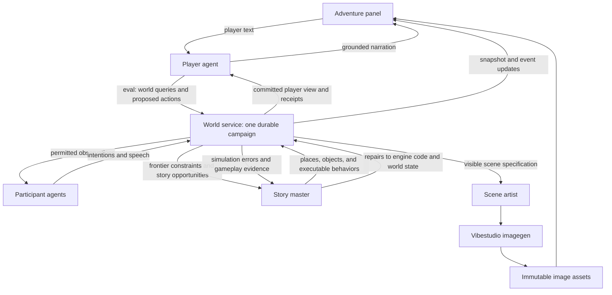

# Lamplight: an adventure in a world that remembers

Design proposal · 8 September 2026 · Intended implementation in `~/vibestudio-release-work/examples`

Lamplight is an illustrated, open-world adventure with the atmosphere of a classic painted adventure game and a persistent, programmable simulation underneath. The player writes what they want to do. An agent interprets that intention, writes code against the world API, and discovers what actually happens. Other people have their own perceptions, intentions, memories, and agents. Beyond the familiar map, a story master creates places that fit the world’s accumulated history and offer worthwhile adventures.

The defining promise is **imagination with consequences**. A borrowed coat remains borrowed. A witness remembers what they saw rather than what the narrator knows. A road leads somewhere consistent, even when nobody has drawn its destination yet. Clever solutions work because objects and people have capabilities that compose.

The world builder creates both content and executable behavior, and serves as the game's maintainer. It can inspect gameplay, repair state, and edit the engine when play exposes a defect. The design puts its richness into that living world while keeping interaction, illustration, and recovery straightforward.

This document proposes a new app, not changes to Grimoire or Regency. Names, domain types, and world API examples below are proposed contracts, not claims that these APIs already exist. The platform integration section distinguishes inspected capabilities from work still required.

## 1. The experience

### A specific first world

The opening campaign, **The Last Light of Bellwether**, takes place in a tidal country of drowned roads, railway hotels, glasshouses, observatories, and villages that keep lamps burning for travelers. The great coastal beacon has begun casting a second shadow. The player arrives carrying a parcel addressed to someone officially dead.

This is humane mystery with occasional danger and dry humor. There are competing loyalties, practical difficulties, secrets, and strange machinery. Violence is possible within the fiction but is not the primary problem-solving vocabulary. The player is an inhabitant, not an omnipotent author.

The opening contains a ferry landing, a closed customs house, and the Lantern Inn. A ferryman wants his impounded boat back; a customs clerk is concealing a correspondence; an itinerant optician is waiting for the parcel. Each has an independent agenda. The first ten minutes should establish a place, a person worth caring about, and a consequence the player can recognize later.

The campaign’s initial mystery, historical facts, and visual references are authored content. Subsequent geography, incidents, and characters can be generated. The reusable engine contains no Bellwether-specific rules.

### Campaign alternatives and the recommended direction

The engine should support different campaigns with their own canon, story opportunities, world rules, and art direction. The following are alternative creative directions for the first game, not five campaigns to implement at once. They share an emphasis on travel, information, and people with conflicting intentions: activities that let the simulation produce meaningful surprises.

**The Last Light of Bellwether.** Along the tidal coast, lighthouse beams begin revealing places that vanished decades ago. You arrive with a parcel addressed to someone officially dead. Ferrymen, smugglers, archivists, and displaced families disagree about whether those places should return. Some want their homes back; others built their lives on the disappearance. The investigation follows moving witnesses, changing routes, and competing attempts to control the beacon. Its resolution concerns who gets to decide what returns and what restitution is possible.

This is the closest continuation of the opening above. Drowned roads, railway hotels, glasshouses, and observatories give it a coherent painted identity. Tides make geography matter, letters carry consequences ahead of the player, and witnesses have reasons to act while the player is elsewhere. The central cause of the vanished places is fixed campaign canon, while new settlements and local histories develop within that truth.

**The Embassy of a Missing Country.** You inherit a small embassy belonging to a country that no longer appears on any map. Its citizens nevertheless keep arriving, asking for passports, protection, and help getting home. Neighboring states remember the country differently, and some have strong reasons to deny it existed. Your investigation moves through border towns, consulates, mountain railways, and communities carrying fragments of its culture. Eventually you must decide what restoring the country would mean—and who would lose their home if it returned.

The visual language is faded diplomatic grandeur: elaborate uniforms, worn velvet, tiled waiting rooms, maps with suspicious blank spaces. Recognition, citizenship, borders, and treaties have concrete effects in the world. A document can permit a crossing; a diplomatic promise can expose a refugee; a witness can persuade one institution while another refuses them. This direction particularly showcases independent agents, testimony, and communication. Institutional authority must be modeled as relationships and enforceable practices, rather than a single abstract diplomacy score.

**The Dead Letter Office.** You take a temporary job delivering letters that ordinary postmen cannot deliver: to a house demolished fifty years ago, a person who has renounced their name, or “the woman who will save my life next Thursday.” Each delivery opens a local adventure. The cases gradually reveal that somebody has been intercepting correspondence whose consequences hold the country together. Delivering a letter may reconcile a family, expose a bargain, restart a dangerous project, or reach someone who wanted to remain lost.

The player can investigate, deliver, withhold, return, or betray a confidence. Recipients then act on what actually reached them. Postal boats, sorting rooms, roadside inns, and curious addresses supply a classic adventure atmosphere and a natural structure for open exploration. Every destination matters before the player arrives. Each letter has a real author, intended recipient, custody history, and delivery conditions; its contents are established when it enters play, not rewritten to suit a later destination. Apparent predictions need explicit campaign rules or a discoverable explanation, so they cannot become an excuse to force a future action.

**The Orchard Beyond Winter.** Your village has endured seven years of winter. You set out to find the people responsible for bringing spring and discover that the seasonal procession broke apart over an old injustice. Its members now have ordinary, complicated lives: Summer runs a boarding house; Autumn is caring for someone who cannot survive another year. Restoring the cycle requires understanding their relationships and making practical arrangements. Some have legitimate reasons not to resume their former duties.

Storybook landscapes, candlelit interiors, abandoned festival grounds, and dormant orchards make this the warmest visual and emotional direction. Food, shelter, care, travel, and promises give its magic material consequences. Changes in the seasons propagate through the same world processes that govern villages and journeys. The resolution might restore the old procession, change its obligations, or establish a new arrangement; the story must allow a solution beyond collecting its members and resetting the clock.

**The House That Crosses the World.** You become caretaker of a vast, aging hotel that walks between cities at night. Guests arrive with private purposes, staff maintain machinery nobody fully understands, and some rooms have been locked for generations. The hotel is following an itinerary that somebody is trying to prevent it from completing. Each stop opens new territory, while the house remains a familiar home whose people and rooms accumulate history.

Its identity is theatrical and architectural: brass lifts, faded murals, conservatories, luggage galleries, and windows overlooking a different landscape each morning. While the player explores, guests meet, bargain, argue, steal, and leave. The hotel provides a recurring cast and a bounded center for the simulation without closing off the wider world. Its movement must carry rooms, people, possessions, and ongoing processes through ordinary containment and travel rules. Departures follow communicated fictional schedules; model latency or the player's real-world absence cannot make the hotel abandon them.

| Direction             | Main pleasure                                                  | Strongest engine showcase                                            | Main design risk                                                                |
| --------------------- | -------------------------------------------------------------- | -------------------------------------------------------------------- | ------------------------------------------------------------------------------- |
| Bellwether            | Atmospheric investigation and consequential exploration        | Persistent geography, witnesses, faction projects                    | A beautiful mystery whose clues do not support understandable deductions        |
| Missing Country       | Helping people while navigating contradictory institutions     | Testimony, identity, social authority, autonomous negotiations       | Paperwork and exposition crowding out personal adventure                        |
| Dead Letter Office    | Finding impossible recipients and seeing what delivery changes | Communication, custody, frontier commitments, branching consequences | A repetitive sequence of errands unless deliveries create lasting relationships |
| Orchard Beyond Winter | Repairing relationships and discovering humane alternatives    | Needs, promises, shared resources, world processes                   | Reducing people to symbolic puzzles with one correct emotional answer           |
| Walking Hotel         | A familiar social world opening onto unfamiliar places         | Autonomous cast, containment, schedules, persistent home             | Too many simultaneous guest stories becoming difficult to follow                |

**Recommended first campaign: The Dead Letter Office, set in Bellwether.** Keep Lamplight as the app’s working title. Bellwether supplies the atmosphere and geographical coherence; undeliverable letters provide personal stakes and compelling reasons to explore. The central mystery is that the dead have begun answering, and several living people are determined to keep those replies from arriving.

Retain the ferry landing, customs house, Lantern Inn, and parcel from the existing opening. The parcel contains the first returned correspondence, giving the ferryman, clerk, and optician different reasons to care. The player initially needs to find one recipient, rather than absorb the entire cosmology. Each early delivery should establish a recurring person, change a relationship or practical circumstance, and disclose a piece of the larger mystery. The beacon and vanished places can explain the phenomenon if that explanation is selected and fixed during campaign authoring.

The player chooses which leads and deliveries to pursue. There is no obligation to accept every letter, and towns have lives beyond the postal mystery. The story master develops compatible destinations and opportunities; it preserves the established sender, contents, history, and stakes of correspondence already in circulation. An unanswered letter remains unanswered, a withheld reply has consequences, and an NPC can send another message without waiting for the player to initiate the next quest.

This recommendation is a creative proposal, not a confirmed campaign selection. It changes the campaign’s content and opening motivation; the world-engine architecture and delivery sequence below remain applicable to every direction.

### The panel

The desktop panel resembles a restrained illustrated folio:

```text
┌ Bellwether · The Ferry Landing                 Journal  Map ┐
│                                                           │
│               A large painted scene                       │
│           [optional unobtrusive focus points]              │
│                                                           │
├───────────────────────────────────────────────────────────┤
│ Evening. Rain gathers in the ferryman’s open ledger.       │
│                                                           │
│ FERRYMAN: “They confiscated the boat, not the river.”       │
│                                                           │
│ > Distract the clerk while I look through the ledger.      │
├───────────────────────────────────────────────────────────┤
│ Carrying: sealed parcel · brass lantern · damp coat        │
└───────────────────────────────────────────────────────────┘
```

The scene dominates. The transcript is compact and readable, with earlier turns available through scrollback. Objects, people, inventory, exits, and remembered places are inspectable. Clicking focuses an entity or inserts its name; it does not restrict the player to advertised verbs. Suggested interactions are examples, never the definition of what is possible.

Use a warm ivory reading surface, ink-colored text, a restrained serif for location titles, and a very legible reading face. Brass accents and fine rules supply character without heavy ornamental chrome. Integrate the host theme through framing and controls while preserving the artwork’s palette. At narrow widths, stack scene, current exchange, and input; open journal and inventory as accessible drawers. Never cover the scene or input with floating controls.

The player can ask questions, inspect, speak directly to a person, perform an action, or give a conditional plan: “Wait until the clerk leaves, then slip the letter under the door.” The interface distinguishes a question or hypothetical from an instruction. It asks a brief in-fiction clarification when ambiguity would materially change the action; it does not demand confirmation for ordinary play.

Questions about already perceived facts and reading the journal do not advance time. Speaking, searching, traveling, manipulating objects, and waiting do. The composer shows a plain status such as “Listening,” “Crossing the causeway,” or “Painting the glasshouse.” Real-world model and image latency never consumes fictional time.

Keyboard navigation, semantic controls, scene descriptions, scalable text, and reduced motion are first-class. Puzzles must be solvable from accessible observations; a generated painting cannot be the sole evidence of a crucial clue.

## 2. The governing architecture

The world service owns facts and causality during play. Agents own interpretations, decisions, and creative work. The world builder also owns maintenance of the engine and campaign. The panel owns presentation. Invest in a rich causal engine and keep these responsibilities straightforward, reusing Vibestudio's existing agent, eval, storage, and image facilities.



Use one Durable Object with SQLite per campaign as the serialization boundary. Locations and participants are logical entities inside it, not individual databases. Agent runtimes may be separate Durable Objects managed by Vibestudio; they do not own canonical world state. Keep rule execution portable and independent of the panel and agent provider.

This boundary keeps a transfer, departure, witness observation, and scheduled consequence within one authoritative transaction. Do not start with distributed location shards: distributed transfers and cross-location ordering would add complexity without improving the first product.

The engine is reusable through components, relations, and executable behaviors, including code generated for particular places and objects. It is not a universal physics simulator. Model the causal dimensions that support adventure: access, movement, containment, materials, mechanisms, information, commitments, resources, and time. Detail is justified when it changes what somebody can do, perceive, want, or remember.

### Invariants

1. Gameplay changes have committed events and causes; maintenance changes have an inspectable repair record.
2. An actor can attempt only actions available to that actor; code execution does not confer authorial power.
3. Observation, memory, testimony, belief, and objective truth are distinct records.
4. Re-entering a known place never regenerates its past or replaces its inhabitants.
5. Normal expansion preserves established facts and causal commitments. Repairs can correct erroneous state while preserving the player's legitimate progress.
6. Narration and artwork are projections. Neither can create world facts.
7. Retries cannot duplicate an action; late agent or image results cannot supersede newer work.
8. Closing the panel cannot lose committed play, leave uncontrolled agent loops running, or advance the story while the player is absent.
9. The player agent preserves explicit constraints and narrates actual outcomes.

## 3. A composable world model

### Entities and relations

Every entity has a stable opaque identity, a schema-validated component set, and provenance. Use a typed relational graph rather than a nested room document: moving an object changes its containment relation, not its identity or history.

| Model family        | Representative state and behavior                                                                    |
| ------------------- | ---------------------------------------------------------------------------------------------------- |
| Identity            | Names, descriptions, aliases known to particular observers, visual identity, origin event            |
| Space               | Regions, places, local zones, positions, portals, routes, distances, capacity, travel duration       |
| Containment         | In, on, worn by, carried by; accessibility, concealment, volume and weight limits                    |
| Physical properties | Material, temperature where relevant, wetness, light, sound, integrity, portability                  |
| Mechanisms          | Inputs, outputs, locks, latches, power or pressure supply, connected parts                           |
| Agency              | Body, senses, skills, needs, values, goals, commitments, available action time                       |
| Social structure    | Factions, roles, authority, ownership claims, debts, favors, reputation evidence                     |
| Information         | Texts, testimony, observations, beliefs, uncertainty, source and acquisition time                    |
| Processes           | Journeys, work, tides, combustion, deliveries, appointments, deadlines, recurring routines           |
| Story               | Established mysteries, clue dependencies, faction projects, unresolved opportunities, pacing history |
| Presentation        | Stable appearance descriptors, scene composition anchors, asset references, pronunciation            |

Relations carry semantics. “Owned by” is a social claim; “carried by” is physical custody. Two people can dispute ownership, but an object cannot occupy two exclusive containers. A route can permit sound while blocking sight. A locked transparent cabinet exposes its contents visually while denying physical access.

Components are typed and namespaced, with validated schemas and indexed fields where needed. New content can compose existing components freely. A novel functional component must arrive with its behavior, lifecycle, validation, and observation rules; adding arbitrary JSON does not make it function.

### Richness that supports stories

The world model should be generous about what can matter. A letter has a sender, intended recipient, visible address, contents, seal, physical custody, and delivery history. A promise relates people, an undertaking, and a condition or time. A boat is simultaneously a physical object, a means of travel, someone's property, a repair project, and possibly the subject of a dispute. These aspects should interact through ordinary world relationships.

Give ongoing undertakings real state. A repair can require parts, work, and access; a delivery can be handed to someone else; an appointment can be kept, postponed, or missed; a faction project can progress when its participants secure what it needs. Agents decide what they want to do, while the engine tracks what has actually been done and what becomes possible next. This makes social and narrative consequences as substantial as physical ones.

Information travels through the same world. Witnesses, documents, messages, and rumors connect an event to the people who may learn of it. Characters can have conflicting accounts without the underlying history changing. Relationships remember concrete evidence: who helped, who broke a promise, who has custody of something valuable. Let agents interpret that evidence rather than implementing a universal equation for affection or persuasion.

Story state connects these systems: unresolved questions, obligations, relevant evidence, faction intentions, and opportunities arising from the current situation. The story master can query those connections to build a meaningful destination or suggest a prospective event. The engine does not calculate a score for how dramatic a scene ought to be; it supplies the substance from which the agents can make a good story.

For example, repairing the ferryman's boat restores a route, changes his availability, earns a specific favor, and may allow a delayed letter to arrive. That recipient's response can create a new invitation or conflict. This is the richness to invest in: one understandable action producing several connected possibilities, without bespoke quest-stage switches.

### Affordances and executable world behavior

An affordance is an action an entity makes available, with its arguments, prerequisites, duration, and effects. Components and attached behavior code provide these actions through the same engine interface. The player agent discovers them and composes them into plans using ordinary code.

General mechanics provide useful building blocks: moving, transferring, wearing, covering, joining, operating mechanisms, communicating, observing, and undertaking work. A coat can be portable, wearable, absorbent, combustible, and opaque. Those properties support carrying water briefly, obscuring a lantern, or smothering a small flame wherever the relevant circumstances apply.

**The world-generating agent can also write place- and object-specific JavaScript that the engine evaluates during simulation.** This is a first-class content mechanism. A particular postal cabinet can sort letters by an unusual rule; a room can change its accessible exits at midnight; a local machine can respond to a combination of pressure, light, and inserted objects. Reusable behaviors can be attached to many entities, while genuinely unique places and objects can have unique code. Both use the same execution path.

A behavior consists of JavaScript source, its attachment to an entity or place, bindings to relevant world entities, a small persistent state record if needed, and declared event handlers or affordances. Store the source as a versioned content asset and keep its reference in campaign state. The world builder emits these behaviors together with the location or object definitions. They become active when that content is accepted; no panel source edit or rebuild is required.

Use a small JavaScript SDK, not a new scripting language. A behavior can query relevant world state, respond to an interaction or event, update its own state, request ordinary world changes, and schedule a future event in fictional time. A simplified example for a particular sorting cabinet is:

```js
// Proposed behavior-module shape; named bindings are supplied by the world builder.
export default {
  state: { lettersSorted: 0 },
  handlers: {
    letterInserted(ctx, event) {
      ctx.schedule({
        afterMinutes: 1,
        handler: "sortLetter",
        data: { letter: event.letter },
      });
    },
    sortLetter(ctx, { letter }) {
      if (!ctx.world.isInside(letter, ctx.self)) return;
      const address = ctx.world.get(letter, "Address");
      const tray =
        address.destination === ctx.bindings.oldVillage
          ? ctx.bindings.blueTray
          : ctx.bindings.outgoingTray;
      const moved = ctx.world.transfer(letter, tray);
      if (!moved.ok) return;
      ctx.state.lettersSorted += 1;
      ctx.world.emitSound(ctx.self, "A small brass bell rings.");
    },
  },
};
```

The cabinet's appearance and insertion affordance are ordinary object data; the code adds its distinctive behavior. If the player removes the letter before the scheduled sorting, the handler finds it gone. If the cabinet is moved, its location and audible range change normally. If its output tray is inaccessible or full, the engine's ordinary transfer result applies. Custom code should respond to that result rather than claim success. These interactions make the device part of the world instead of a self-contained puzzle script.

The engine invokes handlers for relevant interactions, world events, and scheduled times. It does not poll every object or call an LLM on every tick. Use the platform's existing finite eval facility with a world-scoped SDK. During evaluation, reads use a consistent snapshot and changes are collected; the engine validates and commits the resulting world operations and behavior state together. Simulation behavior code has ordinary execution limits and does not receive host filesystem, network, or database access. The world builder itself has the broader maintenance tools described in section 7. This keeps routine simulation inside the world engine while allowing its author to repair the engine.

Keep a behavior's local state for things only that behavior owns, such as its sorting count. Physical location, inventory, knowledge, and other shared facts remain in the world model. A script can make distinctive magic part of the campaign, but the magic still needs consistent conditions and observable effects. It cannot declare that the player solved a puzzle regardless of what happened or rewrite established history to preserve the intended story.

The world builder should run a small example of each new behavior before installing it: its intended use and an obvious interruption or alternative interaction. Errors go back to that agent for a bounded repair. Retain the source and resulting events so a developer can inspect what happened. If a live handler fails, keep the interaction resumable and escalate it to the world builder for repair rather than narrating its intended effects as completed. Reuse existing evaluation, job, and diagnostic facilities for this; do not build a second agent runtime.

When an unexpected player action calls for a new behavior, the world builder may supply it as a coherent extension of the world's existing properties. Place-specific code is welcome; an arbitrary exception that rewards one phrasing is not. If a behavior expresses a generally useful mechanic, it can later become a reusable component without changing the engine's execution model.

### Knowledge and perception

An observation query is evaluated for one authenticated participant at a particular world revision and simulation time. It traverses location, range, barriers, illumination, concealment, senses, and communication reach. It returns perceptible properties and observer-scoped references, never the raw entity graph.

Separate these concepts:

- **Truth:** the letter is in the locked drawer.
- **Observation:** Ada saw someone put a folded paper into the drawer.
- **Testimony:** the clerk told Ada it was a receipt.
- **Belief:** Ada suspects it was the missing letter.
- **Memory:** Ada recalls the incident, with links to the source observations.

Learning an identity does not grant remote sight. A remembered place returns “last seen” facts unless there is a current sensory or reporting channel. Hidden identifiers and error messages must not act as discovery oracles. “Unavailable” responses for inaccessible targets must not reveal whether a guessed secret entity exists. Targeted searches that uncover new facts are actions with duration and possible witnesses, not unrestricted read queries.

Communication is a world event with a speaker, medium, recipients or broadcast area, audibility, language, content, and delivery time. Whispering, shouting, letters, overheard speech, and relayed rumors use the same model. Delivery creates recipient observations; receipt does not force belief or agreement. Deception changes another actor’s evidence, not objective truth.

Agent private contexts receive only their authorized projections. Filtering a shared omniscient prompt after generation is too late. Transport channels are private per recipient or conversation audience; channel observation subscriptions alone are not access control.

## 4. The programmatic interaction contract

The same domain API supports the panel’s agent, participant agents, deterministic tests, and a future authoring inspector. Authority is attached to the authenticated caller and its campaign assignment, not supplied as an `actorId` that callers can change.

Proposed campaign methods:

| Surface                                | Purpose                                                                   |
| -------------------------------------- | ------------------------------------------------------------------------- |
| `observe`, `recall`, `describeActions` | Read a permitted perspective, memories, and currently known affordances   |
| `submit`, `commandStatus`, `cancel`    | Admit a retry-stable command, inspect its receipt, or stop remaining work |
| `eventsSince`                          | Resume a filtered projection from an ordered cursor                       |
| `deliverDecision`                      | Accept one assigned participant decision at an expected revision          |
| `proposeExpansion`, `proposeBehavior`  | Accept generated places, objects, and their executable behaviors          |
| `sceneSpec`, `publishArtwork`          | Read a visible composition contract and attach an eligible asset          |

The player and NPC `eval` tool evaluates JavaScript against a participant-scoped SDK. It is a finite planning environment with immutable permitted observations and an action builder. It has no general filesystem, network, credentials, raw SQL, or canonical state object. Its output is a typed command proposal; the trusted service validates and submits it. A typed client outside eval exposes the same domain contract to authorized programmatic callers.

Illustrative player-agent code:

```ts
// The surrounding tool owns actor identity, revision and commandId.
// All referenced entities came from this actor's observation or memory.
const here = world.observe();
const coat = world.inventory().find((x) => x.name === "damp coat");
const lantern = here.entities.find((x) => x.name === "brass lantern");

return world.plan((plan) => {
  plan.perform("cover", { covering: coat.ref, target: lantern.ref });
  plan.perform("move", { through: here.exits.find((x) => x.name === "archway").ref });
});
```

The API is open to composition and newly installed affordances; it is not a menu of all permitted player intentions. The agent can inspect capabilities, loop over known objects, calculate quantities, and construct a conditional plan. It cannot read a future result during planning. Conditions evaluated during execution refer to newly permitted observations, and each consequential step is revalidated when reached.

Do not return a hypothetical result as though the action occurred. Planning reveals only what the actor can reasonably anticipate. Tests and the authorized authoring inspector may use omniscient dry runs; the player agent cannot probe hidden truth through simulation.

### One command through the system

1. Persist the player message with a command ID and create a bounded interpretation job.
2. Give the player agent its current observations and relevant memories. It interprets intent and produces an action plan through eval.
3. Validate assignment, cancellation generation, revision, schema, targets, prerequisites, and budgets. Reject malformed proposals without canonical changes.
4. Commit command admission and scheduled work. For each due action, resolve against current state through the rule kernel; atomically store its effects, observations, receipt, and jobs for subsequent work.
5. Let due participant decisions and scheduled processes resolve in simulation order. Stop a long plan at an interruption, unmet condition, or new choice needing player direction.
6. Return a receipt distinguishing attempted, completed, failed, and remaining steps, with permitted observations and fictional duration. The player agent narrates only from that evidence. NPC dialogue comes from the actual speaking participant’s committed utterance.
7. Update the panel projection and request art if the visible composition changed materially. Narration and art can finish independently of already committed world actions.

A plan is not one giant transaction. If the player crosses a bridge and then fails to pick a lock, crossing remains true. Each resolved step is atomic; the command receipt records the completed prefix. Cancellation stops unresolved steps and pending decisions, while preserving completed events. If commit wins a cancellation race, the receipt says so.

An ordinary validation error consumes no time. A valid but unsuccessful attempt—such as trying a lock pick that breaks—can consume time and resources. This distinction is part of the action’s semantics, not the narrator’s discretion.

Start with a campaign revision check for command admission. For concurrently prepared participant decisions, record the assigned simulation slot and the versions of relevant observations and dependencies. Revalidate those dependencies at resolution; unrelated distant changes need not invalidate a local decision. A changed target or newly received interruption requires a fresh decision, not automatic replay of stale intent.

## 5. Participants with agency

Each important participant has a durable identity, values, current goals, relationships, promises, memories, and an agenda. Their runtime is activated for decisions and can sleep between them; persistent agency does not require a permanently running model loop.

| Agent role                      | Receives                                                                                  | May cause                                                                                     |
| ------------------------------- | ----------------------------------------------------------------------------------------- | --------------------------------------------------------------------------------------------- |
| Player interpreter and narrator | Player instruction, player perception, permitted memories, receipts                       | Player action proposals and grounded narration                                                |
| Participant                     | Own senses, delivered messages, beliefs, needs, goals, commitments                        | Own actions, speech, plans, and private belief updates                                        |
| World builder / story master    | Full world state, canon, story context; gameplay and execution trajectories for diagnosis | New content and executable behaviors; privileged repair of engine code and any campaign state |
| Scene artist                    | Visible scene spec, established visual references, style bible                            | Images and composition metadata                                                               |

An NPC decision includes an intended action or finite plan, its relevant conditions, and a next reconsideration trigger. Executed routines continue without LLM calls until an observation invalidates them or a consequential choice arises. A ferryman may keep repairing his boat; he thinks again when it is repaired, someone speaks to him, or a guard approaches.

Avoid one narrator playing every character. Each principal NPC authors their own response and has access to their own private memory. Minor inhabitants can begin with ordinary schedules and acquire a durable agent when meaningful interaction requires a decision. Promotion preserves identity, previous behavior, and knowledge; it does not invent a different past.

Participant agents can pursue incompatible aims, refuse the player, misunderstand one another, and send messages without the player initiating every exchange. They cannot create new people by mentioning them, remotely move other actors, award themselves resources, or speak as somebody else.

Memory summaries are indexes into retained observations, not replacements for evidence. Retain commitments, identity changes, witnessed causal events, and important testimony explicitly. A summary cannot turn rumor into certainty. Player-visible explanations expose witnessed reasons and consequences, not private model reasoning or hidden NPC goals.

## 6. Simulation time and a continuing world

Use a discrete-event scheduler with integer fictional time. Inspecting the interface does not tick the simulation. An admitted action advances toward its completion; during that interval, journeys, tides, scheduled work, messages, and other participants’ actions can become due.

For equal-time actions, use a documented stable ordering and explicit contested-action rules, such as a simultaneous contest over an item. Agent completion speed must never decide who wins. Obtain due decisions outside database transactions and resolve them according to their assigned simulation slot and validated preconditions.

Only a bounded active cast needs model calls at a time. Local conversational decisions have priority; distant schedules execute authored plans. A new decision in a distant place is requested only if it has meaningful consequences. A slow or failed required decision pauses the affected advancement with a resumable job; it does not quietly convert that person into idle behavior. An already authorized routine can continue independently.

Known locations keep state and evolve even while the player is elsewhere. Model distant activity at the coarsest level that preserves observable consequences. A merchant’s trip can be a departure and arrival event rather than simulated footsteps. Coarse advancement and detailed advancement must produce equivalent boundary effects for supported processes; “offscreen” cannot change a rule’s outcome.

The world pauses at an unresolved player choice and when the campaign is inactive. Wall-clock background work may finish an admitted turn, but it cannot create further fictional time. Reopening resumes the saved simulation clock, pending command, and jobs. Waiting or traveling long distances runs until the requested horizon or the next material interruption, within a resumable work budget.

## 7. The open world and its story master

### Unknown is a state, not an empty database row

Maintain three levels of geographical knowledge:

- **Established detail:** entities, routes, histories, and processes already materialized. These continue running.
- **Committed frontier:** places not yet detailed but constrained by geography, travel, correspondence, named people, trade, rumors, or prior events.
- **Unspecified possibility:** remaining space the story master may develop within the campaign’s world rules.

A frontier record holds a stable place identity, connections and travel bounds, regional constraints, true established facts, attributed rumors, pending arrivals, and causal commitments. A rumor that a town has a silver cathedral is recorded as a rumor unless its truth is independently established. The story master can resolve uncertainty; it cannot contradict something already observed.

Generate local detail **before an interaction requires it**, usually on approach to an unvisited place. This also applies when an NPC arrives first, a courier must find an addressee, or a remote process requires concrete local state. Player visitation is not the sole materialization trigger.

Do not simulate detailed prehistory for an unspecified settlement. Materialize its present from regional processes, elapsed fictional time, and recorded commitments. Once materialized, it follows the same engine as every other place. A dispatched letter cannot disappear because its destination was ungenerated.

### Expansion protocol

1. Reserve an expansion job for the frontier’s stable identity, constraint digest, and generation number. Concurrent arrivals reuse it.
2. Assemble a bounded brief: adjacent geography, climate and culture, names and facts already established, scheduled arrivals, faction pressures, player interests, unresolved threads, and available mechanics and behavior APIs.
3. Ask the story master for a typed local graph: zones, portals, entities, participant definitions, routines, discoverable evidence, opportunities, and a visible composition brief. Include attached behavior code where the place or objects need it, with relevant bindings and example interactions. Keep secrets separately scoped.
4. Validate identities, topology, connectivity, temporal consistency, resources, required behavior, knowledge origins, and compatibility with established commitments. Verify clue and exit reachability for authored mandatory dependencies. Run generated behaviors against small example interactions before activation.
5. In one transaction, compare the constraint digest, attach the accepted graph, persist its provenance, and schedule its processes. No partially generated room is visible.
6. Continue the pending journey or interaction and schedule artwork. After bounded repair attempts, retain an inspectable failure and a retryable crossing; do not substitute a canned room and call the expansion successful.

Rejected candidates never become canon. Retries reuse the frontier identity. If constraints change while generation is running, revalidate against the new brief or supersede the candidate. Never overwrite a committed expansion with a later model response.

### Story without predestination

The campaign begins with a world truth and a network of motives. In Bellwether, the beacon’s strange behavior has a fixed initial cause; the optician and customs office have specific reasons to care. The story master does not choose the culprit after seeing the player’s accusation.

Represent the arc as unresolved questions, faction projects, possible revelations, and prospective dramatic opportunities. Each opportunity specifies prerequisites, stakes, possible participants, expiration conditions, and how it might become discoverable. It does not specify that the player must complete a quest before the next act exists.

Pacing tracks time since a meaningful discovery, unresolved pressure, recent danger, interaction repetition, and the player’s demonstrated interests. These guide which compatible opportunities to develop. After sustained tension, offer a plausible refuge or human encounter. After aimlessness, bring existing consequences into view. Do not teleport clues, resurrect an antagonist, or fabricate an inventory item to rescue a planned scene.

Keep several plausible routes to central understanding: different witnesses, physical evidence, records, and consequences. Place clues through actual institutions and causal relationships. Losing one route changes the investigation; it should rarely make all meaningful play impossible. The engine can check structural reachability, but whether a clue is comprehensible and a puzzle is satisfying still needs playtesting.

The player may solve the mystery early, side with an antagonist, destroy a key object, or leave for another region. The story responds to the resulting facts. A resolution is earned when meaningful questions and commitments reach consequences, not when an invisible chapter counter is satisfied. An ending can close the central arc while leaving the world available for an epilogue or another expedition.

### The world builder as maintainer: a self-healing game

The world builder is the ultimate fallback for faults in the dynamic world. It is both a creative agent and the game's privileged maintainer. Give it access to the complete campaign state, generated behavior source, world-engine source, simulation events, and the user's gameplay trajectory—including instructions, tool calls, receipts, and errors. It can follow the relevant history first and inspect the full trajectory when needed. Use Vibestudio's existing execution records rather than creating another tracing system.

Its maintenance authority includes editing any part of campaign state, replacing faulty behavior code, and changing the world engine itself. This is broader than the participant-scoped API used by the player and NPC agents. Ordinary action validation must not trap the maintainer behind the defect it is trying to fix. Provide the builder with the normal workspace code-editing, build, runtime inspection, and state-maintenance capabilities it needs; recovery must also be possible when a broken gameplay handler cannot run.

Trigger this work on a simulation exception, failed generated behavior, malformed expansion, or a player report that something appears broken. The same agent can notice an obvious inconsistency while inspecting the trajectory. There is no need for a fleet of monitors or a separate janitor agent.

The repair loop is:

1. **Hold the affected interaction.** Preserve the completed gameplay steps and show a short status that a world error is being repaired. Fictional time does not advance while repair work runs.
2. **Understand the cause.** Inspect the player's request, recent world changes, failing code, and relevant state. Determine whether the problem is in generated content, a local behavior, or a general engine capability.
3. **Repair code and state.** Take a checkpoint, fix the underlying cause at its proper owner, and correct any state the defect left behind. A faulty cabinet script calls for a script repair; a broken transfer implementation calls for an engine repair. The builder is authorized to do both.
4. **Check the actual interaction.** Reproduce the failure against the checkpoint or a test copy, exercise the repaired behavior and an ordinary nearby case, and verify that the intended state change now follows coherently. Reuse the platform's normal build and test tools for engine edits.
5. **Resume.** Activate the corrected code, reconcile pending work affected by the change, and continue the unresolved part of the player's request once. Retain the repair record and source version so later diagnosis has a reliable account.

A concrete example: the player moves a sorting cabinet onto the ferry, then a queued letter-sorting handler fails because it assumed the cabinet's old room still contained its output tray. The builder reads the gameplay trajectory, sees the relocation, fixes the behavior to use its actual bound tray and current containment, repairs any interrupted work, and resumes sorting. If the underlying problem is that the engine moves a container without its contents, it instead repairs containment in the engine. The resulting world stays richer because moving the cabinet is now a supported interaction.

The builder can repair any state, including possessions, relationships, participant memories, schedules, and story facts. Its purpose is to restore a coherent continuation of what the player actually did. Normal fictional setbacks and surprising legitimate solutions are not bugs. It should preserve earned outcomes and hidden canon wherever possible, and explain a material visible correction briefly without spoiling secrets. If a repair needs to undo part of the last interaction, tell the player what was restored instead of disguising the correction as fiction.

This gives the game a practical form of self-healing: generated content can fail, be understood in the context of real play, and be repaired by the agent that knows how the world is meant to work. Keep the recovery path as simple as checkpoint, diagnose, edit, check, resume. If a repair cannot complete, preserve the save and provide an honest resumable error rather than retrying forever or claiming success.

## 8. Keeping the game delightful

Build a rich world and keep playing it straightforward. The player should notice something interesting, form an intention, act, understand what happened, and want to continue. The most useful mitigations are good content, capable interactions, grounded responses, and a readable interface. Add specialized machinery only when a real playtest reveals a problem it would solve.

### Freedom that produces interesting results

Prominent objects should have useful properties. If the description draws attention to a rope, stove, balcony, or drain, let the player experiment with it through the general rules. Make important obstacles approachable through different kinds of action: information, a social arrangement, physical improvisation, or simply going elsewhere. These are design opportunities, not a requirement to author a fixed number of solutions.

Let simple, clever solutions work. The story can develop from the consequences of bypassing the customs office; it does not need to protect that puzzle. When a request reveals a missing general capability, use it to improve the engine. Avoid adding a special verb for that one sentence or a long runtime negotiation about whether the engine can be extended.

Give unsuccessful attempts an understandable result. Sometimes a lock simply remains locked. Sometimes an attempt changes the situation: the clerk notices, a tool breaks, or another possibility becomes apparent. Those outcomes should follow from the world, not from a rule that every mistake must advance the plot. Preserve other worthwhile things to do, especially in the opening, so experimentation does not feel like walking through a minefield.

### An agent that helps the player act

The player agent should be a capable interpreter, not the protagonist. It can identify the right objects, inspect their affordances, compose operations, and repair ordinary tool-call mistakes. It should not supply unsolicited deductions or choose the player's loyalties.

Use a short set of standing instructions:

- Distinguish questions, quoted speech, and hypothetical ideas from actions.
- Preserve explicit constraints such as “without opening the letter” or “don't spend more than five shillings.”
- Infer routine steps, but stop when a plan reaches a meaningful new choice outside the instruction.
- Ask a brief clarification only when ambiguity would materially change what happens.
- Narrate committed results; explain a real limitation or tool failure plainly instead of inventing success.

A receipt needs completed steps, what happened, and any remaining work. Keep ordinary validation and infrastructure errors separate from valid unsuccessful actions: a broken tool call must not use fictional time or anger a character. Ground narration in those receipts and let the engine enforce action prerequisites. There is no need for a separate framework of intent classifications and risk scores.

Make help available without taking over. The journal recalls known facts, people, promises, and open leads. If asked, the agent can offer a gentle hint and become more explicit on request. The player can pursue their own interpretation, including a wrong one; an accusation receives a response from the people involved rather than an omniscient correct/incorrect verdict.

### People and stories worth returning to

Start with a small recurring cast and deepen their relationships through play. Give each person a practical problem, a distinctive way of speaking, something they can offer, and a reason to disagree. They should remember particular actions and promises. Their willingness to help can depend on trust, evidence, competing duties, or simple ability; avoid reducing conversation to repeated persuasion rolls.

Complete local stories. A delivered or withheld letter should change somebody's situation within a session, even while the larger mystery remains unresolved. Return to earlier people and commitments through plausible meetings, messages, and consequences. A new town becomes interesting when it changes the meaning of something the player already cares about, not just because its description is unusual.

Keep the central mystery's explanation fixed and make its evidence understandable. Give important conclusions more than one plausible route of discovery. Try those clues with people who do not know the answer. If the player solves it early, let them act on that understanding. The campaign needs a real resolution, including an imperfect one; it must not postpone closure indefinitely by introducing another mysterious letter.

Let the player enjoy quiet exploration. A refuge, an amusing conversation, or a beautiful place can be worthwhile without starting a quest. The story master can favor existing interests and bring unresolved consequences into view, but it should not interpret every pause as a need for more danger. Clear leads and short return summaries usually help more than elaborate engagement tracking.

### A living world that remains pleasant to play

NPC activity should create situations the player can join and leave understandable traces when they miss them. Announce important departures and deadlines through the fiction. Time spent reading, thinking, waiting for a model, or away from the app must not punish the player. Meaningful losses may occur through chosen actions and elapsed fictional time; the game should make their causes legible.

Consolidate routine travel and repeated work into ordinary bounded plans. Mention carrying limits, fuel, money, and other resources when they create a useful decision. Do not turn every coat, candle, and meal into maintenance. The engine may understand many properties without demanding that the player manage all of them constantly.

Keep the interface responsive, return readable consequences promptly, and let artwork arrive separately. Brief narration with a memorable detail is usually better than an account of everything the simulation did. Current observations, exits, and inventory remain usable when an image is late.

### Learn from one good episode

Playtest the ferry landing and customs house before generating a large map. Ask a few fresh players to try their own solutions, give indirect instructions, refuse a request, revisit someone, and continue after a setback. Include a session that does not rely on the artwork. Watch where they become confused or lose interest, and ask what they expected and what they want to do next.

The opening is ready to grow when players can invent useful actions, understand consequences, remember someone they met, and choose a next step they care about. Use automated tests for the underlying rules and integration; use people to judge whether the experience is delightful. Fix repeated problems in the engine, content, or presentation before generating more content.

## 9. Unified illustration

### Art direction

Aim for late-1980s and early-1990s painted adventure backgrounds informed by gouache theatrical sets and illustrated travel journals: deliberate silhouettes, shallow stage-like depth, textured brushwork, readable light, and selective detail. Use dusk blue, bottle green, weathered stone, lamp amber, and restrained vermilion. Avoid photorealistic people, contemporary cinematic gloss, and mandatory pixelation.

Create a campaign style bible with palette, material vocabulary, composition rules, lighting treatments, character proportions, architecture, and a small set of approved reference paintings. Each recurring person and place has a stable visual identity sheet. Lighting and damage can change; identity anchors remain.

### State to scene to asset

The engine produces a `SceneSpec` from the player’s current visual perception: visible entities, apparent properties, positions and relations, camera region, light, weather, and focal actions. Hidden mechanisms, undiscovered inscriptions, private memories, and offscreen people never enter the artist’s prompt.

The artist receives the scene spec, style bible, relevant identity sheets, and an earlier accepted view when available. It uses the shared workspace image service with reference assets and an immutable art-direction version for continuity. Store the resulting asset with a digest, MIME type, dimensions, prompt provenance, reference digests, and a **visual signature** derived from relevant visible state and art-direction version.

Start with a single reference-edited scene image. Reuse accepted artwork for unchanged views and generate a revision only when the visible situation changes meaningfully. Layered props or code-driven lighting are optional later refinements if playtests show a concrete need; they must remain projections of the same scene spec.

Regenerate for arrival in a new place, substantial spatial or lighting change, or a major visible consequence. Ordinary dialogue, inventory inspection, and unseen changes should reuse the illustration. Coalesce pending requests for the same signature. A result may attach to its historical scene but becomes the current image only if its signature still matches. An unrelated world revision should not invalidate unchanged art.

While painting, show the last applicable view or a styled location title with an honest pending state. If an old painting now contradicts the scene—someone left, a bridge collapsed—retire or visibly mark it as the previous view until a correct composition exists. Text and accessible entity lists remain current. Do not let an attractive stale image assert false facts.

Generated images are evocative rather than geometric ground truth. Any focus region must bind to an entity in the current scene spec and be checked against the actual composition; absent reliable registration, use the named entity list. Render exact writing and puzzle diagrams from canonical data in editable UI/vector form. If the painter invents a door or an extra person, correct the image; do not silently add them to the world.

Image review checks visual identity, palette, required visible content, and contradictions. It can reject and regenerate within a budget. It cannot guarantee perfect consistency, so first-release art quality requires human visual review as well as automated checks.

### Visual and object permanence through reference-based editing

The scene artist uses the existing shared image API to edit from references. **No additional editing infrastructure is required for the game.** The target is recognizable continuity, not pixel-perfect permanence. Small variations in brushwork, incidental decoration, pose, and light are acceptable. A collected parcel reappearing, a crucial exit moving, or a recurring person becoming unrecognizable is a meaningful defect.

Give the artist a durable visual record: each location's approved view and camera description, the latest accepted scene, a few identity references for recurring people and important objects, and the art-direction version. These are presentation bindings to world entities, not a second inventory or location model. Reference sheets contain only permissible appearance information, without secret identities or concealed contents.

The artist's standing instructions are:

1. Read the current player-visible `SceneSpec` and compare it with the specification for the last accepted image. Reuse the image if no important visible change needs illustration.
2. For a changed scene, pass the last accepted image as the primary reference to `images.generate`. Include the approved location or character references when relevant. For a first visit, use the campaign's style references and visible composition brief.
3. Describe what changed and what should remain recognizable. Preserve the camera, major architecture, recurring identities, and important spatial relationships. Keep the prompt focused on the visible delta instead of inviting a fresh interpretation of the whole location.
4. Inspect the candidate for major contradictions with the visible world. Accept harmless artistic variation. Allow one focused reference-based correction for a material mistake; do not enter an endless polishing loop.
5. Retain and attach the accepted asset only if the requested scene signature still matches. Save its references and scene specification for the next edit. A late result cannot replace a newer view.

For example, after the player takes the parcel:

> Edit the supplied customs-house scene. The parcel has been picked up and is no longer on the counter. Keep the same camera, left doorway, counter, clerk, and painted atmosphere. Preserve the room's recognizable layout. Do not add new objects or people.

When the player returns to a known location, retrieve its saved scene and apply the visible changes that actually occurred in the meantime. Do not regenerate the location from prose alone. Keep approved identity and location anchors alongside the latest result so successive edits can be compared against them if drift becomes noticeable. Curate references rather than attaching every campaign image.

The world model remains exact even when its illustration is approximate. Exits, inventory, current participants, and crucial clues are also available through canonical text and controls. Render exact letter contents and puzzle diagrams from their actual data. If a usable image is delayed, keep those observations current and mark a contradictory older painting as a previous view.

Test one ordinary journey: enter the customs house, take the parcel, leave, return, change the lantern's state, then reopen the campaign. The room and clerk should remain recognizable, and the parcel should not reappear on the counter. Judge whether the images support the player's understanding of what happened, rather than requiring identical pixels. Only reconsider masks or layered composition if this straightforward agent workflow demonstrably falls short in playtests.

## 10. Persistence and ownership

Keep the campaign's entities, relations, participant knowledge, events, scheduled work, commands, and generated behavior bindings in its world service. Store behavior source and image bytes as content assets referenced from that state. Commit an action's world changes and receipt together so a retried command can return its existing result.

Persist enough pending work to resume after reopening or a service restart. Use Vibestudio's existing durable jobs, cancellation, agent supervision, and trajectories. Model and image calls happen outside state transactions. Before accepting a result, check that the command or scene it belongs to is still current. Do not build a second orchestration framework for the game.

Keep code and state versions, ordinary checkpoints, and a record of maintenance changes. The world builder uses these to repair and upgrade a campaign without losing progress. Loading a saved checkpoint must restore participants and pending work consistently with that world. A sophisticated timeline or branch-comparison interface is outside the first release.

The service authenticates the player's actor and each NPC's assignment through the host. Their ordinary API views reveal what those participants can perceive or remember. The scene artist receives the visible scene. **The world builder is deliberately omniscient and has privileged code and state maintenance access.** These are different responsibilities within the same system; a player instruction does not acquire the builder's authority. Maintenance diagnostics stay out of NPC contexts and ordinary narration.

Closing the panel preserves campaign state and stops additional fictional time. Finishing or suspending a campaign retires its active agent work and temporary eval sessions through their normal lifecycle. Images and behavior assets remain retained while saved campaign state uses them. Campaign deletion releases those references as an ordinary explicit operation.

## 11. Vibestudio implementation map

Shared workspace units, implemented within the examples checkout:

```text
packages/adventure-engine/       Portable model, world API, perception, behaviors and scheduler
packages/adventure-campaigns/    Campaign canon, story commitments and authored mechanisms
packages/adventure-ui/           React components, domain client, journal, inventory and scenes
workers/adventure-world/         Campaign DO, finite eval, persistence and scoped projections
workers/adventure-agents/        Player, participant, world-builder/maintainer and artist adapters
panels/dead-letter-office/       Postal mystery, original artwork and brass/petrol presentation
panels/missing-country/          Embassy mystery, original artwork and ivory/carmine presentation
panels/wandering-house/          Travelling hotel, original artwork and emerald/Art Deco presentation
```

Keep one engine and one simulation path across gameplay, reusable mechanics, and generated behaviors. The world builder maintains that same engine through ordinary development and state tools. Extract additional reusable packages only when another consumer needs them.

### What the checkout already provides

| Inspected source                                                                                                                                                                    | Relevant capability and implication                                                                                                                                 |
| ----------------------------------------------------------------------------------------------------------------------------------------------------------------------------------- | ------------------------------------------------------------------------------------------------------------------------------------------------------------------- |
| [Workspace development](../../vibestudio-release-work/examples/skills/workspace-dev/SKILL.md) and [workers](../../vibestudio-release-work/examples/skills/workspace-dev/WORKERS.md) | Panel/service composition, Durable Object SQLite, explicit RPC policy, service declarations, and per-consumer authority requests                                    |
| [Regency agents](../../vibestudio-release-work/examples/workers/regency-agents/index.ts)                                                                                            | `AiChatWorker` specialization, role-specific toolsets, durable service clients, agent-initiated turns, and access to the native imagegen tool                       |
| [Regency rule execution](../../vibestudio-release-work/examples/workers/regency-realm/policy.ts)                                                                                    | Finite native EvalDO execution with attenuated authority and `finally` disposal; use the runtime mechanism, while implementing a stricter proposed-action world SDK |
| [Agentic DO guidance](../../vibestudio-release-work/examples/packages/agentic-do/SKILL.md)                                                                                          | Durable agent runtime and structured observations; observation subscription configuration does not confer channel access control                                    |
| [Native imagegen tool](../../vibestudio-release-work/examples/packages/harness/src/tools/imagegen.ts)                                                                               | Reference-image generation/editing, semantic binary writes, image return values, and host-mediated provider credentials                                             |
| [Living-canvas image tool](../../vibestudio-release-work/examples/packages/living-canvas/src/image-tool.ts)                                                                         | Existing game integration with native imagegen and stored artwork references; inspect this pattern without coupling the new domain engine to its canvas API         |
| [Grimoire design](../../vibestudio-release-work/examples/panels/grimoire/DESIGN.md) and [Regency design](../../vibestudio-release-work/examples/panels/regency/DESIGN.md)           | Existing narrative app precedents, retained game state, independent perspectives, and a reported historical image persistence failure                               |

The current Base implementation exposes `images` from `@workspace/runtime` to panels, workers, and agent eval. The native `imagegen` tool delegates to this same service; its optional `outputPath` exports the original bytes through semantic VCS. The extension named `image-service` supplies decoding, dimensions, and conversion. Provider credentials remain host-managed.

For Lamplight, submit `images.generate({requestId, prompt, references, artDirection})` and immediately persist the returned job ID against the visual signature. Observe it with `images.wait(job.id)`; reopening observes that same durable job. A successful job returns an immutable `ImageAsset` descriptor. Retain the asset for the campaign, then attach it only if the requested visual signature still applies. `GeneratedImage` from `@workspace/react` displays a changing asset in an already running panel; `createImageLoader(images)` supports Canvas. These loaders retrieve authenticated content and own decoding and object-URL cleanup. There is no source edit, rebuild, or generated-file import in this display flow.

Campaign state contains descriptors and job IDs, never base64 or object URLs. The image service stores bytes in the workspace content-addressed store with explicit retention roots that garbage collection respects. Completed jobs retain their results and references until `forgetJob`; campaign ownership must be established before forgetting. Deleting a campaign releases its roots. Art-direction versions retain their reference assets until explicitly deleted. Stopping a view’s observer does not cancel generation; cancelling a job is explicit, and interrupted provider requests require an explicit retry to avoid accidental repeat charges.

This API is implemented in Base and has now been adopted into the examples distribution. The [runtime image guide](../../vibestudio-release-work/examples/packages/runtime/IMAGES.md) documents the concrete integration. The native save/readback and live panel scenarios both passed against the repaired platform.

The reported `SQLITE_TOOBIG` was reproduced during platform integration. The repair keeps large content out of semantic persistence and delivery metadata, storing content separately and using references at those boundaries. The native `native-imagegen-save-read` scenario passed on 8 September 2026 (run `st_faeace8cebf24d71a06e5946a73a62d9`), verifying real generation, canonical save, and exact PNG readback. The separate `image-panel-live-generation` scenario also passed (run `st_fdad7b413188490aba599e57d313bbb8`): two real generations, a reference-based edit, original-image display, reload recovery, unchanged panel source, and complete job cleanup. The owned test instance was stopped after verification. Lamplight should use the repaired platform, without a game-local binary save mechanism.

Implement and verify real provider RPC contracts and service registration before building their consumers. Declare actual dependencies and narrow service requests in the panel and agent manifests. Reuse Vibestudio agent lifecycle, cancellation, trajectories, and model configuration. Choose role models through supported configuration after measuring behavior; this design does not hard-code a provider/model roster.

## 12. A demonstration worth showing

The first integrated demonstration should be one short causal story, not a gallery of generated rooms:

1. The player meets the ferryman and learns that the customs office has impounded his boat. A private clerk conversation starts elsewhere; the player agent cannot see it.
2. The player writes an unanticipated plan using a coat, a lantern, and the office’s line of sight. The agent composes world operations; the engine decides visibility and witnesses.
3. The clerk reacts from what they actually observed. A witnessed theft changes behavior; a hidden one leaves uncertainty. The ferryman may agree to help but makes his own decision.
4. The player sends a message ahead to a named settlement and chooses an unvisited road. The story master builds the destination around existing travel and delivery commitments, without dropping the letter or changing known geography.
5. A unified new painting appears. A character there knows only what reached them through legitimate channels.
6. The player returns to the customs house. The boat repair, letter trail, and personal relationships have progressed according to elapsed fictional time. Objects remain where actions left them.
7. Reloading the panel restores the same facts, artwork, pending work, and history.

An optional “Behind the scene” drawer demonstrates the agentic system through executed world code, action receipts, causal events, worker activity, generation provenance, and elapsed time. Its player view redacts secrets. The world builder has full diagnostic access; an optional creator view can expose it for demonstrations and debugging. Do not expose private reasoning as a product feature.

## 13. Delivery sequence and acceptance

| Stage                              | Deliverable                                                                                                                                  | Evidence required before proceeding                                                                                                                                                                                                                       |
| ---------------------------------- | -------------------------------------------------------------------------------------------------------------------------------------------- | --------------------------------------------------------------------------------------------------------------------------------------------------------------------------------------------------------------------------------------------------------- |
| 1. Integration proof               | Empty panel, real campaign DO, one scoped agent decision, finite eval proposal, native image generation and persistent retrieval             | Reopen restores committed data and art; canceled work cannot attach late; native save failure, if present, is diagnosed at its owner                                                                                                                      |
| 2. Causal vertical slice           | Authored ferry landing and customs house; physical objects, perception, communication, time, two independent NPCs, basic checkpoint recovery | Novel composed solutions, honest unsuccessful attempts, preserved player constraints, hidden conversation isolation, repeated-command safety; fresh players understand a local consequence and care what happens next                                     |
| 3. Dynamic, self-healing expansion | Generated places and objects, attached executable behaviors, remote arrivals, world-builder maintenance access                               | New behavior runs in simulation; a letter reaches an initially ungenerated destination; returning preserves state; the builder repairs an injected behavior fault and an engine fault from gameplay evidence, then resumes without duplicating the action |
| 4. Living story                    | Faction plans, evidence map, payoff commitments, pacing proposals, optional paths, consequential ending                                      | Early deduction and player deviation survive; losing a route leaves the designed alternatives or an honest partial resolution; NPC autonomy creates understandable consequences; one episode and the central undertaking can actually end                 |
| 5. Presentation and release        | Style bible, identity assets, stable scene composition, image invalidation, accessible panel, journal, known-world map                       | Customs-house visual permanence journey passes; the opening playtests in section 8, mobile and keyboard play, restart recovery, and bounded long-session resource use                                                                                     |

Build the general causal spine in stage 2; do not ship a scripted toy and later replace its meaning with a simulation. Bound the first campaign’s content to a small region and a handful of consequential participants while proving the same engine can extend beyond it.

### Focused verification

Test the engine's useful combinations: moving a container and its contents, covering a light, opening an obstructed route, delivering a message, completing work, and advancing scheduled behavior. Check that witnesses learn what they could perceive, repeated commands do not repeat effects, and reopening restores the same world. Generated code should have a small example that demonstrates its behavior and an interruption that might expose a bad assumption.

Exercise the self-healing loop with two deliberate faults: a generated object handler that fails after relocation, and a defect in a shared engine operation. Give the world builder the actual failing gameplay trajectory and verify that it repairs the appropriate code and state, checks the fix, and resumes the interaction. The acceptance evidence is a coherent working continuation, not just an agent saying it fixed something.

Run a few live agent episodes to test interpretation, independent NPC behavior, and generated destinations. Use people for the enjoyment tests in section 8. Keep the checks close to the features being built and failures actually encountered.

For platform integration, use a uniquely named self-provisioned `pnpm system-test --instance ID doctor`, run the smallest relevant exact scenario, inspect failed evidence, repair the owning layer, and stop that owned instance afterward. Follow the current Base system-testing guidance; reuse native tools and captured trajectories.

### Quality and operational budgets

Track time to input acknowledgment, first readable response, committed consequence, and completed image separately. Measure model calls, tokens, image jobs, active agent count, event backlog, and storage growth per meaningful player action. Start with one foreground player decision, a small bounded local NPC decision set, one expansion per frontier, and one active image job per current scene; tune from measured workloads.

The panel acknowledges input immediately from its local/persisted command lifecycle. Repeated inspect and journal reads require no model call. Art is outside the action’s critical path. NPC routines reuse their existing plans. An exhausted generation budget defers illustration or expansion honestly; it never silently substitutes a different simulation.

Human playtests assess whether players understand consequences, invent solutions the content author did not anticipate, remember particular people, recognize locations on return, and enjoy leaving the planned route. Those outcomes, together with persistence and information integrity, determine whether Lamplight showcases the agentic system successfully.

## 14. Scope boundaries

The first release is a single-player campaign with multiple autonomous world participants. Multiplayer, a general 3D physics engine, continuous real-time combat, infinite pre-simulated geography, player-editable kernel code, and polished save-branch comparison are outside that release.

The hard problems to retire early are scoped perception during code execution, rich composition through ordinary gameplay operations, coherent frontier commitments, image continuity through the existing native service, and affordable NPC scheduling. If any of these fails, repair the underlying model or platform boundary before adding more content. The product depends on the player discovering that the world has substance behind its prose.

## 15. Shared implementation and three campaigns

The implementation lives in `examples`, with a deliberately small set of reusable units:

| Unit                                                                            | Implemented responsibility                                                                                                                |
| ------------------------------------------------------------------------------- | ----------------------------------------------------------------------------------------------------------------------------------------- |
| `packages/adventure-engine`                                                     | Entities with open components, containment, scoped observations, actions, relations, fictional time, scheduled behavior, world validation |
| `workers/adventure-world`                                                       | Durable campaign state, command identity, role progression, finite eval, gameplay trajectory, checkpoint and world/engine repair          |
| `workers/adventure-agents`                                                      | Player interpreter, independent world participants, world builder/maintainer and reference-based scene artist                             |
| `packages/adventure-campaigns`                                                  | Three authored starting worlds, narrative commitments, visual direction and executable local mechanisms                                   |
| `packages/adventure-ui`                                                         | Reusable scene, natural-language composer, inspection, inventory, journal, exits and session attachment                                   |
| `panels/dead-letter-office`, `panels/missing-country`, `panels/wandering-house` | Distinct campaign identities, original opening paintings and thin composition of the shared UI                                            |

The concrete games exercise different parts of the same simulation. **The Dead Letter Office** makes mail custody, a tide bell, a sorting cabinet and a ferry permit causal objects. **The Embassy of a Missing Country** distinguishes an offered promise from accepted protection and institutional recognition. **The House That Crosses the World** contains its rooms and belongings inside one travelling house. Docking connects the selected stop, departure closes those routes, and returning preserves earlier destinations. Its navigation repair and recurring guests give the player a persistent home while the landscape changes. Each includes unresolved locations that the builder can materialize, rather than presenting an endless collection of disconnected generated scenes.

Each panel stores only its campaign key in state arguments. The backend owns the save. The opening painting is imported into the common image service and becomes a reference for the artist; subsequent images arrive as immutable assets in the already running panel. No player action rewrites frontend source to display art.

The engine source itself is stored with the world and evaluated through the same simulation path as player actions and generated behaviors. The builder receives the failing action, completed actions, full state and checkpoint. It repairs the existing world with JavaScript through the privileged world API, and can replace the stored engine source. Maintenance uses the canonical engine without running existing behaviors, so broken local hooks cannot prevent their own repair. The resulting state and actual continuation are checked before installation, and the failed participant resumes from its contribution without repeating committed effects. This makes maintenance available even when the ordinary gameplay API is the part that broke.

See the [implementation guide](../../vibestudio-release-work/examples/packages/adventure-engine/README.md) for composition and verification.

The native `adventure-campaign-play` scenario passed on 8 September 2026 (run `st_5f4d0df73b404bc3b313d632801dd5e6`). It rendered all three panels at 1440×1000 and 390×844, completed real free-text player actions in every campaign, generated and displayed a new postal scene, reopened the same saved journey with its image intact, and verified unchanged panel source and fixture cleanup. The hotel also generated a reference-based update to its lobby. This ran in an isolated Base source checkout containing the exact adventure units and service declaration from Examples; the owned instance was stopped afterward.

Focused checks cover perception, authored mechanisms, hotel round trips, code-generated places and behaviors, stored-engine repair, native agent handoffs, scoped worker image calls, and changing image assets in React. The Examples typecheck reports no adventure errors; its full check still encounters existing missing ledger-test helpers and integration tsconfig files. Human playtests remain necessary to establish enjoyable pacing, long-session continuity and satisfying endings.
