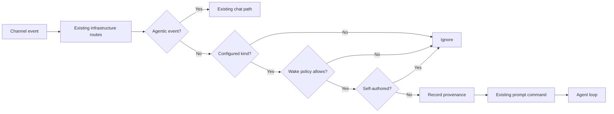

# Refactor Plan: Structured Channel Observations

## Goal

Allow an agent to opt into specific non-chat channel payloads and receive them as structured model input, while preserving all existing chat, wake, replay, and tool-result behavior.

> **Compatibility rule:** without an `observations` subscription setting, behavior must remain unchanged.



## Key design decisions

1. **Exact payload-kind matching only.** No filters, wildcards, registry, or predicate language.
2. **Non-agentic events only.** Existing agentic lifecycle events remain exclusively handled by their current routes.
3. **Self-authored observations are always ignored in v1.** This prevents accidental feedback loops.
4. **`wakePolicy` remains authoritative.** Observations only auto-wake subscriptions using `every-envelope`.
5. **Use the existing `prompt` command and turn lifecycle.** No new loop event or session-entry kind.
6. **Preserve structured data through an explicit prompt sidecar.**
7. **No batching, debounce, state hydration, schema registry, or UI protocol in this refactor.**

---

## Phase 1: Add the subscription contract

### Files

- `packages/agentic-core/src/agent-subscription-config.ts`
- `packages/agentic-core/src/agent-subscription-config.test.ts`

### Add

```ts
export interface AgentObservationConfig {
  payloadKinds: string[];
}

export interface AgentSubscriptionConfig extends AgentConfig {
  // Existing fields...
  observations?: AgentObservationConfig;
}
```

Add a pure resolver:

```ts
resolveAgentObservationConfig(value: unknown):
  | { payloadKinds: ReadonlySet<string> }
  | null
```

### Validation rules

- `payloadKinds` must be a nonempty array of nonempty strings.
- Remove duplicates.
- Set a modest maximum number of kinds, such as 32.
- Reject reserved kinds:
  - `agentic.trajectory.v1/event`
  - `presence`
- Invalid configuration fails closed.
- No wildcard matching.

### Tests

- Valid configuration survives `toSubscriptionConfig()`.
- Behavior settings remain stripped as before.
- Missing or malformed configuration resolves to no observations.
- Reserved kinds are rejected.
- Duplicate kinds are normalized.

No subscription database migration is required because configuration is already persisted as JSON.

---

## Phase 2: Preserve structured prompt input

A correction to the earlier proposal: `Command.content` is typed as `unknown`, but `recvItem()` currently converts a non-array object with `String(content)`, producing `"[object Object]"`. Structured observations therefore need an explicit transport path.

### Files

- `packages/agent-loop/src/commands.ts`
- `packages/agent-loop/src/step.ts`
- `packages/agent-loop/src/context.ts`
- `packages/agent-loop/src/agent-loop.test.ts`
- `packages/agent-loop/src/context.test.ts`

### Command extension

Add an optional field to prompt-like commands:

```ts
structuredInput?: unknown;
```

The ordinary `content` remains readable text. For example:

```ts
{
  kind: "prompt",
  content: "Channel observation: application.incident.v1",
  structuredInput: {
    kind: "channel-observation",
    version: 1,
    // ...
  }
}
```

### Private trajectory representation

`recvItem()` should continue creating the existing private user `message.completed`, but include:

```ts
structuredInput: command.structuredInput
```

Do not create a new payload kind or session-entry variant.

### Model context

When a user entry contains `structuredInput`, expose:

```ts
{
  role: "user",
  content: {
    message: "Channel observation: application.incident.v1",
    structuredInput: { /* exact object */ }
  }
}
```

Normal messages and UI interactions retain their current representation.

### Tests

Prove the structure survives the full path:

```text
prompt command
  → private message.completed
  → fold
  → SessionEntry
  → buildModelContext
```

Also verify:

- ordinary strings are unchanged;
- ordinary block arrays are unchanged;
- UI interaction handling is unchanged;
- structured input remains valid after replay/fold reconstruction.

---

## Phase 3: Add observation routing to `AgentVessel`

### File

- `packages/agentic-do/src/agent-vessel.ts`

### Structured observation shape

```ts
interface ChannelObservationInput {
  kind: "channel-observation";
  version: 1;
  source: {
    channelId: string;
    envelopeId: string;
    sequence?: number;
    payloadKind: string;
    timestamp: number;
    sender: ParticipantRef;
  };
  payload: unknown;
  truncated?: {
    originalChars: number;
    preview: string;
  };
}
```

Use `participantRefFromMetadata(event.senderId, event.senderMetadata)` so only public participant metadata enters model context.

### New helpers

Add small, focused methods:

```ts
protected resolveChannelObservation(
  channelId: string,
  event: ChannelEvent
): ChannelObservationInput | null
```

```ts
private async routeConfiguredObservation(
  channelId: string,
  event: ChannelEvent
): Promise<boolean>
```

The protected resolver provides a future worker-specific transformation seam without changing the core routing path.

### Routing placement

Preserve the current infrastructure ordering:

1. Presence cache invalidation.
2. Existing `onChannelEvent()` hook.
3. Supervised task terminal routing.
4. UI feedback routing.
5. Chat-operation settlement.
6. Invocation terminal routing.
7. Edit/retract routing.
8. Existing agentic message handling.

For events whose type is **not** `AGENTIC_EVENT_PAYLOAD_KIND`:

1. Read subscription observation configuration.
2. Require `wakePolicy === "every-envelope"`.
3. Require an exact payload-kind match.
4. Reject `event.senderId === this.participantId()`.
5. Build the bounded observation.
6. Call:

```ts
await this.recordMessageIngestion(
  channelId,
  event,
  "channel-observation"
);
```

7. Dispatch the existing prompt command:

```ts
await this.driver.handleIncoming(channelId, {
  type: "command",
  command: {
    kind: "prompt",
    channelId,
    source: { envelopeId: event.messageId },
    content: `Channel observation: ${event.type}`,
    structuredInput: observation,
    senderRef,
  },
});
```

### Important identity behavior

Do **not** set `sourceMessageId` for observations.

That field controls chat read receipts and edit/retract correlation. Observation deduplication should instead use the original channel envelope through:

```ts
source: { envelopeId: event.messageId }
```

This retains existing deterministic prompt identity without creating a chat receipt.

---

## Phase 4: Bound observation payloads

Add a named limit such as:

```ts
const MAX_CHANNEL_OBSERVATION_CHARS = 32_768;
```

Measure the canonical serialized payload before dispatch.

If oversized, do not cut JSON arbitrarily. Replace the payload with a valid bounded representation:

```ts
{
  payload: null,
  truncated: {
    originalChars,
    preview: serializedPayload.slice(0, previewLimit)
  }
}
```

This prevents a single event from unexpectedly dominating model context while preserving its identity and enough data for diagnosis.

Do not add configurable per-agent budgets in this refactor.

---

## Phase 5: Regression and integration tests

### `packages/agentic-do/src/chat-op.test.ts`

Add ingress tests for:

- unconfigured custom payload is ignored;
- configured exact payload creates one prompt;
- nonmatching payload is ignored;
- self-authored payload is ignored;
- sender reference uses sanitized public metadata;
- structured payload is passed unchanged;
- oversized payload is represented as truncated;
- `manual` and `explicit` wake policies suppress observation turns;
- existing agentic events never enter the observation path;
- subclass `onChannelEvent()` can still consume an event first.

### `packages/agentic-do/src/agent-loop-driver.test.ts`

Add integration coverage for:

- replaying the same envelope does not create a second turn;
- two different envelope IDs produce two inputs;
- an observation during an open turn uses existing steering behavior rather than opening a parallel turn;
- failure before prompt admission keeps channel delivery retryable.

### Existing behavior to re-run

- ordinary user messages;
- agent-to-agent addressing;
- UI feedback;
- edits and retracts;
- invocation completion;
- supervised subagent terminals;
- `explicit` and `manual` task channels;
- prompt artifact preparation;
- crash/replay tests.

---

## Phase 6: Diagnostics and documentation

### Diagnostics

Use bounded runtime logs rather than durable diagnostic events:

- debug when a configured observation is dispatched;
- debug when a matching event is skipped as self-authored;
- warn for invalid observation configuration;
- include only channel ID, envelope ID, payload kind, and truncation status;
- never log the complete payload.

### Documentation

Update `packages/agentic-do/SKILL.md` with:

- configuration example;
- exact-match semantics;
- wake-policy interaction;
- self-event exclusion;
- model-facing observation shape;
- replay and deduplication guarantees;
- payload limit;
- explicit statement that observation configuration does not provide privacy.

Example:

```ts
{
  name: "Incident agent",
  observations: {
    payloadKinds: ["application.incident.v1"]
  }
}
```

---

## Completion criteria

The refactor is complete when:

- existing agents without `observations` behave identically;
- one matching custom envelope yields exactly one model input;
- the model receives the structured payload rather than `"[object Object]"`;
- replay does not duplicate a turn;
- infrastructure events cannot be captured as observations;
- self-authored events cannot form a feedback loop;
- content-integrity ingestion occurs before model exposure;
- no database migration or channel protocol change is introduced;
- focused tests and package typechecks pass.

Batching should be considered only after this version is exercised by a real application and event frequency is measured.
